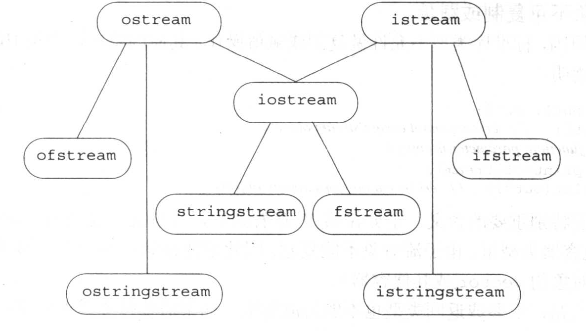
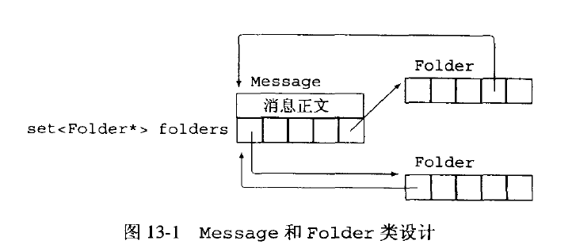
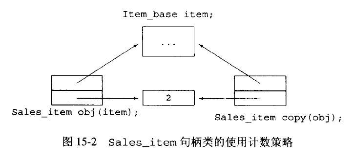
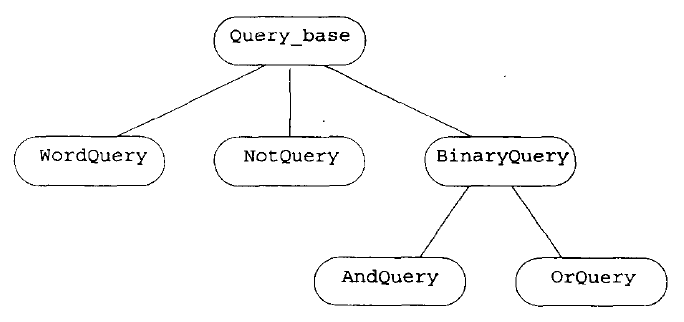

# Compile


# C++ Primer 中文版

## Chapter 1

### 1.1
主函数
```
int main()
{
    return 0; // Means success
} // this is curly brace
```
函数必须指定4个元素：返回类型, 函数名, 形参表, 函数体。

Linux下编译：
```
g++ hello.cc –o hello
./hello // Execute
echo $? // see the return value from main
```

### 1.2
Preprocessor directive: include尖括号中是头文件。标准库用`<>`括起来。自定义库用`""`。

iostream
* istream：cin。输入值与存入的变量类型不符合时, 或读入`ctrl+D`时, 返回的值为假, 可用于while的中。
* ostream：cout,  cerror, clog。
* iostream库能所有处理内置类型的输出。

```
#include <iosteam>
int main()
{
    std::cout << "Enter two numbers: " << std::endl; // std::endl is one of manipulators
    int v1, v2;
    std::cin >> v1 >> v2;
    std::cout << "Sum :" << v1 + v2 << std::endl;
}
```

`<<`操作符：每次接受两个操作数, 左边为ostream对象, 右边为内容。该表达式执行完后, 返回`void*`的`ostream`对象。

Manipulator操作符：`endl`, 换行并刷新缓冲区(buff)。

调用前需有`std::`是使用命名空间(namespace)std内的函数或操作符避免定义变量时冲突。

作用域(Scope)操作符：取namespace中的对象。

对于出错的情况：
```
    std::cerr << "Error" << std::endl;
    return -1;
```

内置类型：如int。最好都赋初值。

### 1.3
区块注释：
```
/*
 *
 */
```

### 1.4
控制结构:
- 迭代while：括号内条件式返回非0时执行。
```
int sum = 0, val;
while(std::cin >> val) 
    sum += val;
```

- 简化循环变量for：循环结束后循环变量释放, 不可再用。
```
int sum=0;
for(int val = 1; val <= 10; ++val)
    sum += val;
```

- 条件执行if：
```
if(条件)
    执行;
else
    执行;
```

### 1.5
类(class):
- 自定义数据类型。istream也是。
- 三要素：名字、定义域、可执行操作。
- 在一个与类名相同且后缀为`.h`文件中。
实例化：
```
Sales_item item;
```
Sales_item是类, item是对象。

成员函数：`item.same_isbn(item2)`是函数。

可以覆写操作符。

点操作符.：左操作数是类的对象, 右操作数是成员。

调用操作符()：扩住实参。

### 1.6

### 小结
Argument: 实参; Parameter: 形参。Statement: 语句。

Routine: 一系列操作组成。用以定义函数或数据类型。

Statically typed: C是而smalltalk不是。

## Chapter 2
### 2.1
算术类型(arithmetic type)：
* bool,  true, false。可以为任何算术类型。
* char(8 bit, 1 byte), wchar_t汉语或日语(16位)。每个字符的数值为literal constant。
* short(16位), int(16位), long(32位),  定义时前可加 unsigned。C++中-1给unsigned类型得4294967295(与编译器有关)。unsigned 类型用于数组下标。越界会被wrap around。
* float (32 bit) 6位有效数字, double (32 bit) 10位有效数字, long double (96 或128 bit)10位有效数字。double 的运算效率可能比float 还高。
Void type.  

内存机制: 本为序列存储, 用chunk 来处理, 32 bit为一个word。每个byte 有一个地址。

### 2.2
20等同于20 (decimal), 024 (octal), 0x14 (hexadecimal)。  
20UL得到long和unsigned类型。  
单精度浮点: 3.14159F = 3.14159E0f 0. = 0e0, 1E-3F = .001f  
wchar_t类型: L'a'。  
转义字符(Escape characters)：`\n`, `\t`, `\v` 纵向制表符, `\b`退格符？, `\r`, `\12` 回车符, `\f` 进纸符, `\a` 报警符, `\0` 空字符, `\40` 空格符。`\xxx` (八进制数) = (char)0xxx。  
字符串：`cout << "a" "b""c"`可以用空格、回车、tab连起来。在末尾自动添加空字符：'A' 是一个字符，而"A" 是'A', '\12' 两个字符。

escape `\ `: 可以断开单词来换行。不允许之后有空格或注释。下一行的第一个字符, 不论是空格和tab都会包含, 所以不能正常缩进。  

nonportable: 利用未定义行为编程, 如将char string 和long string 相连 `"apple" L"banana"`。  

### 2.3
左值(lvalue): 即变量，可出现在赋值语句左或者右。右值(rvalue): 即常量，只能在右。  

对象: 内存中具有类型的区域。  

C语言大小写敏感。且关键词和替代名不能作为变量名(identifier)。变量名必须以`_`或字母开头。  

关键词表：

|  1  |  2  |  3  |  4  |  5  |  6  |  7  |  8  |  9  |  0  |
|:---:|:---:|:---:|:---:|:---:|:---:|:---:|:---:|:---:|:---:|
|asm|do|if|return|try|auto|double|inline|short|typedef| 
|bool|dynamic_cast|int|signed|typeid|break|else|long|sizeof|typename|
|case|enum|mutable|static|union|catch|explicit|namespace|staitc_cast|unsigned|
|char|export|new|struct|using|class|extern|operator|switch|virtual|
|const|false|private|template|void|const_cast|float|protected|this|volatile|
|continue|for|public|throw|wchar_t|default|friend|register|true|while|
|delete|goto|reinterpret_cast|


替代名：替代操作符

| 1 | 2 | 3 | 4 | 5 | 6 |
|:-:|:-:|:-:|:-:|:-:|:-:|
|and|bitand|compl|not_eq|or_eq|xor_eq|
|and_eq|bitor|not|or|xor|


变量名只能由数字、字母、下划线组成。一般为小写。多个单词由下划线分开，或第二个单词以后的每个单词首字母大写。  

初始化不是赋值。赋值是将对象当前值用新值代替。直接赋值(Direct-initialization)：`int ival (1024);` 对class object 来说, 比copy-initialization 效率高且灵活。   
类对象: 由constructor 初始化。不定义任何构造函数则使用default constructor。有默认构造函数的类可以在初始化时不提供初始值。不然无法初始化。  
```
#include <string>
std::string titleA = "Hello World"; 
std::string titleB("Hello World"); 
std::string all_nines(3, '9'); // 999
```

内置类型，函数体外的初始化自动为0。函数体内不自动初始化。
```
#include <iostream>
#include <string>
int global_var; 

int main()
{
    int local_var; 
    std::string local_str; 
    std::cout<< global_var << std::endl; // it is 0. 
    std::cout << local_var << std::endl; // ？
    std::cout << local_str << std::endl; // ""
}
```
#### 2.3.5
Definition: 分配存储空间，一个变量只能有一个。  
Declaration: 定义也是一种声明。在多个文件中, 一个文件含有变量的定义, 其他的需要声明。
只声明不定义变量，或在新的文件中声明已定义过的变量： 
```
extern int i; 
```
#### 2.3.6
Scope: global scope(全局作用域)中定义的变量可用于local scope(局部作用域)和statement scope(语句作用域)。
- 局部定义可hide(屏蔽)全局定义的变量。
- 对象定义在首次使用的地方。之后在同一个作用域内只能声明不能再定义。
- class scope
- namespace scope

#### 2.3.7

### 2.4
Magic number.  
定义常数：
```
const int bufsize = 512; 
extern const int globalConst = val; // then can be declared in other file
```

### 2.5
Reference(引用): 就是对象，主要用作形参。 
- compound type: 用其他类型定义的。  
- 变量名前加&, 将两个变量的地址联系起来。 
- 引用的变量值不能被赋值, 即`&refVal`始终指向`ival`的地址。
```
int ival = 1024; 
int &refVal = ival; 
refVal += 2; // ival = 1026
```
Nonconst reference.  

### 2.6
定义类型的同义词： 
```
typedef double wages; 
wages salary; // salary is a double value
```

### 2.7
Enumeration(枚举): 
- 枚举的第一个enumerator(成员)默认为0, 之后为1, 2。赋值过的成员之后的默认递增。
- Constant expression.  
- enum定义了一种类型, 已定义的不能再定义，只能用另一个同类型赋值。
```
enum Points {point2d = 2, point2w, point3d=3, point3w}; 
```

### 2.8
定义类：定义interface(接口)和implementation(实现)。  
- 接口为该类可执行的member(操作)。有function member 和data member。
- 实现包括包括该类需要的数据和内部函数。
- 类可以有多个private或public的access label(访问标号)。决定代码是否可以访问。public中的成员都可以访问。private中的只能执行规定的操作, 不能修改数据。
- class定义的类中成员默认都是private,  struct定义的默认都是public。

定义类： 
```
class Sales_item {
public: 
    // operations. 
private: 
    std::string isbn; // use constructor to init
    unsigned units_sold;
    double revenue;
}; // Don't miss this one
```
或
```
struct Sales_item {
}
```

### 2.9
Separate compilation.  
#### 2.9.1
头文件：存放程序中名字的使用和声明。
- 包含类的定义， extern变量的声明（不要定义）, 函数的声明。  
- 可以定义类，const 对象和inline 函数。 

编译链接源文件：
```
CC -c main.cc Sale_item.cc
# create executable file
CC -c main.cc Sale_item.cc -o main
```
Or separate compilation
```
CC -c main.cc
CC -c Sale_item.cc
CC main.o Sale_item.o
# create executable file
CC main.o Sale_item.o -o main
```
#### 2.9.2
Preprocessor: 编译时`#include` 处用头文件内容替代。
- 可以用文本格式或编译器认识的格式（系统的头文件）保存。 
- 头文件可嵌套。
- 同一源文件中多次包含的同一头文件要避免重复定义类和对象。 

用header guard 预防重新定义已包含的头文件：
```
#ifndef SALESITEM_H
#define SALESITEM_H 
//Define class. 
#endif
```
其中用到预处理变量SALESITEM_H 做状态检测。 

`<>`的头文件为标准头文件，编译器在预定义位置查找。  
`""`为自定义头文件，从源文件所在路径处查找。  

### 小结

## Chapter 3
Abstract data type： String 和vector 是Iterator 的companion type。 bitset 用集合处理值。    
### 3.1
using声明(命名空间：：名字)：`using std::cin; `  
- 头文件中不用using。  

### 3.2
标准库类型(非基本类型)：需包含
```
#include <string>; 
using std::string;
```
#### 3.2.1
string构造函数：
```
string s1; // empty
string s2 (s1); 
string s1 ("value"); 
string s4(n,’c’); 
```
字符串字面值`"abc"`和string是不同的类型。  
#### 3.2.2
`cin`输入string：
- 返回的是布尔值。 文件尾或无效字符处返回非。 
- 从非空字符开始, 到遇到空字符（space, enter, tab）结束。  
- input： "  Hello World   "，则s1 为"Hello"。

```
cin >> s1 >> s2; 
```
string IO 操作读入一整行： 输入流和string对象
```
while(getline(cin, line)) 
    cout << line << endl; 
```

与`cin`不同，不忽略enter。如果一行只有enter，则返回空string。


#### 3.2.3
string API：
```
s.empty(); 
s.size(); // \n count as one. return string::size_type 
s[n]; 
s1 + s2; // concatenation
s1 = s2; // high cost
v1 == v2; 
v1 != v2; 
v1 <= v2; 
v1 > v2; 
```
`st.size()`： 
- st中包含空字符的字符数
- 返回string::size_type类型，认为是无符号长整型，不能赋给int型，但是可以用int赋值。
- 使用companion type 来获得machine-independent。 

string关系操作符：  
- 不考虑长度，先依次比较每个字符大小。
- 大写比小于小写。
- 如之前都一样, 短字符串小于长字符串。

字符串字面值无法concatenation，只有string类型才有： 
```
string s1 = "Hello" + "World"; // error
```

下标操作符`[]`读入size_type类型数做index读入单个字符。
- 下标从0开始。下标可以是任何整型值。
- 上下界为0到`str.size()-1`。
```
    for (string::size_type ix = 0; ix != s1.size(); ++ix) {
        cout << s1[ix] << endl;
    }
```

#### 3.2.4
`cctype`头文件中定义处理char值的函数：
- 测试字符串中单个字符的函数, 返回一个int值, 失败为0, 其他为非0值。
- `tolower(c)`, `toupper(c)`返回的是字符。
- `isalpha(c)`, `isalnum(c)`, `isdigit(c)`
- `isxdigit(c)`是否为16进制数。
- `iscntrl(c)`是否为控制字符。 
- `isgraph(c)`不是空格，但可打印。
- `isprint(c)`, `ispunct(c)`, `isspace(c)`
- `islower(c)`, `isupper(c)`

C++标准库中包括C标准库。
- `cctype`定义于`ctype.h`中。
- 要导入C标准库，`#include <c[name]>;`
- 虽然也可以`#include "ctype.h";` ，不建议使用。

### 3.3
vector：container(容器), 可包含同一类型其他对象的集合。
- `vector`头文件中。
- 是class template。可用于不同的数据类型。
- 声明：
```
using std::vector; 
vector<int> ivec; 
```

#### 3.3.1
构造函数定义和初始化：
```
vector<T> v1; 
vector<T> v2(v1); 
vector<T> v3(n, i); 
vector<T> v4(n) // init with n default T object
```
- 建议初始化空容器，再动态添加元素到vector。
- 为高效添加元素vector 不预先分配连续内存。
- value initialization。

#### 3.3.2
vector的操作：
- `v.empty()`
- `v.size()` 返回`vector<T>::size_type`类型。
- `v.push_back(t)` 添加元素t 到v 的末尾。
- `v[n]` 无法在下标n处添加元素，或尝试获取，不然会buffer overflow
- `v1 = v2`
- `v1 == v2`
- `!=`, `<`， `>=`

C++优先选用`size_type != size`来做循环的判断条件。  
`size()`是inline 函数，执行代价小，编译器在此处扩展代码。  

### 3.4
iterator(迭代器)：
- 标准库为每种容器各定义一迭代器类型，但不是每种容器都支持下标操作。
- 定义：`vector<int>::iterator iter; `
- 标准库容器类型都定义了一个iterator成员。
- `begin()`，`end()`函数指向最后元素的下一个位置。`end()`为off-the-end iterator，起sentinel作用。
```
vector<int>::iterator iter = ivec.end(); 
```
- 访问迭代器指向元素；用解引用操作符`*iter = 0;`。等同于`ivec[iter] = 0;`。
- `++iter;`移动。
- `iter1 == iter2;`来比较迭代器位置。
- `vector<string>::const_iterator iter;` 则`*iter`可得string对象的const引用，不能赋值。
- 迭代器间距离：`iter1 - iter2`, 由`difference_type`储存, 是signed，必须指向同一个容器。
- iterator arithmetic：`iter += n;`n需为vector的`size_type`或`difference_type`类型。
- 中间元素：`vector<int>::iterator mid = vi.begin() + vi.size() / 2;`
- `push_back`后迭代器失效。
```
int main()
{
    vector<int> ivec(3); 
    int i = 1; 
    vector<int>::iterator end = ivec.end(); 
    for (vector<int>::iterator iter = ivec.begin(); iter != end; ++iter) {
        *iter = i++; 
    }

    for (vector<int>::const_iterator iter = ivec.begin(); iter != end; ++iter) {
        cout << *iter << endl; 
    }
}
```

### 3.5
bitset：位操作。头文件`bitset`中。
#### 3.5.1
定义与初始化：
- 也是类模板，但是用长度区别。
- 长度必须为整型字面值或const对象。
- 32位bitset 的low-order bit 从0 开始，在最右，high-order bit 为31。

```
bitset<32> bitvec; 

bitset<64> bitvec2(0xffff); // a copy of unsigned int, fill from 0 to high-order bit
bitset<16> bitvec3(0xffff); // abandon bits from 16 to 31

string strval("1100"); 
bitset<32> bitvec4(strval); // strval[3] -> bitvec4[0]

bitset<32> bitval5(str, pos, n); // str[pos] to str[pos + n - 1]
bitset<32> bitval6(str, pos); // str[pos] to the end
```

#### 3.5.2
bitset 对象的操作：
- `bool is_set = bitvec.any(); ` 测试是否有1，返回1为true。`bitvec.none()`相反。
- `b.count()` 置1的个数。返回`size_t`类型,在`cstddef`头文件中。
- `b.size()`
- `b[pos]`
- `b.test(pos)` 是否为1。结果等同于`b[pos]`。
- `b.set()` 全置为1。`b.set(pos)`，`b.reset()`，`b.reset(pos)`，`b.flip()`，`b.flip(pos)`。
- `unsigned long number = b.to_ulong();` 将二进制数返回为长整型。需`b`的长度小于等于long，不然throw exception。
- `os << b` 输出到OS流，如`cin`。
- 支持各种位操作符。

### 小结

## Chpater 4
Array, pointer 是低级复合类型。  
Array 长度固定。没有size 操作。  
只有在追求速度是才在类实现内部使用数组和指针。  
### 4.1
Array: 
- 复合数据类型：类型名，标识符，dimension (维数)。 
- 没有所有元素都是引用的数组<b>?</b>

#### 4.1.1
维数只能是常量或编译时已知的const 对象。  
```
const unsigned buf_size = 512; 
char input_buffer[buf_size]; 

const unsigned sz = get_size(); // cannot used as dimension
```

显式初始化：
```
int ia[3] = {1, 2, 3}; 
int ia[] = {1, 2, 3}; 
```

不初始化，则
- 函数体内，元素无初始化。
- 函数体外，初始化为0或空。 
- 类类型则调用默认构造函数。 
- 内置类型的局部数组<b>?</b>的元素没有初始化。

字符初始化：
```
char ca[] = {'C', '+', '+', '\0'}; 
char ca[] = "C++"; // add null terminator 
```

标准规定数组无法用另一个数组赋值或初始化。  
#### 4.1.2
数组下标类型是`size_t`。  
```
const size_t array_size = 10; 
int ia[array_size]; // if in int main(), then not init

for (size_t ix = 0; ix != array_size; ++ix) {
    ia[ix] = ix; 
}
```

小心buffer overflow。  

### 4.2
Pointer: 
- dereference operator`*`
- increment operator`++`
- address-of`&`

#### 4.2.1
指针概念：
- 指针是对所指对象的间接访问。  
- 保存另一个对象的地址。  
- 可用于vector, string, array 的下标操作和解引用操作得到的左值。  
```
string s("hello World"); 
string *sp = &s; 
```

容易犯bookkeeping 和语法规则的错误。  
#### 4.2.2
定义：  
```
double dp, *dp2; // dp2 is a pointer
string* ps1, ps2; // legal but can be misleading. ps2 is string object
```

取值：
- 0值常量或`cstdlib`库中的预处理器变量`NULL`，表示无指向。`int *pi = NULL;`
- 特定对象地址。`int *pi2 = &ival; `
- 某对象的下一个对象。
- 同类型的有效地址。`pi = pi2; ` 或`int *pi = pi2;`
- 未初始化的指针无效。但编译器无法检测。
- 一定要初始化指针。最好在创建对象后再定义，不然初始化为0。

预处理变量不在命名空间`std`中。  

`void*`指针可存放任意类型。但是可执行的操作有限：  
- 与另一个指针比较。
- 向函数传递或返回指针。
- 给另一个`void*`指针赋值。

#### 4.2.3
可以通过解引用返回对象左值：
```
*sp = "Hello World"; 
```

指针和引用的区别：
- 引用总是指向某对象。
- 给引用赋值修改对象，给指针赋值修改地址。

指向指针的指针：
```
int val = 3; 
int *pi1 = &val; 
int **ppi = &pi1; 
int *pi2 = *ppi;  // dereference, pointer to pi1
cout << **ppi << endl; // 3
```
#### 4.2.4
数组名也是个指针，指向第一个元素：
```
int ia[] = {1, 2, 3}; 
int *ip = ia; 
int *ip2 = &ia[0]; // same as above
```
Pointer arithmetic: 
```
int *ip2 = ip + 4; // point to ia[4]
ptrdiff_t n = ip2 - ip1; // include in lib cstddef
```

加法操作precedence (优先级)低于解引用。  
```
int last = *(ia + 4); // Array name is a pointer
```

反过来，指针指向数组时也可用下标访问元素。  
```
int ia[] = {1, 2, 3, 4}; 
int *p = &ia[3]; 
cout << p[-2]; // 2
```

数组的哨兵指针：
```
const size_t arr_size = 5; 
int arr[arr_size] = {1, 2, 3, 4, 5}; 
int *p = arr; 
int *pe = p + arr_size;  // cannot dereference 
```

遍历：
```
const size_t arr_sz = 5; 
int ia[arr_sz] = {1, 2, 3, 4}; 

for (int *p = ia, *pe = ia + arr_sz; p != pe; ++p) { // init-statement
    cout << *p << " "; 
}
```

内置类型没有成员函数，数组也是内置类型。  
#### 4.2.5
指向const 对象：
- 指针必须有const 特性的。
- 但该指针不是const 的。不需定义时赋值。
- 可以给该指针重新赋值令其指向另一个对象。
- 但是不能通过该指针给解引用返回的左值赋值。
- 但是对所指对象（未必是const）的改变仍可执行。
```
const doule *cptr; 
double dval = 3.14; 
cptr = &dval; // but cannot change value
```

用于将形参定义为指向const 对象的指针以确保不改变对象。  
不含const 特性的指针不能指向const 对象。  

const 指针：不能改变所指地址。但是能否解引用修改对象取决于对象。  
```
int errNumb = 0; 
int *const curErr = &errNumb; 
if (*curErr) {
    errHandler(); 
    *curErr = 0; 
}
```

Const 限定符可放在类型前或后：
```
string const s1; 
const string s2; // same type as s1
```
Typedef 写const 类型定义：
```
string s; 
typedef string *pstring; 
const pstring sctr1 = &s; 
pstring const sctr2 = &s; // Same as sctr1
string *const sctr3 = &s; // same type
```

### 4.3
C-style character string（C 风格字符串）：
- 不建议使用。  
- 字符串字面值类型是const char 数组。  
```
char ca1[] = {'C', '+', '+'}; // not C style
char ca2[] = {'C', '+', '+', '\0'}; // C style
char ca3[] = "C++"; // C style
const char *cp1 = "C++"; // C style
char *cp2 = ca2; // C style
```

遍历：利用结尾的null。
```
const char *cp = "string"; 
while (*cp) {
    cout << *cp; 
    ++cp; 
}
```

C风格字符串标准库函数：
- `cstring`库中。
- 传入函数的指针必须指向字符数组第一个元素。
- `strlen(s)` 不包括null
- `strcmp(s1, s2)` 相等返回0，s1大于s2返回正。
- `strcat(s1, s2)` 需确保s1足够大。
- `strcpy(s1, s2)` 将s2复制给s1并返回s1。
- `strncat(s1, s2, n)` 将s2前n个字符复制给s1并返回s1。
使用cat和cpy前需计算s1大小。
```
char s1[10]; // cannot shorter than s2, include null
char *s2 = "tail"; 
char *res = strcpy(s1, s2); 
```

避免数组溢出，使用标准库类型string。
```
#include <string>
using std::string; 
char *cp = "string"; 
string s = cp; 
s += " "; 
cout << s; 
```
#### 4.3.1
动态分配的数组：
- 长度仍固定。
- 需显式释放。  
- 存储在heap(堆)中。
- 动态分配的数组是对象，而编译时就确定的数组是变量。

堆：也称free store(自由存储区)。存放动态分配的对象。  
- C语言用`malloc`和`free`来分配该空间。
- C++用`new`和`delete`。

定义：
```
int *pia = new int[10]; // array does not have name
int *pia = new int[10]();  // init with 10 0s. 
```
- 内置类型的元素不会初始化。除非用圆括号。
- 对象用默认构造函数初始化。 
- 不能用初始化列表来为元素提供不同初值。 
- const 的动态数组对象必须初始化。然而没有什么用。

动态分配0长度的数组：
```
size_t n = get_size(); 
int *pia = new int[n]; 

for (int *p = pia; p != pia + n; ++p) {
    *p = 1; 
}
```
- 如果n 为0，仍可成功分配空间。
- 但是数组的指针并未指向任何元素，故不能解引用。
- 指针仍可进行比较操作。

释放内存：
```
delete [] pia; 
```
`[]`表明释放的是指针所指的数组空间，而非单个对象。  
- 编译器无法检测出指针所指是数组还是对象。
- 会导致memory leak(内存泄漏)。

用动态分配的数组选择C风格字符串：
```
int main()
{
    bool errorFound = true; 

    const char *noErr = "Success"; 
    const char *err189 = "Error: a function must "
        "specify a function return type!"; 

    const char *errorTxt; 
    if(errorFound) 
        errorTxt = noErr; 
    else 
        errorTxt = err189; 

    int dimension = strlen(errorTxt) + 1; // null char
    char *errMsg = new char[dimension]; 
    strncpy(errMsg, errorTxt, dimension); 
    
    while (*errMsg) { // same as cout << errMsg 
        cout << *errMsg; // and cout << *(errMsg++); 
        ++errMsg; 
    }
    cout << endl; 

    return 0; 
}
```
#### 4.3.2
C风格字符串与字符串字面值是相同的数据类型。
- 可以用来赋值：`string st1 = sp; `
- 可做string类型加法的其中一个操作数。
- 不能用string 对象初始化字符指针。
- 使用`c_str()`函数：
```
string s1("Hello World"); 
const char *cp = s1.c_str(); 
s1 = "Bye World"; 
cout << cp << endl; // Bye World
```

使用数组初始化vector对象：
```
const size_t arr_size = 6; 
int int_arr[arr_size] = {1, 2, 3, 4, 5, 6}; 
vector<int> ivec(int_arr, int_arr + arr_size); // begin and end
```

### 4.4
多维数组就是元素为数组的一维数组。  
- 第一维为row(行)，第二维为column(列)。 
- 初始化：如不用花括号，先行后列。
```
int ia[2][3] = {
    {0, 1, 2}, {3, 4, 0}
}
int ia[2][3] = {
    0, 1, 2, 3, 4 // same, the last is init to 0
}
```
- 下标引用：
```
const size_t rowSize = 3; 
const size_t colSize = 4; 
int ia[rowSize][colSize]; 
for (size_t i = 0; i != rowSize; ++i) {
    for (size_t j = 0; j != colSize; ++j) {
        ia[i][j] = i * colSize + j; 
    }
}
```
- 声明指向多维数组的指针：
```
int ia[3][4]; 
int (*ip)[4] = ia; // ip is a pointer to int[4] type
ip = &ia[2]; 
```
- `&ia`是个指向int[3][4]类型的指针，`ia`是个指向int[4]类型的指针，`ia[0]`是个指向int类型的指针，`ia[0][0]`是个int。
-用`typedef`简化：
```
int ia[2][3] = {0, 1, 2, 3, 4}; 
typedef int int_array[3]; 
for (int_array *p = ia; p != ia + 2; ++p) {
    for (int *q = *p; q != *p + 3; ++q) 
        cout << *q << " "; 
    cout << endl; 
}
cout << endl; 
```

### 小结
compiler extension: 不同编译器对语言添加的特性。难以移植。  
dynamically allocated: 在显式释放前一直存在。  

## Chapter 5
Operator(操作符)：
- 内置或复合类型的操作符含义已定义。
- 可重载。
- 可与数个operand 组成expression，产生result。
- result 一般是右值。 
- 操作符执行什么操作由操作数类型决定。
- unary(一元)和binary(二元) operator 操作符。
- 有一个ternary operator（三元）。
- 有些symbol 既可是一元也可是二元操作符。
- 二元操作符通常需要操作数为相同类型或可转换为相同类型。 

操作符的特性：
- precedence（优先级）。
- associativity（结合性）。
- order of evalution（求值顺序）：如左操作数先于右操作数执行。

### 5.1
操作符表：


| Precedence | Operator | Description | Associativity |
|:---:|:---:|:---:|:---:|
|1|`::`|Scope resolution (C++ only)|None
|2|`++`|Suffix increment|Left-to-right
||`--`|Suffix decrement
||`()`|Function call
||`[]`|Array subscripting
||`.`|Element selection by reference
||`->`|Element selection through pointer
||`typeid()`|Run-time type information (C++ only)
||`const_cast`|Type cast (C++ only)
||`dynamic_cast`|Type cast (C++ only)
||`reinterpret_cast`|Type cast (C++ only)
||`static_cast`|Type cast (C++ only)
|3|`++`|Prefix increment|Right-to-left
||`--`|Prefix decrement
||`+`|Unary plus
||`-`|Unary minus
||`!`|Logical NOT
||`~`|Bitwise NOT (One's Complement)
||`(type)`|Type cast
||`*`|Indirection (dereference)
||`&`|Address-of
||`sizeof`|Size-of
||`new, new[]`|Dynamic memory allocation (C++ only)
||`delete, delete[]`|Dynamic memory deallocation (C++ only)
|4|`.*`|Pointer to member (C++ only)|Left-to-right
||`->*`|Pointer to member (C++ only)
|5|`*`|Multiplication|Left-to-right
||`/`|Division
||`%`|Modulo (remainder)
|6|`+`|Addition|Left-to-right
||`-`|Subtraction
|7|`<<`|Bitwise left shift|Left-to-right
||`>>`|Bitwise right shift
|8|`<`|Less than|Left-to-right
||`<=`|Less than or equal to
||`>`|Greater than
||`>=`|Greater than or equal to
|9|`==`|Equal to|Left-to-right
||`!=`|Not equal to
|10|`&`|Bitwise AND|Left-to-right
|11|`^`|Bitwise XOR (exclusive or)|Left-to-right
|12|`|`|Bitwise OR (inclusive or)|Left-to-right
|13|`&&`|Logical AND|Left-to-right
|14|`||`|Logical OR|Left-to-right
|15|`? :`|Ternary conditional|Right-to-left
|16|`=`|Direct assignment|Right-to-left
||`+=`|Assignment by sum
||`-=`|Assignment by difference
||`*=`|Assignment by product
||`/=`|Assignment by quotient
||`%=`|Assignment by remainder
||`<<=`|Assignment by bitwise left shift
||`>>=`|Assignment by bitwise right shift
||`&=`|Assignment by bitwise AND
||`^=`|Assignment by bitwise XOR
||`|=`|Assignment by bitwise OR
|17|`throw`|Throw operator (exceptions throwing, C++ only)|Right-to-left
|18|`,`|Comma|Left-to-right


（摘自[Operators in C and C++](https://en.wikipedia.org/wiki/Operators_in_C_and_C%2B%2B#Operator%20precedence) 和5.10.2）

运算次序：
`5 + 10 * 20 / 2`
- Operand: stack: , mem: 5; Operator: stack, mem: +; 
- Operand: stack: 5, mem: 10; Operator: stack: +, mem: `*`; So first do `*`. 
- Operand: stack: 5, 10, mem: 20; Operator: stack: +, `*`, mem: /; `/` is not higher than `*`, so pop 10 to compute. 
- Operand: stack: 5, 200, mem: 2; Operator: stack: +, mem: /; `/` is higher than `+`, pop 200 to do compute. 
- Operand: stack: 5, 100, mem: ; Operator: stack: +, mem: ; Pop all to finish. 

算术异常：
- 数学错误。
- 计算机特性：溢出。 
```
short short_value = 32767; 
short ival = 1; 
short_value += ival; // -32768 wrapped around
```

`%`：reminder 或modulus （求余）：
- 只能用于`bool`, `char`, `short`, `int`, `long` 及对应的`unsigned` 的整型。  
- 两操作数为负，返回负值。
- 一操作数为负，未定，机器决定。

`/`：一操作数为负，上或下取整由机器决定。  

### 5.2
0为假，其他为真。  
Short-circuit evalution（短路求值）：当表达式的布尔值已确定时，不会再执行下去。  
```
string s("Expressions in C++ are composed..."); 
string::iterator it = s.begin(); 
while (it != s.end() && !isspace(*it)) {
    *it = toupper(*it); 
    ++it; 
}
```

bool值true转换为整型1：`i < j < k` 当k 大于1时总成立。  

### 5.3
位操作符：
- 将整型看作二进制序列。
- 或者处理bitset 类型。
- 对于负数，如何操作符号位取决于机器。所以建议使用unsigned 型。  
```
unsigned int bits = 1; 
bits = ~bits; // (2^32 - 1) - 1
```
- `>>`和`<<`抛弃移出去的位。无符号时补0。
- 有符号数，`>>`可能移进符号位副本或0，取决于机器。  
- 右操作数必须为小于左操作数位数的正值。  
- `&` `|` 位异或`^`： 
```
unsigned char b1 = 0145; // oct value
unsigned char b2 = 0257;
unsigned char result = b1 & b2; // 0045
```

#### 5.3.1
用`bitset`做布尔数组：
```
bitset<30> quiz; 
quiz.set(27); 
quiz.reset(28); 
bool status; 
status = quiz[28]; 
```

如果用整型实现会比较复杂：
```
unsigned int quiz; 
quiz |= 1UL << 27; 
quiz &= ~(1UL << 28); 
bool status; 
status = quiz & (1UL << 28); 
```

#### 5.3.2
输入输出标准库重载了`>>`和`<<`。  
- 左结合：
```
cout << "hi" << "there" << endl; 
((cout << "hi") << "there") << endl; 
```
- 优先级低于算术操作符，高于关系操作符：
```
cout << 1 + 2; 
cout << (1 < 2); 
```

### 5.4
赋值操作符的左操作数必须是非const 的左值：  
```
i + j = ival; // error, i + j return rvalues
```

当左右操作数类型不符时，会类型转换而改变值。  
#### 5.4.1
赋值操作是右结合的：
```
int val; 
int *pval; 
val = pval = 0; // error, cannot assign pointer to int
```
#### 5.4.2
优先级很低，故可以写入条件表达式：  
```
int i; 
while ((i = getValue()) != 42)
    // do
```
小心`if (i == val)` 不要写成赋值。  
#### 5.4.3
复合赋值操作符：`+=` 等10个。计算中左操作数只计算一次。  

### 5.5
自增：在变量前和变量后分别是两种运算符。
- `++i`是右结合的，返回的值是左值（对象本身）。
- `i++`是左结合的，返回右值（对象原始值）。
- 如无必要不使用后自增。只有int和指针编译器有优化。

```
vector<int> ivec; 
int cnt = 10; 
while (cnt > 0)
    ivec.push_back(cnt--);  // 9 - 1

vector::iterator iter = ivec.begin(); 
while (iter != ivec.end()) 
    cout << *iter++ << endl; 
```

### 5.6
箭头操作符：`->`等同于点`.`加解引用`*`操作符。  
```
Sales_item item1; 
Sales_item *sp = &item1; 
(*sp).same_isbn(item2); // * is lower priority than .
```
为避免忘记给解引用操作符加括号，引入`->`：
```
p->foo; // (*p).foo
sp->same_isbn(item2); 
```

### 5.7
Conditional operator(条件操作符)：`cond ? expr1 : expr2`。
- 三元。
- 短路求值。
- 优先级低。
```
cout << (i < j ? i : j); 
```

### 5.8
`sizeof`操作符：
- 返回`size_t`类型。
- 单位是字节。 
- 作用于表达式时，其实不执行表达式，只检查返回类型。
- 作用于类型名，一定要括号，返回该类型所需内存：
```
cout << sizeof(int) << endl; // 4
```
- 作用于表达式，返回结果所需内存：
```
int a = 1, b = 2; 
cout << sizeof (a + b) << endl; // 4
```
- 作用于指针，返回地址大小；作用于解引用的指针才返回对象大小：
```
    char *p; 
    cout << sizeof p << endl; // 4 it is the size of pointer itself, the pointer is a number that needs 4 byte to store
    cout << sizeof *p << endl; // 1 it is the size of the object pointer points to
```
- 作用于引用类型，返回存放引用类型对象所需的空间：
```
vector<int> ivec; 
vector<int>::iterator iter; 
cout << sizeof iter << endl; // 12
cout << sizeof *iter << endl; // 4
```
- 作用于数组，是数组元素长和元素个数的乘积。
```
int a[3]; 
cout << (sizeof a / sizeof *a) << endl; // 3
```

### 5.9
逗号表达式：
- 用逗号排列的多个表达式。
- 每个表达式从左向右执行。
- 逗号表达式的值最右边的表达式值。<b>?</b>
```
vector<int> ivec(9); 
int cnt = ivec.size(); 
for (vector<int>::size_type ix = 0; ix != ivec.size(); ++ix, --cnt)
    ivec[ix] = cnt; 
```

### 5.10
Compound expression(符合表达式)：
- 含有多个操作符。
- 操作符的优先级决定操作数的结合方式，并没有说明计算次序。
- 由结合性决定次序。

#### 5.10.1
优先级相同的操作符，由结合性决定谁先执行。
```
int res = 6 + 3 * 4 / 2 + 2; 
int tmp1 = 3 * 4; // same as /, left to right
int tmp2 = tmp1 / 2; 
int tmp3 = 6 + tmp2; 
int res = tmp3 + 2; 
```
#### 5.10.2
左结合：
```
a + b + c; 
((a + b) + c); 
```
右结合：
```
a = b = c; 
(a = (b = c));
```
#### 5.10.3
`&&`和`||`和`?:`当且仅当右操作数（为一个函数且改变某对象的值）有影响时才计算。  
其他操作符并未指定操作数的执行次序。  
```
if (ia[index++] < ia[index]) // ia[0] < ia[0] or ia[0] < ia[1] undifined
```

避免错误的建议：
- 不清楚时使用括号。
- 修改值的语句内不要出现调用该值的操作。除了`*--iter`。

### 5.11
动态创建对象时返回的是指针而不是该对象名称。  
```
int i; // i is name
int *pi = new int; 
```
初始化对象与初始化变量相同：
```
int *pi = new int(1024); // Direct-initialization
int *pi = new int; // uninitialized
int *pi = new int(); // value-initialize, 0
```
对未初始化的对象的引用没有意义。  

内存耗尽后，会抛出`bad_alloc`的异常。  

释放：
```
delete pi; 
```

如果不是用`new`动态创建的对象，`delete`该指针非法。
```
int i; 
int *pi = &i; 
string str = "dwarves"; 
int *pz = 0; 

delete pi; // error but can compile
delete str; // failed to compile
delete pz; // ok but useless
```

释放了对象后内存释放，但指针仍指向该处，为dangling pointer（悬垂指针）。为避免错误最好置0。

`const`对象创建时必须初始化。
```
const int *pci = new int(1024); 
delete pci; 
```

易发错误：
- memory leak（内存泄漏）：删除动态分配的对象指针失败。很难发现。  
- 读写已删除的对象：所以释放后立即将指针置0。  
- 两次删除同一内存空间：当两个指针指向相同对象时。会造成只有存储区破坏。  

### 5.12
Conversion(互相转换)：
- 相关的类型。
- Implicit type conversion(隐式类型转换)：由编译器执行。
- 算术类型：内置转换由低精度向高精度转换，如`double`加`int`则转换`int`为`double`。
- 左值精度低于计算结果时会产生`warning`。

#### 5.12.1
混合类型的表达式中隐式转换操作数：
```
int ival; double dval; 
ival >= dval; // ival change to double
if (ival); // ival change to bool
ival = 3.14; // 3.14 change to int
```
#### 5.12.2
Arithmetic conversion(算术转换)：
- 二元操作符的操作数
- 转换为两数中较大精度的类型
- Integral promotion(整型提升)：小于`int`的如`char`
- 无符号的比同类型有符号的大，但不同类型，如`unsigned short`仍比`int`小。
- 依赖于机器，如32位机器，`long`和`int`都用一个字长。
- 转换无符号类型时可能会出错，避免使用。

#### 5.12.3
指针转换：
- 将数组转换为第一个元素的地址。  
- 所有指针转换为`void*`
- 0转换为任意指针类型。

布尔转换：0值，包括指针为false。  

枚举对象和成员自动转换为整型：最小能容纳成员数目的整型，如`int`不够，则为`unsigned int`或`long`。  
```
enum Points {point2d = 2, point2w, point3d = 3, point3w}; 
const size_t arr_size = 1024; 
int chunk_size = arr_size * point2w; 
int array_3d = arr_size * point3w; 
```

用非const的对象初始化const对象的引用，或用地址赋给const类型指针，自动转换该对象为const：
```
int i; 
const int &ref = i; 
const int *pt = &i; 
```

标准库类型转换：
- `cin >> s`返回的是`isteam`类型的`cin`，但是可转换为bool。 

#### 5.12.4
cast(强制类型转换)：
- 非常危险。
- 操作符：`static_cast`，`dynamic_cast`，`const_cast`，`reinterpret_cast`。

#### 5.12.5
```
double dval; 
int dval; 
ival *= static_cast<int>(dval); 
```
#### 5.12.6
强制类型转换概述：
`cast-name<type>(expression)`
- `dynamic_cast`: 运行中识别指针或引用指向的对象。
- `const_cast`: 转换表达式的const属性：如函数`string_copy`只接受非const参数。
```
const char *pt_str; 
string_copy(const_cast<*char>(pt_str)); 
```
- `static_cast`: 与编译器的自动类型转换相同。可用于覆盖编译器精度丢失的警告。
```
void* p = &d; 
double *dp = static_cast<double*>(p); 
```
- `reinterpret_cast`: 操作数位模式的低层次解释。强行改变对象类型。强烈不建议使用。 
```
int *ip; 
char *pc = reinterpret_cast<char*>(ip); 
string str(pc); // meaningless and unexpected
```

#### 5.12.7
旧式强制转换：
- 可视性差（无法搜索定位）。
- `type (expr)`：function-style cast notation。
- `(type) expr`: C-language-style cast notation。
- 先尝试较安全的`static_cast`和`const_cast`，如不合法，再执行`reinterpret_cast`。

## Chapter 6
Flow-of-control（控制流）。  

### 6.1
Expression statement(表达式语句)。  
null statement(空语句): `;`  
```
while (cin >> s && s != sought)
    ;
```

### 6.2
Declaration statement(声明语句)。

### 6.3
Compound statement(复合语句): 又称block (块)。  
- `{}`内。
- 内部变量的作用域仅为内部。
- 不以`;`结尾。

### 6.4
控制结构中，即`while`, `for`括号内定义的变量作用域仅在后面的块语句中。  
如要在块外访问，则需在控制结构外定义：  
```
vector<int>::size_type index = 0; 
for (; index != vec.size(); ++index) 
    ;
```

### 6.5
```
if (int ival = compute_value()) { // must init and can convert to bool
} else if {
} else {
}
```

Dangling-else(悬垂else): 两个`if`后接一个`else`。`else`与最后出现的未于`else`匹配的`if`配对。  

### 6.6
#### 6.6.1
Switch 语句：
- `switch`括号中的表达式必须返回一个整数。
- `case`后的值为case label(case 标号)，必须是整型常量，且需互相不同。
```
char ch; 
int aCnt = 0, bCnt = 0, otherCnt = 0; 
while (cin >> ch) {
    switch (ch) {
        case "a":
            ++aCnt; 
            break; 
        case "b":
            ++bCnt; 
            break; 
        default: 
            ++otherCnt;
            break; 
    }
}
```

#### 6.6.2
```
switch (ch) {
    case 'a': case 'b':
        ++a_or_bCnt; 
        break; 
}
```
#### 6.6.3
Default label(default 标号)： 
#### 6.6.4
`switch(int ival = get_response())` 是正确的语法。  
#### 6.6.5
`switch`内部的变量只能定义在最后一个case中，或在case执行的操作中加入块。  

### 6.7
`while`循环条件中的变量作用域只在之后的块中。  
每执行一次循环，循环条件都执行一遍，所以该处的定义的变量会重复定义。  
```
int *source = arr1; 
size_t sz = sizeof(arr1) / sizeof(*arr1); 
int *dest = new int[sz]; 
while (source != arr1 + sz) 
    *dest++ = *source++; 
```

### 6.8
```
for (init-statement condition; expression)
    ;
```
init-statement(初始化语句)：同时包括initializer 和condition。 
```
for (vector<int>::size_type ind = 0; ind != svec.size(); ++ind) {
    cout << svec[ind]; 
    if (ind + 1 != svec.size()) 
        cout << " "; 
}
```
#### 6.8.1
可用一个空语句省略`for`循环中的任意一部分。但是后两部分省略了循环都无法退出。  
#### 6.8.2
`for`初始化可以同时定义多个变量，用逗号分隔，所以只能是同类型。  
表达式部分也可用逗号分隔。  

### 6.9
`do ... while`不能在循环条件中定义变量。  

### 6.10
`break`只能出现在循环和`switch`中，用于跳出当前层的循环。  

### 6.11
`continue`提前结束此次循环。  

### 6.12
`goto`语句难以理解和修改，不使用。  
(!!skip!!)

### 6.13
异常处理：  
- `throw` expression: `raise`了异常条件，但当场不处理。  
- `try` block: 处理`try`块中抛出的异常，以多个`catch` clause(子句) 结束。`catch`子句又称handler(处理代码)。  
- exception class(异常类): 标准库定义，用以传递错误信息。  

#### 6.13.1
```
if (!item1.same_isbn(item2)) 
    throw runtime_error("Data must refer to same ISBN"); 
```
`runtime_error` 是该表达式的类型。定义在`stdexcept` 头文件中。用字符串创建。  
#### 6.13.2
```
try {
    program-statements
} catch (exception-specifier) {
    handler-statements
}
```
- exception specifier: 异常说明符。  
- program statements: 任意语句，作用域仅在`try` 和之后的`catch`中。  
- `err.what()`返回标准库异常类error 的初始化字符串对象副本，为C风格字符串。 
```
while (cin >> item1 >> item2) {
    try {
        func_throw_runtime_err(); 
    } catch (runtime_error err) {
        cout << err.what()
             << "\nTry again? y/n"; 
        char c; 
        cin >> c; 
        if (cin && c == 'n')
            break; 
    }
}
```

如果找不到匹配的`catch`子句，程序跳转到定义在`exception`中的标准库函数`terminate`。  
#### 6.13.3
标准库异常：
- `exception`头文件：定义`exception`类，用于通知异常发生。 
- `stdexcept`头文件：
 1. `exception`: 最常见的异常，标准库中只定义了默认构造函数。 
 1. `runtime_error`: 运行时才能检测到的异常。 
 1. `range_error`: 超出值域。 
 1. `overflow_error`。
 1. `underflow_error`。
 1. `logic_error`: 可在运行前检测到。 
 1. `domain_error`: 参数的值不存在。 
 1. `invalid_argument`: 不合适的参数。 
 1. `length_error`: 产生了超出类型长度的对象。 
 1. `out_of_range`: 超出有效范围的值。 
- `new`头文件：`bad_alloc`异常类型，只定义了默认构造函数。
- `type_info`头文件：`bad_cast`异常类型，只定义了默认构造函数。 

除了`exception`,`bad_alloc`和`bad_cast`外，其他异常只定义了用`string`初始化的构造函数。  
只有一个`what()`操作。返回`const char*`。  

### 6.14
用预处理器调试：
```
int main() 
{
    #ifndef NDEBUG
    cerr << "Starting main" << endl; 
    cerr << __FILE__ << endl; 
    #endif
}
```
- 开发过程中，保持`NDEBUG`未定义，则会执行其中的测试代码。  
- 交付时，定义预处理变量再编译：
```
$ CC -DNDEBUG main.C # same as #define NDEBUG
```

调试常量：
- `__FILE__`
- `__LINE__`
- `__TIME__`: 文件编译时间。 
- `__DATE__`

Preprocessor macro(预处理宏): 类似函数调用，用表达式作为条件。  
`assert`(断言)预处理宏： 
- 定义于`cassert`中。 
- `assert(expr);`。如果表达式结果为false或0，输出信息并终止程序。 

### 小结
flow of control(控制流): 程序执行路径。  
现代C++很少使用预处理宏。 


## Chapter 7
function(函数)：传递参数，返回值。  
inline(内联)函数，类成员函数和重载函数。  

### 7.1
函数：
- 函数名和操作数类型唯一表示一个函数。 
- Parameter(形参)。
- function body(函数体)。 
- return type(返回类型)。

Call operator(调用操作符): `()`，操作数是函数名和一组argument(实参)。  

执行过程：

1. 创建形参并用实参初始化。  
1. Calling function(主调函数) 挂起。  
1. Called function(被调函数) 执行。  


形参是Local variable(局部变量)。  

`return`: 返回结果。  
#### 7.1.1
`Date &calendar(const char*)` 返回一个Date对象的引用。  
`int *foo_bar()` 返回int指针，可指向函数或数组。  
#### 7.1.2
形参表每个参数都需单独定义类型。`int v1, v2`是错的。  
C++是静态强类型语言，编译时会检查实参的类型是否与形参相同或可隐式转换。不然会报`interface error`(接口错误)。  

### 7.2
形参如果不是引用，复制实参；不然是实参的别名。  
#### 7.2.1
函数非引用地调用实参，不会改变实参的值。  
指针形参：实参指向的地址不变，但该地址存储的数据可以改变，除非是`const`类型指针。  
可以将const指针指向非const的对象，但不能用非const指针指向const的对象。  
为了兼容C，编译器将const的形参认为是非const的普通类型。  

当1. 需要改变; 2. 时空间占用大; 3. 无法复制对象 时，使用指针形参。  
#### 7.2.2
Local copy(局部副本)。  

一个函数返回多个结果：  
```
#include <iostream>
#include <vector>

using std::cout; 
using std::endl; 
using std::vector; 

vector<int>::const_iterator find_val(
    vector<int>::const_iterator beg, 
    vector<int>::const_iterator end, 
    int value, vector<int>::size_type &occurs) 
{
    vector<int>::const_iterator res_iter = end; 
    occurs = 0; 
    
    for (; beg != end; ++beg) 
        if (*beg == value) {
            if (res_iter == end) 
                res_iter = beg; 
            ++occurs; 
        }

    return res_iter; 
}

int main() 
{
    vector<int> ivec(5, 4); 
    vector<int>::size_type occurs; 

    vector<int>::const_iterator res_iter = find_val(ivec.begin(), ivec.end(), 4, occurs); 
    int val = *res_iter; 
    cout << val << endl; 
    cout << occurs << endl; 

    return 0; 
}
```

非const引用形参只能与完全相同类型的非const对象关联。  
应该将不修改实参的形参定义为const引用，不然函数无法传入字面值，右值或const对象。  

交换指针： 
```
#include <iostream>

using std::cout; 
using std::endl; 

void ptrswap(int *&v1, int *&v2) {
    int *tmp = v1; 
    v1 = v2; 
    v2 = tmp; 
}

int main() 
{
    int a = 1, b = 2; 
    int *p1 = &a; 
    int *p2 = &b; 

    ptrswap(p1, p2); 
    
    cout << *p1 << endl; 
    cout << *p2 << endl; 

    return 0; 
}
```

#### 7.2.3
通过传递迭代器来传递容器到函数。  
```
void print(vector<int>::const_iterator beg, vector<int>::const_iterator end) {
    while (beg != end) {
        cout << *beg++; 
        if (beg != end) 
            cout << " "; 
    }

    cout << endl; 
}

int main() 
{
    vector<int> ivec(5, 4); 
    print(ivec.begin(), ivec.end()); 

    return 0; 
}
```

#### 7.2.4
数组无法复制，只能用指针做形参。  
`int*`, `int[]`, `int[10]`三种形参等价，但是第一种最好。  

如形参是数组的引用，不会将数组转换为指针，而是传递数组的引用。这时数组大小决定传入的形参需什么大小。  
```
void printValues(int (&arr)[10]) {
    const size_t array_size = 10; 
    for (size_t ix = 0; ix != array_size; ++ix) {
        cout << arr[ix] << " "; 
        if (ix != array_size - 1) cout << " "; 
    }

    cout << endl; 
}

int main() 
{
    int arr[10] = {1, 2, 3, 4, 5, 6, 7, 8, 9, 0}; 
    printValues(arr); 

    return 0; 
}
```
注意`int &arr`是一个`int`的引用，而`arr[10]`是一个数组元素，不能引用。`[]`比引用操作符优先级高。   

多维数组的传递：元素也是数组。形参指针需是一个数组指针。  
```
void printValues(int (*matrix)[2], int rowSize) {
    size_t colSize = 2; 
    for (size_t rowIx = 0; rowIx != rowSize; ++rowIx) {
        for (size_t colIx = 0; colIx != colSize; ++colIx) {
            cout << matrix[rowIx][colIx]; 
            if (colIx != colSize - 1) cout << " "; 
        }
        cout << endl; 
    }
}

int main() 
{
    int matrix[3][2] = {{1, 2}, {3, 4}, {5, 6}}; 
    printValues(matrix, 3); 

    return 0; 
}
```

#### 7.2.5
传递数组需确保不会越界：
- 在数组内放置一个标记，如C风格字符串。  
- 使用标准库规范，提供指向数组的第一个和最后一个元素的数组。  
- 显示传递数组大小。C中常用。调用`printValues(arr, sizeof(arr) / sizeof(*arr))`。  

标准库规范：
```
void printValues(const int *beg, const int *end) {
    while (beg != end) {
        cout << *beg++; 
        if (beg != end) cout << " "; 
    }
}

int main()
{
    int arr[3] = {1, 2, 3}; 
    printValues(arr, arr + 3); 

    return 0; 
}
```

#### 7.2.6
给`main`函数传递参数：
```
int main(int argc, char *argv[])
int main(int argc, char **argv)
```
- `argc`表示字符串数组的个数。  
- `argv`是字符串数组，两种方式等价。  
- 如果`main`在`prog`的可执行文件中，则`$ prog -d -o ofile data0`调用。 
- 则`argc`为5，数组的元素为
```
int main(int argc, char *argv[])
{
    cout << argc << endl; 
    for (char** beg = argv; beg != argv + argc; ++beg) {
        cout << *beg << endl; 
    }

    return 0; 
}
```
结果为
```
argv[0] = "prog"; 
argv[1] = "-d"; 
argv[2] = "-o"; 
argv[3] = "ofile"; 
argv[4] = "data0"; 
```

Visual Studio 2010 调试main： 
- 菜单 -> 项目 -> [工程名]属性 -> 配置属性 -> 调试 -> 命令参数 添加传递的参数。 
- 输出的第一个字符串是 [项目路径]\Debug\[工程名].exe。

#### 7.2.7
省略符形参`...`：  
- 暂停了类型检查机制。  
- 可以有0或多个实参。 
- C++中的省略符形参是为了编译使用了`varargs`的C程序<b>?</b>。  
- 只能传递简单数据类型，类对象可能不能正确复制。  
- 显式声明的形参仍会检查类型。  
```
void foo(param_list, ...)
void foo(...)
```

### 7.3
```
return; 
return expression; 
```

#### 7.3.1
`return`用于`void`类型函数中类似`break`功能。  

#### 7.3.2
非`void`的函数必须`return`正确的或可隐式转换的结果。  
就算循环内有`return`，非`void`函数的循环外一定要有`return`。  
`main`函数可以没有`return`就结束，自动返回`0`。  

`main`函数返回值代表执行成功与否： 
- `cstdlib`头文件中定义了预处理变量：  
```
#include <cstdlib>
int main()
{
    if (success) 
        return EXIT_SUCCESS; 
    else
        return EXIT_FAILURE; 
}
```

求解表达式时，如要临时存储某结果，编译器创建temporary object(临时对象)。  
函数的返回值初始化了调用函数时创建的临时对象。方法与用实参初始化形参相同。   
注意千万不要返回局部对象的引用。  
```
const string &shorterString(const string &s1, const string &s2) {
    return s1.size() < s2.size() ? s1 : s2; // Not copy 
}
```

引用返回左值：这返回的还是引用，可修改。  
```
char &get_val(string &str, string::size_t ix) {
    return str[ix]; 
}
int main() 
{
    string str = "a value"; 
    get_val(str, 0) = "A"; // now string is "A value"
}
```
如不需要修改返回值，声明为const: 
```
const char &get_val(str, 0)
```

千万不要返回指向局部对象的指针。  

#### 7.3.3
recursion function(递归函数): 
- 必须有个终止条件，不然会infinite recursion error。 
- `main()`不能调用自己。 

求最大公约数： 
```
int rgcd(int v1, int v2) {
    if (v2 != 0) 
        return rgcd(v2, v1 % v2); 
    return v1; 
}
```

论证： 
* v1 = ax, v2 = bx
* 如设i 为除数，则v1 = iv2 + (a - ib)x
* 如余数(a - ib)x = 0, 则a = ib
* 则v1 = ibx, v2 = bx, 最大公约数是v2

percolate(向上回渗)：返回值作为上层调用的返回值。  

### 7.4
函数声明可以和定义分离，可以声明多次但只可定义一次。  
function prototype(函数原型): 是组成声明的部分。返回类型，函数名，形参列表。形参不必命名。  
函数声明放在头文件中。  

默认实参：给形参预定义一个值。形参表中之后的形参也都需是默认实参。调用函数时可省去这些参数。  
```
string screenInit(string::size_type height = 24, string::size_type width = 80, char background = ' '); 
screenInit(66); // equal to screenInit(66, 80, ' ')
```

只能给形参指定默认实参一次。故在头文件的函数声明中指定默认实参。  

### 7.5
lifetime(生命期)：对象存在的时间。  

#### 7.5.1
automatic object(自动对象): 当函数被调用时才存在的对象。  

#### 7.5.2
static local object(静态局部变量): 用`static`定义。生命周期跨越函数多次调用。第一次执行时初始化。  
```
size_t count_call() {
    static size_t ctr = 0; 
    return ++ctr; 
}
int main()
{
    for (int i = 0; i != 10; ++i) 
        cout << count_call() << endl; 
    return 0; 
}
```

### 7.6
调用函数比表达式执行慢。  
内联函数：
- 编译器在调用函数处展开代码。
- 用`inline`定义。  
- inline specification(内联说明) 不强制编译器执行。
- 应该在头文件中定义。 
- 修改后需全部文件重新编译。
```
inline &shortString(const string &s1, const string &s2) {
    return s1.size() < s2.size() ? s1 : s2; 
}
```

### 7.7
成员函数： 
- 函数原型必须在类中定义，即必须在类中声明函数。
- 但是函数体可在类中或类外定义。

```
class Sales_item {
public: 
    double avg_price() const; 
    bool same_isbn(const Sales_item &rhs) const {
        return isbn == rhs.isbn; // isbn is private
    }
    
private: 
    std::string isbn; 
    unsigned units_sold; 
    double revenue; 
}; 
```

#### 7.7.1
- 类的所有成员必须在类定义中说明。
- 在类内定义的函数隐式成为内联函数。 
- 类的成员函数可以访问该类的private 成员。 
- 调用成员函数时，隐藏的形参是调用该成员函数的对象，即`this`指针指向自己。 
- `const`改变隐藏的`this`形参类型。 
- 不能显式地形参表中加入`this`，但是在函数体中使用`this->attr`是合法但不必须的。 

编译器重写为： 
```
Sales_item::same_isbn(const Sales_item &rhs) const {
    return (this->isbn == rhs.isbn); //const Sales_item *const this 
}
```

const member function(常量成员函数): 声明函数时在形参表后添加`const`。  

#### 7.7.2
在类定义外定义成员函数：  
```
double Sales_item::avg_price() const {
    if (units_sold)
        return revenue / units_sold; 
    else 
        return 0; 
}
```

#### 7.7.3
constructor(构造函数)： 
- 与类名相同，没有返回类型。 
- 一个类可有多个不同形参表的构造函数。  
- 应确保每个数据成员都初始化了。 
- default constructor(默认构造函数): 无形参。 
- 构造函数需为`public`。 

构造函数定义：  
```
class Sales_item {
public: 
    Sales_item: units_sold(0), revenue(0.0) {}
}
```

constructor initializer list(构造函数的初始化列表): 为数据成员指定初值。  

synthesized default constructor(合成的默认构造函数): 未定义默认构造函数，则用变量初始化规则初始化。但不会初始化内置类型。  

#### 7.7.4
`type`类定义置于`type.h`中。成员函数的定义则置于`type.cc`。    

### 7.8
overloaded function(重载函数): 
- 相同作用域中的两函数有相同的名字但不同的形参表。  
- function overloading(函数重载)简化了程序的实现。  
- `main()` 不能重载。  
- 两函数的非引用形参如只有是否为`const`这样的区别，则不是重载，而是重定义。 
- 但引用形参和指针形参，为`const`和不为`const`是不同的，函数会重载。  

#### 7.8.1
局部声明的函数将屏蔽而非重载全局作用域中同名的函数。所以重载函数都需定义在同一作用域中。  
不建议局部声明函数。  

#### 7.8.2
overload resolution(重载确定): 即function matching(函数匹配)。用实参表去找函数。可能发生：  
- 编译器找到best match(最佳匹配)。  
- 找不到。  
- 找到多个存在ambiguous(二义性)的函数。  

#### 7.8.3
```
void f(int); 
void f(double, double = 3.14); 

f(5.6); // use f(double, double)
```
candidate funtion(候选函数)，viable funtion(可行函数)。  
最佳匹配：
- 每个实参的匹配都不劣于其他可行函数。 
- 至少一个实参匹配优于别的函数。 

#### 7.8.4
实参类型转换： 
- exact match(精确匹配)。 
- promotion(类型提升)。  
- standard conversion(标准转换)。 
- class-type conversion(类类型转换)。 

较小的整型优先提升为`int`而非`short`，如`char`。  
类型提升优于标准转换。  
标准类型转换的优先级相同，会造成二义性。  

枚举的匹配： 
```
enum Tokens {INLINE = 128, VIRTUAL = 129}; 
void ff(Tokens); 
void ff(int); 
void newf(unsigned char); 
void newf(int); 

int main()
{
    Tokens curTok = INLINE; 
    ff(128); // ff(int)
    ff(INLINE); 
    ff(curTok); 
    newf(INLINE); // newf(int)
}
```
因为枚举无法用整型初始化。但可以将枚举传递给整型。  

指针是否为`const`不影响重载，指向`const`对象的指针才用于寻找匹配。  
```
f(int *const); // a const pointer 
f(const int*); // a pointer to const object
```

### 7.9
函数指针：  
- 指向函数的指针。 
- 函数类型由其形参表及返回类型确定，与函数名无关。  
- 用`typedef`将该指针简化成一种类型。 
- 不存在类型转换。 

```
bool (*pf)(const string&, const string&); // a pointer to function
bool *pf(const string&, const string&); // a function that return a bool pointer
```

初始化和赋值： 
```
bool lengthCompare(const string&, const string&); 

typedef bool *(cmpFcn)(const string&, const string&); 
cmpFcn pf1 = 0; 
cmpFcn pf2 = lengthCompare; 
pf1 = lengthCompare; 
pf1 = pf2; 
```

函数名等于该函数地址： 
```
cmpFcn pf1 = lengthCompare; 
cmpFcn pf2 = &lengthCompare; 
```

调用： 
```
pf("hi", "bye"); // implicitly dereferenced
(*pf)("hi", "bye"); // explicitly dereferenced
```

函数的形参可以是函数或函数指针； 
```
void useBigger(const string&, bool(const string&)); 
void useBigger(const string&, bool (*)(const string&)); // equal
```
但返回类型必须是函数指针。  

返回指向函数的指针: 
```
int (*ff(int))(int*, int); 

typedef int (*PF)(int *, int); 
PF ff(int); 
```
这是个叫`ff`的函数，形参是一个`int`，返回值是指向`int (*)(int*, int)`函数的指针。  

指向重载函数：  
```
extern void ff(vector<double>); 
extern void ff(unsigned int); 

void (*pf1)(unsigned int) = &ff; // reloaded function
```

## Chapter 8
IO标准库面向对象。  

### 8.1
wide-character(宽字符)。  
IO操作可作用于不同设备和不同大小的字符。  

标准库用inheritance(继承)来定义object-oriented(面向对象)的类。  
通过继承关联的类都共享共同的接口。  
base class(基类)和derived class(派生类)。  

IO类型定义于三个头文件中:  
- `iostream`读写控制窗口。定义`istream`, `ostream`, `iostream`类型。  
- `fstream`读写文件。定义`ifstream`, `ofstream`和`fstream`类型。  
- `sstream`读写内存中的`string`。定义`istringstream`, `ostringstream`和`stringstream`类型。  

  

如函数有基类类型的引用形参时，可给函数传递派生类型的对象。  

支持`wchar_t`类型(国际字符)的类：`wostream`, `wistream`和`wiostream`, `wifstream`, `wofstream`和`wfstream`, `wistringstream`, `wostringstream`和`wiostringstream`。  
标准输入`wcin`, 输出`wcout`, 错误`wcerr`。  
也在三个头文件中定义。  

标准库类型不允许复制或赋值。`ofstream out1, out2;`，则`out1 = out2`是错误的。也不能做形参，只能用指针或引用。  
```
ofstream &print(ofstream&); 
```
对IO 对象的读写会改变它的状态，所以引用不能是`const`的。  

### 8.2
IO标准库管理一系列condition state(条件状态):  
- `strm::isolate`: 机器相关，定义条件状态。 
- `strm::badbit`: `strm::isolate`类型的值，指出被破坏的流。无法恢复该流。  
- `strm::failbit`: `isolate`类型的值，失败的操作。如将字符串读入整型变量。 
- `strm::eofbit`: `isolate`类型的值，到达文件结束符。 
- `s.eof()`: 如设置了`eofbit`值，返回true。 
- `s.fail()`: 如设置了`failbit`值，返回true。 
- `s.bad()`: 如设置了`badbit`值，返回true。 
- `s.good()`: 处于有效状态否。 
- `s.clear()`: 所有s的状态重置。 
- `s.clear(flag)`: flag是`isolate`类型。 
- `s.setstate(flag)`。 
- `s.rdstate()`: 返回流s的当前条件。是`iostate`类型。 

```
int ival; 
while (cin >> ival, !cin.eof()) {
    if (cin.bad()) 
        throw runtime_error("IO Stream corrupted"); 
    if (cin.fail()) {
        cerr << "bad data, try again"; 
        cin.clear(istream::failbit); 
        continue; 
    }
    
    cout << ival; 
}
```

```
istream::iostate old_state = cin.rdstate(); 
cin.clear(); 
process_input(); 
cin.clear(old_state); // reset
```

利用位操作同时操作多个状态： 
```
is.setstate(ifstream::badbit, ifstream::failbit); 
```

### 8.3
IO对象管理一个缓冲区。刷新时才真正写入输出设备： 
- `main`函数结束。 
- 缓冲区满。 
- 操纵符如`endl`换行, `flush`, `ends`插入`null`字符，可显式刷新。 
- 用操纵符`unitbuf`设置流的内部状态令其每次执行完写操作后都刷新。`cout << unitbuf << "a" << "b" << nounitbuf;` 用`nounitbuf`复原。 
- 将输出流与输入流tie(关联)起来。如`cin`和`cout`已关联。  

注意程序崩溃不会刷新缓冲。  

关联输入与输出流：
```
cin.tie(&cout); // What IO library does
ostream *old_tie = cin.tie(); 

cin.tie(0); // break tie
cin.tie(&cerr); // tie to cerr is a bad idea
cin.tie(0); 
cin.tie(old_tie); // reset
```

### 8.4 
`fstream`头文件中定义的类型: 
- `ifstream`
- `ofstream`
- `fstream`: 读写同一文件。
  - 由`iostream`派生，故条件状态、操作符等都适用。  
  - 新定义了`open`和`close`操作。  

#### 8.4.1
`cin`, `cout`, `cerr`是绑定在标准输入输出上的。  
读写文件时，需定义对象并绑定于文件上。注意文件名为C风格字符串。  

用文件名初始化流对象，则相当于打开了文件。  
```
string ifile("in"); // input file name
string ofile("out"); 

ifstream infile(ifile.c_str()); 
ofstream outfile(ofile.c_str()); 
```

或者用`open`函数将对象与文件绑定。  
```
infile.close(); // Otherwise next step will fail
infile.open("in"); 
```  

检查文件打开是否成功：  
```
string it("in.txt"); 
ifstream infile(it->c_str()); 
if (!infile) {
    cerr << "Fail" << endl; 
    return -1; 
} else {
    string s; // include <string>
    while (infile >> s)
        cout << s << endl; // read file word by word
}
```

注意`close()`并不改变流对象的内部状态，需要`clear()`。  
```
#include <iostream>
#include <fstream>
#include <string>
#include <vector>

using std::cout; 
using std::cerr; 
using std::endl; 
using std::string; 
using std::ifstream; 
using std::vector; 

int main()
{
	vector<string> files; 
	files.push_back("ReadMe.txt"); 
	files.push_back("in.txt"); 

	ifstream input;

	vector<string>::const_iterator it = files.begin(); 
	while (it != files.end()) {
		input.open(it->c_str()); 
		if (!input) 
			break; 
		
		string s; 
		while (input >> s) 
			cout << s << endl; 

		input.close(); 
		input.clear(); 
		++it; 
	}

	return 0; 
}
```

#### 8.4.2
file mode(文件模式): 
- 是个整型常量。 
- 由`fstream`类定义。 
- 模式是文件的属性而非流的属性。  
- 构造函数和`open`函数都有默认实参。 
- 显式的模式： 
  - `in`: `ifstream`或`fsteam`类。
  - `out`: `ofstream`或`fsteam`类。不与`app`一起使用则会删除文件已有内容。  
  - `app`: 写之前找到文件尾。`ofstream`或`fsteam`类。 
  - `ate`: 打开文件时定位于文件尾。 
  - `trunc`: 打开文件时清空已有的流。`ofstream`或`fsteam`类。 
  - `binary`: 以二进制模式进行IO操作。`ofstream`或`fsteam`类。  

默认的`ofsteam`对象打开文件时文件会被清空，不然要显式指定`app`模式。  
```
ofstream outfile("file"); 
ofstream outfile("file", ofstream::out | ofstream::trunc); // same as above
ofstream appfile("file", ofstream::app); 
```

默认的`fstream`对象以`in`和`out`模式打开文件。  

常用程序：  
```
ifstream& open_file(ifstream &in, string &file) {
    in.close(); 
    in.clear(); 
    in.open(file.c_str()); 
    return in; 
}
```

### 8.5
`sstream`头文件： 
- 将流与内存中的`string`对象绑定起来。 
- 以`string`为形参的构造函数：将`string`对象复制给`stringstream`对象。 
- 对象的`str`成员为原`string`。 
- 特殊操作： 
  - `stringstream strm;`
  - `stringstream strm(s);`
  - `strm.str();`
  - `strm.str(s);`: 将`s`复制给`strm`，返回`void`。 

```
string line, word; 
while (getline(cin, line)) {
    istringstream stream(line); 
    while (stream >> word) {
        cout << word << endl; 
    }
}
```

格式转换：  
```
int val1 = 512, val2 = 1024; 
ostringstream format_message; 
format_message << "val1" << val1 << "\n"
               << "val2" << val2 << "\n"; 

istringstream input_string(format_message.str()); 
string dump; // useless part
input_string >> dump >> val1 >> dump >> val2; 
```
其中输入操作符忽略了空白字符如"\n"。  

## Chapter 9
容器共享公共接口。区别在于时间与效率。  
sequential container(顺序容器)类型: 
- `vector`: 支持快速随机访问。  
- `list`: 支持快速插入删除。 
- `deque`: double-ended queue(双端列表)。  

adaptor(适配器): 根据原始的容器类型提供的操作，定义新的操作接口。  
适配器类型: 
- `stack`：LIFO。  
- `queue`：FIFO。  
- `priority_queue`。  

其他操作由算法库提供。  

### 9.1
使用顺序容器： 
```
#include <vector>
vector<string> svec; 
```
用默认构造函数创建容器性能最佳。  

#### 9.1.1
容器构造函数： 
- `C<T> c; `
- `C c(c2); `: 容器类型和元素类型必须都相同。 
- `C c(b, e); `: `b` 和`e` 是标示开始和结束的迭代器。只要元素可复制，不要求容器或元素类型都相同。 
- `C c(n, t); `: 用`n` 个`t` 元素创建。只适用于顺序容器。 
- `C c(n); `: 用`n` 个初始化值的元素。只适用于顺序容器。 

指针也是迭代器。  
```
char *words[] = {"a", "b", "c"}; 
size_t words_size = sizeof(word) / sizeof(char *); 
list<string> words2(words, words + words_size); 
```

容器大小可以是非常量表达式。  
```
const list<int>::size_type list_size = 64; 
list<string> slist(list_size, "eh?"); 
```

#### 9.1.2
可做容器元素的类型； 
- 可赋值。 
- 对象可复制。 

引用类型不支持赋值运算，不能作容器元素。  
除`IO`标准库类型(不支持复制和赋值)和`auto_ptr`类型外，其他标准库类型都可做容器元素，包括容器。  
```
vector< vector<string> > lines;  // cannot ommit space
```

容器操作的要求： 
- 构造函数, 如类型不提供初始化值, 无法只指定容器大小. 

### 9.2
每种容器都有若干迭代器类型.   
所有迭代器具有相同的接口.  

迭代器操作:  
- `*iter`
- `iter->mem`: 等效于`(*iter).mem;`  
- `iter++`
- `iter1 == iter2; `

`vector` 和`deque` 独有的运算:  
- `iter + n`
- `iter1 += iter2`: 
- `iter1 - iter2`: 只适用于`vector` 和`deque`. 
- `>`: 比大小. 只适用于`vector` 和`deque`. 

#### 9.2.1
iterator range(迭代器范围): 是left-inclusive interval(左闭合区间). 要求`first` 经过自增运算能得到`last`.  

#### 9.2.2
修改容器内在状态, 移动元素会导致迭代器失效.  
`erase()` 函数删除元素. 迭代器无意义.    
该类错误难以发现, 尽量使使用某一迭代器的代码简短.  

### 9.3

#### 9.3.1
所有容器定义的类型, 即`typedef`:  
- `size_type`: 无符号整型.  
- `iterator`
- `const_iterator`: 元素只读
- `reverse_iterator`
- `const_reverse_iterator`
- `difference_type`: 存储两迭代器差值的有符号整型.  
- `value_type`: 元素类型. 
- `reference`: 元素的左值类型, 是`value_type&`.  
- `const_reference`: `const value_type&`.  

声明时需用作用域操作符: `list<string>::iterator iter; `  

#### 9.3.2
容器返回迭代器的操作:  
- `c.begin()`
- `c.end()`: 最后一个元素的后一个. 
- `c.rbegin()`: 逆序迭代器的第一个. 
- `c.rend()`

如果容器不是`const`的, 则返回`iterator` 或`reverse_iterator`. 不然返回`const_iterator` 和`const_reverse_iterator`.    

#### 9.3.3
添加元素:  
- `push_back(t)`: 容器尾部添加元素(实参副本)并且长度加1. 返回`void`.  
- `push_front(t)`: 返回`void`, 只适用于`list` 和`deque`.  
- `c.insert(p, t)`: 迭代器`p` 之前插入元素, 返回指向插入元素的迭代器.  
- `c.insert(p, n, t)`: 插入`n`个, 返回`void`.  
- `c.insert(p, b, e)`: 插入迭代器`b` 和`e` 之间的元素.  

```
list<string> lst; 
list<string>::iterator iter = lst.begin(); 
string word; 
while (cin >> word) {
    iter = lst.insert(iter, word); 
}
```

```
string sarray[4] = {"a", "b", "c", "d"}; 
slist.insert(slist.end(), sarray, sarray + 4); 
```

插入元素后指向后一个元素的迭代器一定失效.  

在`vector` 或`deque` 中插入元素后, 假设全部迭代器失效. 因为元素不一定在原内存.   

#### 9.3.4
容器的比较: 
- 只能比较相同的容器类型, 且元素类型也相同 
- 比较元素. 如长度相同且元素也都相同, 则两容器相同. 
- 如对应位置的元素都相同, 但一个容器长度长, 则该容器大于另一个.  
- 不然比较第一个不相等的元素. 

#### 9.3.5
容器大小操作: 
- `c.size()`: 返回类型`c::size_type`. 
- `c.max_size()`: 容器最多可容纳的元素个数.  
- `c.empty()`: 返回布尔值.  
- `c.resize(n)`: 调整容器大小为`n`. 如果容器内已有超过`n`个元素, 删除. 不然补初始值的元素.  
- `c.resize(n, t)`: 补充值为`t`的元素.  

#### 9.3.6
返回元素的引用:  
- `c.back()`: 返回最右一个元素的引用, 等同于`*--c.end()`, 如容器为空则该行为未定义.  
- `c.front()`
- `c[n]`: 只适用于`vector` 和`deque`. 越界时行为未定义.   
- `c.at(n)`: 只适用于`vector` 和`deque`. 下标时抛出`out_of_range` 异常.  

#### 9.3.7
删除元素:  
- `c.erase(p)`: 删除迭代器`p` 所指元素, 返回指向后一个元素的迭代器. `p` 如为`c.end()` 则行为未定义.  
- `c.erase(b, e)`: 删除迭代器`b` 到`e` 之间的元素, 不包括`e`. 返回后一个元素的迭代器, 即`e`.  
- `c.clear()`: 删除所有元素. 返回`void`.  
- `c.pop_back()`: 删除最后一个, 返回`void`. 如果容器为空则未定义.  
- `c.pop_front()`: 返回`void`. 只适用于`list` 和`deque`. 

要用`pop` 获取元素, 需先读取:  
```
while (!ilist.empty()) {
    cout << ilist.front() << endl; 
    ilist.pop_front(); 
}
```

`erase` 不会检查参数有效性, 需确保迭代器不是`end`, 且元素存在.  
```
#include <algorithm>; 

string searchValue("a"); 
list<string>::iterator iter = find(slist.begin(), slist.end(), searchValue); 
if (iter != slist.end()) 
    slist.erase(iter); 
```
调用了`algorithm`头文件中定义的`find(b, e, value)` 函数.  

#### 9.3.8
容器赋值:  
- `c1 = c2;`: 清空容器`c1` 再插入所有`c2` 元素. 不管之前`c1` 长度, 赋值后`c1` 都为`c2` 的长度. 迭代器失效.  
- `c1.swap(c2)`: `c1` 中为`c2` 的元素, `c2` 中为`c1` 的元素. `c1`, `c2` 类型需相同. 比复制操作快. 迭代器不失效且仍指向原元素. 
- `c.assign(b, e)`: 清空`c` 再复制元素. 迭代器`b` 和`e` 必须不指向`c` 中的元素. 容器的迭代去都失效. 元素类型只需兼容即可. 
- `c.assign(n, t)`: `n` 个`t` 元素.  

### 9.4
`vector`中的元素连续存储. 当无可用的内存时, 重新分配内存并复制元素.   
不连续存储元素的容器, 如`list`, 不存在内存分配问题.  
普通情况下`vector`更优. 分配的内存大. 增长效率较高. 

`vector` 容量有关的成员函数:  
- `capacity()`: 能够存储的元素总数.  
- `reserve(n)`: 设置预留存储空间为`n`个.  
- `size()`: 当前实际包含的元素个数.  

### 9.5
`vector` 和`deque` 提供对元素的快速随机访问, 代价是在随机位置插入删除元素比在尾部的开销大.  
`list` 插入, 删除元素的开销小, 但随机访问的开销大, 需遍历.  

`vector` 删除一个元素后该处是hole(空洞), 需挪动之后的元素.  

`deque` 队列两端插入删除数据很快, 且不会使迭代器失效; 但在中间`insert` 或`erase` 效率较低, 且迭代器失效.  

根据所需的操作, 选择合适的容器. 可以先用一种容器进行其擅长的操作然后存储到另一种容器中进行之后的操作.  

### 9.6
`string` 的成员: 
- `size_type`: 无符号整型.  
- `iterator`
- `const_iterator`
- `reverse_iterator`
- `const_reverse_iterator`
- `difference_type`: 存储两迭代器差值的有符号整型.  
- `value_type`
- `reference`
- `const_reference`: `const value_type&`.  

`string` 的基本操作:  
- `string s; `: 定义空`string`对象.  
- `string s(cp); `: 用C风格字符串`cp`初始化.  
- `string s(s2); `: 用`string`对象`s2`初始化.  
- `is >> s; `: 输入流`is`.  
- `s << os; `: 输出流`os`.  
- `getline(is, s); `
- `s1 += s2`
- `==`, `!=`, `<` 等关系符.  

`string` 和`vector` 类似的操作:  
- `string s(b, e); `: `b` 和`e` 是标示开始和结束的迭代器。
- `string s(n, c); `: 用`n` 个`c` 字符。
- `s.insert(p, c)`: 迭代器`p` 之前插入字符`c`. 
- `s.insert(p, n, c)`: 插入`n`个`c`, 返回`void`.  
- `s.insert(p, b, e)`: 插入迭代器`b` 和`e` 之间的字符.  
- `s.size()`: 返回类型`string::size_type`. 
- `s.max_size()`: 最多可容纳的字符个数.  
- `s.empty()`: 返回布尔值.  
- `s.resize(n)`: 调整`string`大小为`n`. 
- `s.resize(n, t)`: 补充值为`t`的字符.  
- `s[n]`
- `s.at(n)`
- `s.begin()` 
- `s.end()`
- `s.clear()`: 返回`void`.  
- `s.erase(p)`: 删除迭代器`p` 所指字符, 返回指向后一个字符的迭代器. 
- `s.erase(b, e)`: 删除迭代器`b` 到`e` 之间的字符, 不包括`e`. 返回后一个字符的迭代器, 即`e`.  
- `s1 = s2;`
- `s1.swap(s2)`
- `s.assign(b, e)`
- `s.assign(n, t)`
- `s.capacity()`
- `s.reserve(n)`

可将`string`类型看作字符容器, 与`vector` 类似.  

#### 9.6.1
`string` 类的构造函数:  
- `string s; `
- `string s(cp); `: 例子: `char *cp = "Hiya"; `. 结果的`null`不会被复制.   
- `string s(cp, n); `: 
- `string s(s2); `
- `string s(s2, pos2); `: 从下标`pos2`的字符开始复制. 如越界, 则行为未定义. `pos2`为`unsigned` 类型.   
- `string s(s2, pos2, len2); `: 从下标`pos2`的字符开始复制`len2`个字符, 或到结尾. `len2`为`unsigned` 类型.   
- `string s(b, e); `
- `string s(n, c); `

注意这不是C风格字符串, 如果用该指针初始化`string` 而不设置计数器, 会导致`runtime error: no_null`.  
```
char array[] = {'a', 'p', 'p', 'l', 'e'}; 
string s(array, 3); // app
```

#### 9.6.2
- `s.insert(p, c)`
- `s.insert(p, n, c)`
- `s.insert(p, b, e)`
- `s.assign(b, e)`
- `s.assign(n, t)`
- `s.erase(p)`
- `s.erase(b, e)`
- `s.insert(pos, n, c)`: 下标`pos`.  
- `s.insert(pos, s2)`
- `s.insert(pos, s2, pos2, len2)`: 从下标`pos`开始, 插入`s2`从`pos2`开始的`len2`个字符.  
- `s.insert(pos, cp)`: `cp`指向的数组需以`null`结尾.  
- `s.insert(pos, cp, len)`
- `s.assign(s2)`: 用`s2`的副本替换`s`.  
- `s.assign(s2, pos2, len2)`
- `s.assign(cp)`
- `s.assign(cp, len)`
- `s.erase(pos, len)`

上述操作都返回`s`的应用.  

#### 9.6.3
只适用于`string` 的操作:  
- 返回子串的操作`substr`: 
  - `s.substr(pos, n)`: 从下标`pos`开始的`n`个字符.  
  - `s.substr(pos)`: 到结尾.  
  - `s.substr()`: 返回副本.  
- `append` 和`replace` 函数:  
  - `s.append(args)`: 将`args` 接于`s`后. 返回`s`的引用.  
  - `s.replace(pos, len, args)`: 用`args` 替换`pos`开始`len`长的字符串. 此处`args`不能为两个迭代器.   
  - `s.replace(b, e, args)`: 迭代器`b`和`e`之间的字符串用`args`替换. 此处`args`不能为"字符串和下标和长度对".  

其中`args` 可为: 
- `s2`
- `s2, pos2, len2`
- `cp`: 指向C风格字符串的指针.  
- `cp, len2`
- `n, c`: `n`个`c`字符.  
- `b2, e2`: 两迭代器.  

#### 9.6.4
`string`类型的查找函数: 返回`string::size_type`类型的值或`string::npos`这一特殊值(大于任何有效下标).  
- `s.find(args)`: `args`第一次出现的位置.  
- `s.rfind(args)`: 最后一次.  
- `s.find_first_of(args)`: `args`中的任意字符第一次出现的位置.  
- `s.find_last_of(args)`
- `s.find_first_not_of(args)`: 第一个不属于`args`的字符.  
- `s.find_last_not_of(args)`

每个函数都有4个重载版本, 取决于`args`:  
- `c, pos`: 从`pos`开始查找字符`c`. `pos`有默认值.  
- `s2, pos`
- `cp, pos`: C风格字符串的指针.  
- `cp, pos, n`: `cp`指向数组的前`n`个字符, 此时`pos`和`n`都没有默认值.  

区分大小写.   

查找到所有匹配的字符的位置:  
```
string numerics("0123456789"); 
string name("r2d2"); 

string::size_type pos = 0; 
while ((pos = name.find_first_of(numerics, pos)) != string::npos) {
    cout << pos << endl; 
    ++pos; 
}
```
注意每次循环`pos`一定要加1.  

#### 9.6.5
`string`对象的关系符比较采用字典顺序比较.  

`compare`函数, 类似于C语言库函数`strcmp`:  
- `s.compare(s2)`
- `s.compare(pos1, n1, s2)`: `s`从`pos1`开始的`n1`个字符去比较.  
- `s.compare(pos1, n1, s2, pos2, n2)`: 和`s2`从`pos2`开始的`n2`个字符比.  
- `s.compare(cp)`
- `s.compare(pos1, n1, cp)`
- `s.compare(pos1, n1, cp, n2)`: `cp`所指数组的前`n2`个字符.  

比较结果有: 
- 正数, 表示`s`大.  
- 负数
- 0

### 9.7
顺序容器适配器, 使用前需包含对应的头文件:  
- `queue`: 头文件`queue`
- `priority_queue`: 头文件`queue`
- `stack`:头文件`stack`

容器Adaptor(适配器): 让已存在的容器类型用一种抽象类型的工作方式实现.  

容器适配器通用操作和类型:  
- `size_type`
- `value_type`
- `container_type`: 基础容器的类型.  
- `A a; `: 创建空适配器.  
- `A a(c); `: 初始化为容器`c`的副本.  
- 关系操作符.  

默认`stack`和`queue`基于`deque`实现, `priority_queue`基于`vector`实现.  
可以指定基础容器的类型:  
```
stack< string, vector<string> > str_stk(svec); 
```
约束条件:  
- `stack`可以用任何顺序容器实现, 即`vector`, `list`, `deque`.  
- `queue`要有`push_front()`支持, 所以只能用`list`.  
- `priority_queue`要有随机访问, 可用`vector`和`deque`.  

适配器的大小比较由元素依次比较实现.  

#### 9.7.1
栈适配器的操作:  
- `s.empty()`
- `s.size()`
- `s.pop()`: 删除栈顶元素, 但不返回值.  
- `s.top()`: 返回栈顶值, 不删除.  
- `s.push(item)`: 压入栈顶.  

就算是基于`deque`实现, `deque`的操作不能使用.  

#### 9.7.2
priority queue(优先级队列): 将新元素放于优先级低于它的元素前面.  
默认使用`<`操作符来决定两元素间的优先级关系. 大的元素优先级高.   

`queue`和`priority_queue`的操作:  
- `q.empty()`
- `q.size()`
- `q.pop()`: 删除队首.  
- `q.front()`: 返回队首元素, 只适用于`queue`.  
- `q.back()`: 队尾, 只适用于`queue`.  
- `q.top()`: 最高优先级的元素. 只适用于`priority_queue`.  
- `q.push(item)`: `queue`插入队尾, `priority_queue`插入优先级低于其的元素之前.  


## Chapter 10
Associative container(关联容器):  
- `map`
- `set`
- `multimap`: 允许出现相同的键.  
- `multiset`

### 10.1
`pair`类型在`utility`头文件中定义:  
- `pair<T1, T2> p1;`: 初始化空`pair`对象.  
- `pair<T1, T2> p1(v1, v2);`: `first`成员为`T1`类型的`v1`, `second`成员为`T2`类型的`v2`.  
- `make_pair(v1, v2)`: 创建新的`pair`对象.  
- `p1 < p2`: 按序比较元素.  
- `p1 == p2`
- `p.first`: 是公有的.  
- `p.second`: 是公有的.  

`pair`是模板类型.  

用`typedef`简化声明:  
```
typedef pair<string, string> Author; 
Author joyce("James", "Joyce"); 
```

### 10.2
关联容器支持的通用容器操作:  
- `C<T> c;`
- `C<T> c1(c2);`
- `C<T> c(b, e);` 
- 关系符
- `c.begin()`
- `c.end()`: 最后一个元素的后一个. 
- `c.rbegin()`: 逆序迭代器的第一个. 
- `c.rend()`
- `size_type`: 无符号整型.  
- `iterator`
- `const_iterator`: 元素只读
- `reverse_iterator`
- `const_reverse_iterator`
- `difference_type`: 存储两迭代器差值的有符号整型.  
- `value_type`: 描述键值对的`pair`类型. 
- `reference`: 元素的左值类型, 是`value_type&`.  
- `const_reference`: `const value_type&`.  
- `c1 = c2;`
- `c1.swap(c2)`: `c1`, `c2` 对换.  
- `c.erase(p)`: 返回`void`. 
- `c.erase(b, e)`: 返回`void`. 
- `c.clear()`: 返回`void`.  
- `c.size()`: 返回类型`c::size_type`. 
- `c.max_size()`
- `c.empty()`: 返回布尔值.  

其他操作与键有关.  
迭代遍历关联容器时, 按键的顺序访问.  

### 10.3

#### 10.3.1
`map`(关联数组)定义于`map`头文件中:  
- `map<k, v> m; `
- `map<k, v> m(m2); `
- `map<k, v> m(b, e);`: 创建副本. 迭代器所指的元素须能转换为`pair<const k, v>`.  

对键类型的唯一约束: 能够比较大小.  
键的比较函数: 
- 默认情况下使用`<`关系符.  
- 必须在键类型上定义strict weak ordering(严格弱排序): 自己与自己比返回`false`; 不存在互相小于; 如互相不小于, 则为等于.   

#### 10.3.2
`map`类定义的类型:  
- `map<K, V>::key_type`: 键的类型.  
- `map<K, V>::mapped_type`: 值的类型.  
- `map<K, V>::value_type`: `pair`类型, `first`是`const map<K, V>::key_type`类型, `second`是`map<K, V>::mapped_type`类型.  

其中值成员可以修改, 但键成员不可.  

对迭代器解引用, 得到指向`value_type`类型的引用.  
```
map<string, int>::iterator map_it = word_count.begin(); 
cout << map_it->first << endl; 
++map_it->second; 
```

`map<string, int>::key_type`可获得类型成员.  

#### 10.3.3
添加元素到`map`: `insert()`或用下标获取元素并赋值. 

#### 10.3.4
用下标访问`map`中不存在的元素会添加一个元素, 其键为下标值, 值为初始化值.  
```
map<string, int> word_count; 
word_count["Anna"] = 1; // add a new pair (Anna, 0), then assign value as 1

string word; 
while (cin >> word)
    ++word_count["word"]; // a new word will always has count as 1
```

下标操作符返回左值, 即键关联的值. 与迭代器解引用返回的不同.  

#### 10.3.5
`map`的`insert`成员:  
- `m.insert(e)`: `e`是`m`上的`value_type`类型. 返回`pair`类型的对象, 包含指向`e.first`的`map`迭代器和表示是否插入元素的`bool`类型.  
- `m.insert(beg, end)`: 迭代器`beg`和`end`包括的元素需是`m.value_type`类型的. 返回`void`.  
- `m.insert(iter, e)`: 如`e.first`不存在, 则创建新元素, 并以`iter`为起点搜索新元素的存储位置. 返回指向`e`元素的迭代器.  

```
word_count.insert(map<string, int>::value_type("Anna", 1)); 
word_count.insert(make_pair("Anna", 1)); 

typedef map<string, int>::value_type valType; 
word_count.insert(valType("Anna", 1)); 
```

如果试图`insert`的元素的键已存在, 则不做任何操作. 这时返回的`bool`值为`false`.  
```
map<string, int> word_count; 
string word; 
while (cin << word) {
    pair< map<string, int>::iterator, bool > ret = word_count.insert(make_pair(word, 1)); 
    if (!ret.second)
        ++ret.first->second; 
}
```

#### 10.3.6
判断元素是否存在:  
- `m.count(k)`: 返回`m`中`k`出现的次数.  
- `m.find(k)`: 如存在, 返回指向该元素的迭代器, 不然返回超出末端迭代器.  

```
int occurs; 
map<string, int>::iterator it = word_count.find("footbar"); 
if (it != word_count.end()) 
    occurs = it.second; 
```

#### 10.3.7
删除元素:  
- `m.erase(k);`: 删除键为`k`的元素, 返回`size_type`类型的值, 表示删除的元素个数.  
- `m.erase(p);`: 删除迭代器`p`所指, 返回`void`.  
- `m.erase(b, e);`: 删除从迭代器`b`到`e`之前一个元素. 返回`void`.  

#### 10.3.8
遍历, 按键的升序排列:  
```
map<string, int>::const_iterator map_it = word_count.begin(); 
while (map_it != word_count.end()) {
    cout << map_it->first << " " << map_it->second << endl; 
    ++map_it; 
}
```

#### 10.3.9
一个荔枝:  
```
#include <iostream>
#include <fstream>
#include <sstream>
#include <map>
#include <string>

using namespace std; 

ifstream& open_file(ifstream &in, char *file) {
	in.close(); 
	in.clear(); 
	in.open(file); 
	return in; 
}

int main(int argc, char **argv)
{
	if (argc != 4)
		throw runtime_error("wrong number of arguments"); // Not handle here
	
	map<string, string> trans_map; 
	string key, value; 

	ifstream map_file; 
	if (!open_file(map_file, argv[1]))
		throw runtime_error("no transformation file"); 
	while (map_file >> key >> value) 
		trans_map.insert(make_pair(key, value)); 

	ifstream input; 
	if (!open_file(input, argv[2]))
		throw runtime_error("no input file"); 
		
	string line; 
	while (getline(input, line)) {
		istringstream stream(line); 
		string word; 
		bool first_word = true; 
		
		while (stream >> word) {
			map<string, string>::const_iterator map_it = trans_map.find(word); 
			if (map_it != trans_map.end())
				word = map_it->second; 

			if (first_word)
				first_word = false;
			else
				cout << " "; 
			cout << word; 
		}

		cout << endl; 
	}
	
	return 0; 
}
```

### 10.4
`set`不支持下标操作符.  
`set`的`value_type`是`key_type`类型.  

#### 10.4.1
`set`定义于`set`头文件中.  

初始化:  
```
vector<int> ivec; 
set<int> iset(ivec.begin(), ivec.end()); 
```

添加元素:  
```
iset.insert(1); // return a pair <iterator, bool>
iset.insert(ivec.begin(), ivec.end()); // return void
```

获取元素: 不能通过下标访问  
```
iset.find(1); // return iterator
iset.count(1); // return size_type
```
键为`const`的, 不能赋值.  

#### 10.4.2
`set`中的键都只出现一次.  

### 10.5
`multimap`和`multiset`也定义于`map`和`set`头文件中.  

#### 10.5.1
插入元素:  
```
author.insert(make_pair("John", "Book a")); 
author.insert(make_pair("John", "Book b")); // same key can still insert
```

删除元素:  
```
string search_item("john"); 
multimap<string, string>::size_type cnt = author.erase(search_item); // return the number it delete
```

#### 10.5.2
相同键的元素相邻存放.  

查找元素时会出现多个元素.  
1. 使用`find`和`count`: 
```
string search_item("John"); 
typedef multimap<string, string>::size_type sztype; 
zstype entries = author.count(search_item); 
multimap<string, string>::iterator iter = author.find(search_item); 
for (sztype cnt = 0; cnt != entries; ++cnt, ++iter) {
    cout << iter->second << endl; 
}
```

2. 使用关联容器的特定操作:  
- `m.lower_bound(k)`: 返回指向键不小于`k`的第一个元素的迭代器.  
- `m.upper_bound(k)`: 返回指向键大于`k`的第一个元素的迭代器.  
- `m.equal_range(k)`: 返回pair类型, `first`为`m.lower_bound(k)`, `second`为`m.upper_bound(k)`. 如键`k`不存在, 返回都指向`m.upper_bound(k)`的`pair`.  

```
multimap<string, string>::iterator beg = author.lower_bound(search_item), end = author.upper_bound(search_item); 
while (beg != end) {
    cout << beg->second << endl; 
    ++beg; 
}
```

3. 使用`equal_range()`:  
```
typedef multimap<string, string>::iterator authors_it; 
pair<authors_it, authors_it> pos = author.equal_range(search_item); 
while (pos.first != pos.second) {
    cout << pos.first->second << endl; 
    ++pos.first; 
}
```

### 10.6

#### 10.6.1
设计程序:  
1. 将所需完成的任务列出.  
2. 决定数据结构. 每个对象需要哪些数据结构.  
3. 设计接口. 可从返回类型开始. 将各任务分配给不同的类.  
4. 决定各类之间的交互关系, 对内存访问的形式.  

#### 10.6.2
头文件中引用标准库须完整地使用`std::`限定符.  

用预处理器`#pragma once`或`#ifndef`去避免重复编译.  

#### 10.6.3
写一个带有`main`函数的文件去使用.  

#### 10.6.4
实现所有的未在类定义中定义的操作.  

调用在别的文件中定义的函数:  
1. 将该函数声明为`extern`的.  
2. 在调用该函数的文件中先写出函数原型.  
3. 调用该函数.  

## Chapter 11
The standard container(标准容器):  
- 只定义了很少的操作.  
- 添加, 删除元素.  
- 访问首尾元素.  
- 获取容器大小.  
- 重设容器大小.  
- 指向首和尾后一个元素的迭代器.  

Generic algorithm(泛型算法):  
- 标准库并未为各个容器实现某些成员函数.  
- 标准库定义了支持多种容器的一些算法, 如查找最大最小值, 排序等.  
- 所有与标准库容器兼容的类型都适用, 如内置数组.  
- 算法通过迭代器访问元素.  

### 11.1
`find`函数: 
- 基于迭代器
- 适用于各种容器

```
int ia[6] = {0, 1, 2, 3, 4, 5}; 
int search_value = 83; 
int *result = find(ia, ia + 6, search_value); 
cout << (*result == ia + 6 ? "Not found" : "Got") << endl; 
```

标准算法独立于容器, 但又限制条件.  
`find`函数的限定条件:  
- 元素间可以比较. 
- 可以顺序遍历. 
- 有结尾指示. 
- 有一个类型指出一个元素的位置, 或不存在. 

`find`函数可以有第四个参数, 为实现比较的函数名.  

标准算法不会去执行容器的操作, 如用容器接口修改容器大小, 删除添加元素等.  

### 11.2
使用泛型算法需`#include <algorithm>`.  
Generalized numeric algorithm(泛化算术算法): 与泛型算法类似, 定义于`numeric`头文件中.  
Input range(输入范围).  

#### 11.2.1
只读算法: 如`find`和`accumulate`.  

`accumulate`函数: 
- `int sum = accumulate(vec.begin(), vec.end(), 42); `
- `string sum = accumulate(v.begin(), v.end(), string("")); // cannot use const char* like ""`
- 第三个形参是初值, 用以创造关联的类型和起始值.  

`find_first_of`函数: 两对迭代器, 在第一段内找第二段中任意匹配的元素, 并返回指向第一个出现的元素的迭代器.  

找交集:  
```
size_t cnt = 0; 
list<string>::iterator it = roster1.begin(); 
while ((it = find_first_of(it, roster1.end(), roster2.begin(), roster2.end())) != roster1.end()) {
    ++cnt; 
    ++it; 
}
```

两对迭代器的约束:  
- 需分别匹配, 即第一个迭代器自增可达到第二个迭代器.  
- 容器类型不需要相同, 只需元素间可比较, 如`string`和`char*`.  

#### 11.2.2
写容器元素的算法需注意有足够的空间. 
 
写入到输入序列: 写入迭代器指定的范围内: 
- `fill(vec.begin(), vec.end(), 0);` 用第三个参数副本填充迭代器范围.  

不检查写入操作的算法: 
- `fill_n(vec.begin(), 10, 0);` 从迭代器开始写入`n`个第三个参数的副本. 需确保容器已有`n`个以上空间.  
- 可使用insert iterator(插入迭代器)自动添加新元素. 

写入目标迭代器的算法:  
- 将元素写入从目标迭代器开始的容器空间内. 
- 如`copy`函数.  

```
copy(ilst.begin(), ilst.end(), back_inserter(ivec));
```

迭代器适配器`back_inserter`函数:  
- 定义于`iterator`头文件中. 
- 使用容器作为形参, 返回新对象.  

```
vector<int> vec; 
fill_n(back_inserter(vec), 10, 0); 
```

算法的copying(复制)版本:  
- 不处理输入序列, 而是创建新序列存储结果.  
- 正常版本`replace(ilst.begin(), ilst.end(), 0, 42);` 将所有0元素替换为42.  
- 复制版本`replace_copy`函数

```
vector<int> ivec; 
replace_copy(ilst.begin(), ilst.end(), back_inserter(ivec), 0, 42);
```

#### 11.2.3
`sort`函数: `sort(words.begin(), words.end());`   
`unique`函数: `vector<string>::iterator end_unique = unique(words.begin(), words.end());` 删除相邻的重复元素并将元素前移补充空位, 返回超出末端指示器.   

使用`unique`函数后容器大小并未改变, 需要调用`erase`等容器操作.  

Predicate(谓词): 做条件判断的函数.  
如:  
```
bool isShorter(const string &s1, const string &s2) {
    return s1.size() < s2.size(); 
}
```
或:  
```
bool GT6(const string &s1) {
    return s1.size >= 6; 
}
```

`stable_sort`函数: 保留相等元素的元素相对位置.  

重载版本的`sort`和`stable_sort`函数第三个形参为谓词. 该谓词接收两实参.   
```
stable_sort(words.begin(), words.end(), isShorter); 
```

`count_if`函数: `vector<string>::size_type wc = count_if(words.begin(), words.end(), GT6);` 将范围内元素依次作为实参调用谓词, 并返回个数.  

### 11.3
迭代器: 都定义于`iterator`头文件中.   
- insert iterator(插入迭代器): 与容器绑定.  
- iostream iterator(iostream迭代器): 与输入输出流绑定, 迭代遍历流.  
- reverse iterator(反向迭代器): 由`rbegin`和`rend`成员函数返回.  

#### 11.3.1
创建插入迭代器: 需要基础容器支持特定操作.   
- `back_inserter`函数: 返回使用`push_back`实现的迭代器.  
- `front_inserter`函数: 使用`push_front`.  
- `inserter`函数: 使用`insert`实现. 第一个实参是容器, 第二个实参是插入起始位置的迭代器. 元素插入到迭代器之前.  

```
list<int>::iterator it = find(ilst.begin(), ilst.end(), 42); 
replace_copy(ivec.begin(), ivec.end(), inserter(ilst, it), 100, 0); 
```
从`ivec`中复制元素, 将100替换为0, 并插入`ilst`的42元素前.  

`front_inserter(ivec)`和`inserter(ivec, ivec.begin())`的区别在于, `front_inserter`的迭代器始终在最前端插入, 而`inserter`的迭代器顺序插入, 并非一直插入首元素前.  

#### 11.3.2
流迭代器将对应的流视为元素序列.  
- `istream_iterator<T> in(strm);`: 从输入流`strm`读取`T`类型对象的迭代器.  
- `istream_iterator<T> in;`: 超出末端迭代器.  
- `ostream_iterator<T> out(strm);`: 将`T`类型元素写于输出流`strm`的迭代器.  
- `ostream_iterator<T> out(strm, delim);`: 使用以`null`结尾的字符数组`delim`作为分隔符.  

`istream_iterator`的操作:  
- `it1 == it2`: 相同类型, 使用同一个输入流构造, 或都是`end`的则相等.  
- `it1 != it2`
- `*it`: 返回流中的值.  
- `it->mem`: 返回对象的`mem`成员.  
- `++it`, `it++`.  

流迭代器是类模板. 定义`>>`输入操作符的类型都可定义`istream_iterator`.  

```
istream_iterator<int> cin_it(cin); 
istream_iterator<int> end_of_stream; 
ofstream outfile; 
ostream_iterator<Sales_item> output(outfile, " "); 
``` 

流迭代器在遇到输入结束或错误时返回`end`迭代器.  
```
istream_iterator<int> in_iter(cin); 
istream_iterator<int> eof; 
while (!in_iter != eof) 
    vec.push_back(*in_iter++); 
```
等同于
```
vector<int> vec(in_iter, eof); 
```

使用`ostream_iterator`:  
```
ostream_iterator<string> out_iter(cout, "\n"); 
istream_iterator<string> in_iter(cin), eof; 
while (in_iter != eof) 
    *out_iter++ = *in_iter++; 
```

流迭代器的限制:  
- 不能从`ostream_iterator`读入, 反之亦然.  
- 给`ostream_iterator`所指元素赋值后无法修改. 且元素只能输出一次.  
- `ostream_iterator`没有`->`操作符.  

用算法处理流迭代器:  
```
ostream_iterator<int> output(cout, " "); 
unique(vec.begin(), vec.end(), output); 
```

#### 11.3.3
反向迭代器也有`const`与nonconst之分.  
反向迭代器自增`++`为向前遍历.  

降序排列: 
```
sort(vec.rbegin(), vec.rend()); 
```

反向迭代器需一个支持`++`和`--`的迭代器. 流迭代器没有`--`, 所以不能创建反向迭代器.  

找到逗号分隔的字符串中的最后一个单词:  
```
string::reverse_iterator rcomma = find(line.rbegin(), line.rend(), ','); 
cout << string(rcomma.base(), line.end()) << endl; 
```
用`base`函数返回反向迭代器所指元素后一个元素的正向迭代器.  

#### 11.3.4
通常需将不需要修改元素值的迭代器声明为`const`. 但是当要用该迭代器作为某些函数的形参时, 不能声明为`const`.  
如`find_first_of(it, roster1.end(), roster2.begin(), roster2.end())` 要求两组迭代器类型相同. 因为`roster2`不是`const`容器, 所以`it`也不能为`const`.  

#### 11.3.5
迭代器种类:  

|  名称  |  操作  |  限制  |  可用算法  |  例子  |
|:---:|:---:|:---:|:---:|:---:|
| input iterator(输入迭代器) | 读, 不能写, 能自增 | `==`, `!=`, `++`, `*it`, `it->member` | `find`, `accumulate` | `istream_iterator` |
| output iterator(输出迭代器) | 写, 不能读, 能自增 | `++`, `*it`能且只能用一次 | `copy` | `ostream_iterator` | 
| forward iterator(前向迭代器) | 读和写, 能自增 | `++`, `*it`多次 | `replace` |  |
| bidirectional iterator(双向迭代器) | 读和写, 能自增自减 | `++`, `--`, `*it`多次 | `reverse` | `map`, `set`, `list`的迭代器 |
| random-access iterator(随机访问迭代器) | 读和写, 支持所有迭代器算术运算 | `++`, `--`, `<=`等, `+=`等, `*it`, `it[n]` | `sort` | `string`, `vector`, `deque` 的迭代器 |


关联容器的键是`const`的, 故不能用任何写元素的算法.  

向算法传递的迭代器需满足该算法最少所需的功能, 然而编译器无法捕捉到该类错误.  

### 11.4
算法分类: 
- 根据所需的迭代器类型.  
- 根据对元素的操作.  

#### 11.4.1
输入范围: 算法的形参中, 一对迭代器`beg`和 `end` 表示的元素范围.  

#### 11.4.2
算法的命名规范:  

排序函数们有重载版本:  
```
sort(beg, end); 
sort(beg, end, comp);
```

检查指定值的算法有带有谓词的类似函数:  
```
find(beg, end, val); 
find_if(beg, end, pred); // pred is a predicate
```

创建副本的函数: 
```
reverse(beg, end); 
reverse_copy(beg, end, dest); 
```

### 11.5
容器特有的算法:  
- 与泛型算法不同, 结合了容器的特点.  
- 可以实现一些泛型算法不支持的操作, 如在`list`上`sort`.  
- 可提高性能, 如`merge`, `remove`, `reverse`, `unique`.  

`list`特有的算法:  
- `lst.merge(lst2)`: 将排过序的`lst`, `lst2`合并入`lst`, 返回`void`. `lst2`将被清空. 与泛型算法的`merge`不同, 实参会被改变.   
- `lst.merge(lst2, comp)`
- `lst.remove(val)`: 调用`lst.erase` 删除所有特定值的元素, 返回`void`. 和泛型算法中的`remove`不同, 不会留有空位.   
- `lst.remove_if(unaryPred)`: `unaryPred`返回非0值的元素删除.  
- `lst.reverse()`
- `lst.sort()`
- `lst.splice(iter, lst2)`: 将`lst2`中的所有元素移到`lst`的迭代器`iter`指向的元素前面. `lst`和`lst2`需是不同的对象. 与泛型算法的`merge`不同, 实参会被改变.  
- `lst.splice(iter, lst2, iter2)`: 将`lst2`中`iter2`所指的元素移出. `lst`和`lst2`可以是同一个对象.  
- `lst.splice(iter, beg, end)`: 需`iter`不在`beg`到`end`之间, 不然行为未定义.  
- `lst.unique()`: 调用`erase`删除同一个值的连续副本. 和泛型算法中的`unique`不同, 不会留有空位.  
- `lst.unique(binaryPred)`


## Chapter 12
类定义了数据成员(状态)和函数成员(操作).  
实现和接口分离. 接口指定支持操作, 实现细节使用者不用关心.  
类被称为abstract data type(抽象数据类型).  

### 12.1
类定义和声明:  
```
class Sales_item {
public: 
    double avg_price() const; 
    bool same_isbn(const Sales_item &rhs) const {
        return isbn == rhs.isbn; 
    }
    // default constructor
    Sales_item(): units_sold(0), revenue(0, 0) {}
private: 
    std::string isbn; 
    unsigned units_sold; 
    double revenue; 
}; 

double Sales_item::avg_price() const {
    if (units_sold)
        return revenue / units_sold; 
    else 
        return 0; 
}
```

#### 12.1.1
类成员: 类可以没有成员.  
成员可以是`public`, `private`, `protected` 的.  
在类定义外没有办法增加成员.  

构造函数: 冒号后初始化数据成员.  

类内部需声明所有的成员函数, 然而定义可以放类外.  

成员函数形参表之后的`const`必须同时出现在声明和定义中. 表明调用该函数时, `this`指针是`const`的.  

#### 12.1.2
封装: 隐藏实现细节, 如类的成员.  

访问标号: `public`等. 作用域到下一个标号或类定义的结束.   
第一个访问标号前的类成员, 访问级别由定义类的方式决定:  
- `struct`定义的类: 共有.  
- `class`定义的类: 私有.  

标准库中`pair`类是具体类.  

如果类包含内置类型或复合类型, 最好有构造函数来初始化.  

数据抽象和封装的优点:  
- 减少修改状态的途径以便于维护. 避免在使用时出现无意的对象状态用户级破坏.  
- 完善类时不必改动用户级代码.  
- 只需改变头文件中类的定义, 就可改动每个使用该类的实现.  

#### 12.1.3
成员函数只能重载本类的其他成员函数.  

声明:  
```
class Screen {
public: 
    typedef std::string::size_type index; 
    char get() const { return contents[cursor]; }
    inline char get(index ht, index wd) const; // define part outside is also inline
    index get_cursor() const; // it is also inline because implementation has inline
private: 
    std::string contents; 
    index cursor; 
    index height, width; 
}; 

char Screen::get(index r, index c) const {
    index row = r * width; 
    return contents[row + c]; 
}

inline index Screen::get_cursor() const {
    return cursor; 
}
```
这样用户也可以使用`Screen::index`.  

#### 12.1.4
一个源文件中一个类只能被定义一次. 多个文件中的类定义需一致.  
可以将类定义在头文件中, 并用头文件保护符.  

Forward declaration(前向声明): 
```
class Screen; 
```

声明后到定义前, 类是incompete type(不完全类型). 此时只能定义指针和引用, 或声明函数的形参和返回类型.   

类中不能出现自己类的对象, 但是可以有指针或引用:  
```
class LinkScreen {
    Screen window; 
    LinkScreen *next; 
    LinkScreen *prev; 
}; 
```

#### 12.1.5
定义类时没有分配存储空间, 直到定义对象后.  
每个对象有自己的类数据成员副本.  

定义对象: 
```
class Sales_item item; 
```
关键词`class`不必须, 是`C`中继承的.  

类定义之后可以接对象定义列表, 但不推荐.  
```
class Sales_item {/* */} accum, trans; 
```

### 12.2
`this`指针解引用返回该对象自身:  
```
class Screen {
public: 
    Screen& move(index r, index c); 
    Screen& set(char); 
    Screen& set(index, index, char); 
}; 

Screen& Screen::set(char c) {
    contents[cursor] = c; 
    return *this; 
}
Screen& Screen::move(index r, index c) {
    index row = r * width; 
    cursor = row + c; 
    return *this; 
}

myScreen.move(4, 0).set('#'); 
```

非`const`成员函数, `this`是`const`指针, 可以改变指向的对象内容但不是能改变指向的地址.  
`const`成员函数中, `this`需是指向`const`内容的`const`指针. 但这样的话该成员函数不能后接非`const`的成员函数, 因为非`const`的成员函数将非`const`的自身作为隐含形参.  
解决方法是用重载:  
```
class Screen {
public:
    Screen& Screen::display(std::ostream &os) {
        do_display(); 
        return *this; 
    }
    const Screen& Screen::display(std::ostream &os) const {
        do_display(); 
        return *this; 
    }   
private: 
    void do_display(std::osteam &os) const {
        os << contents; 
    }
}; 
```

则调用时:  
```
Screen myScreen(5, 3); 
const Screen blank(5, 3); 
myScreen.set('#').display(cout); 
blank.display(cout); 
```

可变数据成员:  
- 永远不能为`const`, 甚至是`const`对象的成员时. 
- `const`成员函数可以改变`mutable`成员.  

```
class Screen {
public: 
private: 
    mutable size_t access_ctr; 
}; 

void Screen::display(std::ostream &os) const {
    ++access_ctr; 
    os << contents; 
}
```

内联函数`do_display`并不影响性能, 但是利于调试, 增加功能.  

### 12.3
每个类都定义了自己的作用域. 在作用域外只能用`.`或`->`访问数据或函数成员, `::`访问定义类型成员.  
作用域内就不用再使用作用域操作符或访问操作符了.  

如果成员函数返回类型是在类内定义的, 需使用完全限定名.  
```
Screen::index Screen::get_cursor() const {
    return cursor; 
}
```

名字查找: 寻找与给定的名字使用相匹配的声明.  
1. 先在使用该名字的块中查找.  
2. 再在作用域中查找.  
3. 必须在使用前声明, 不然报错.  

类定义步骤: 
1. 编译类成员声明.  
2. 在类所有成员都出现了以后, 才编译类定义.  

类成员声明中的名字查找:  
1. 名字出现前的类成员声明.  
2. 类外的作用域(全局作用域)内查找.  

一个用作类型名的名字不能被重复定义.  

类成员定义中的名字查找:  
1. 成员函数局部作用域中查找.  
2. 类成员声明中查找.  
3. 成员函数定义之前的作用域内查找.  

不好的风格屏蔽了变量:  
```
int height; 
class Screen {
public: 
    void dummy_fcn(index height) {
        cursor = width * height; // this->height blocked by height
    }
private: 
    index cursor; 
    index height, width; 
}
```
屏蔽的`height`仍可通过`this->height`或`Screen::height`访问.  
如果形参中没有`height`, 则去类成员声明中查找, 找到`private`中声明的`height`. 全局中的`int height`被屏蔽.  
被屏蔽的全局对象可用`::height`访问.  

注意第三步查找的作用域为函数定义前, 而非成员函数的声明前.   

### 12.4
构造函数可以被重载, 使用户可以通过不同的方式来初始化数据成员:  
```
class Sales_item {
public: 
    Sales_item(const std::string&); 
    Sales_item(std::istream&); 
    Sales_item(); 
}; 
```

构造函数不能声明为`const`, 如`Sales_item() const;`是非法的.  

#### 12.4.1
构造函数没有返回类型, 并且可以包含一个构造函数初始化列表.  

构造函数初始化列表: 
- 省略并在函数体内部对数据成员赋值也是合法的.  
- 构造函数分两个阶段执行: 1. 初始化阶段; 2. 普通计算阶段.  
- 初始化阶段所有数据成员都已初始化.  
- 在计算阶段对数据成员执行的是赋值. 
- 没有默认构造函数的类类型成员, `const`或引用类型的成员, 都必须在初始化列表中初始化.  
- 按声明数据成员的顺序, 而非列表中出现的顺序初始化.  
- 尽量不要用成员来初始化其他成员.  
- 初始化式可以是任意复杂的表达式.  

```
Sales_item::Sales_item(const string &book): isbn(book), units_sold(0),  revenue(0.0) {}
```

和
```
Sales_item::Sales_item(const string &book) {
    isbn = book; 
    units_sold = 0; 
    revenue = 0.0; 
}
```

#### 12.4.2
使用默认形参可以合并(1. 无该形参, 2. 有一个该形参)的构造函数.  
```
Sales_item(const string &book = ""): isbn(book), units_sold(0), revenue(0.0){}
Sales_item(std::isteam &is); 
```

#### 12.4.3
一旦定义了构造函数, 编译器就不会自动生成默认构造函数.  

Synthesized default constructor(合成的默认构造函数):  
- 不用传入任何实参.  
- 具有类类型的成员通过运行各自的默认构造函数来初始化.  
- 内置和复合类型的成员, 如指针和数组, 只对定义在全局作用域中的对象初始化. 所以编译器生成的默认构造函数不会初始化.  

没有默认构造函数的类无法作为动态分配数组的元素.  
作为静态数组元素时需显式初始化.  
无法使用容器仅有大小为形参的构造函数.  

使用默认构造函数创建对象:  
```
Sales_item obj; 
Sales_item obj = Sales_item(); 
```

#### 12.4.4
隐式类类型转换:  
- 可以用单个形参来调用的构造函数定义了形参类型到该类类型的一个隐式转换.  
- 将构造函数声明为`explicit`可以防止隐式转换.  
- `explicit`只能用于类内部构造函数的声明中. 类外部定义时不需也不能使用. 

```
string null_book = "9-999-99999-9"; 
item.same_isbn(null_book); 
```
`null_book`隐式转换为`Sales_item`类型.  

```
class Sales_item {
public: 
    explicit Sales_item(const string &book = ""): isbn(book) units_sold(0), revenue(0.0) {}; 
    explicit Sales_item(std::istream &is); 
}; 

Sales_item::Sales_item(std::istream &is) {
    is >> *this; 
}
```

此时就要显式创建对象: 
```
item.same_isbn(Sales_item(null_book)); 
```

#### 12.4.5
类成员的显式初始化: 继承自C, 不建议使用.   
```
struct Data {
    int ival; 
    char *ptr; 
}; 

Data val1 = {1024, "apple"}; 
```

### 12.5
Friend(友元):  
- 允许特定的非成员函数访问一个类的私有成员, 同时阻止一般的访问.  
- 例如被重载的操作符`>>`需要访问类的私有成员.  
- 友元声明由`friend`关键字开始, 只能出现在类定义的内部. 一般成组地放于类定义的开始或结尾.   
- 友元不是授予友元关系的那个类的成员. 不受声明出现部分的访问控制影响.   
- 友元声明可以是一个非成员函数, 也可以是前面定义的类的成员函数, 或整个类. 整个类声明为友元时该类的所有成员函数都能访问私有成员.  

```
class Screen {
    friend class Window_Mgr; 
}; 
```

或
```
class Screen {
    friend Window_Mgr& Window_Mgr::relocate(index, index, Screen&); 
}
```

```
Window_Mgr& Window_Mgr::relocate(Screen::index r, Screen::index c, Screen& s) {
    s.height += r; 
    s.width += c; 
    return *this; 
}
```

友元声明将已命名的类或非成员函数引入到外围作用域中.  
友元函数可以在类的内部定义, 作用域扩展到包围该类定义的作用域.  
```
class X {
    friend class Y; // declare a new class
    friend void f() {} // define a function
}; 

class Z {
    Y *ymem; // Y is introduced by X
    void g() {return ::f(); }
}
```

重载函数中声明为友元的才有特殊访问权.  

### 12.6
全局对象:  
- 全局对象可用于统计一共有多少个类类型对象.  
- 或是指向类的错误处理例程的指针.  
- 或是指向类类型对象的内存自由存储区的一个指针.  
- 但会破坏封装. 用户代码可以修改该成员.   


`static`类成员(类静态成员): 
- 一些情况下可以定义来取代全局对象. 
- 也与类而非类的对象关联.   
- 名字在类的作用域内.  
- 可以封装, 即可以为`private`.  
- 代码可读.  

`static`类成员函数:  
- 类对象可以共享成员函数  
- 没有`this`指针.  
- 可以直接访问所属类的`static`数据成员, 但不能使用非`static`成员.  

```
class Account {
public: 
    void applyint() {amount += amount * interestRate; }
    static double rate() {return interestRate; }
    static void rate(double); 

private: 
    std::string owner; 
    double amount; 
    static double interestRate; 
    static double initRate(); 
}
```

```
Account ac1; 
Account *ac2 = &ac1; 
double rate; 
rate = ac1.rate(); 
rate = ac2->rate(); 
rate = Account::rate(); 
```

#### 12.6.1
类外部定义`static`成员时无需`static`保留字.  
```
void Account::rate(double newRate) {
    interestRate = newRate; 
}
```

`static`成员函数没有`this`指针.  
`static`成员函数不能声明为`const`.  
`static`成员函数不能被声明为虚函数.  

#### 12.6.2
`static`数据成员:  
- 必须在类定义体的外部定义一次.  
- 为保证只定义一次, 在包含类的非内联成员函数的定义的文件中定义.  
- 不通过构造函数初始化, 而是在定义时初始化.  

```
double Account::interestRate = initRate(); 
```

一旦成员名出现, 如`interestRate`, 定义就在类作用域内.  

数据成员不能在类的定义体内初始化. 例外是整型`const static`数据成员可以用常量表达式初始化, 但仍需要在类的定义体外定义.   
整型`const static`数据成员可以用在需要常量表达式的地方.  

和普通数据成员不同, `static`数据成员的类型可以是所属类的类型.  

和普通数据成员不同, `static`数据成员可以用作默认实参:  
```
class Screen {
public: 
    Screen& clear(char = bkgroud); 
private: 
    static const char bkground = '#'; 
}; 
```

## Chapter 13
Copy control(复制控制): 类通过Copy constructor(复制构造函数), Assignment operator(赋值操作符), destructor(析构函数)来控制复制, 赋值, 撤销该类型对象时的操作.  
这些特殊成员没有被显式定义时, 编译器会定义.  


复制构造函数: 单个形参(常为`const`)是对该类类型的引用.  
析构函数: 对象超出作用域或被删除时, 应用析构函数释放资源. 类中非`static`数据成员的析构函数会被编译器自动执行.  
赋值操作符: 可以通过不同的右操作数重载. 如右操作数为类类型, 编译器会自动合成一个.  

编译器合成的复制控制函数只做必需的工作. 识别何时需覆写默认版本较困难.  
当类具有指针成员时, 需要定义自己的复制控制函数.  

### 13.1
复制构造函数可用于:  
- 用同类型的对象显式或隐式初始化一个对象.
- 复制一个对象, 作为实参传给函数.
- 从函数返回一个对象的副本.
- 初始化顺序容器的元素.
- 用元素初始化列表初始化数组元素.

直接初始化调用构造函数, 复制初始化`=`调用复制构造函数.  
先用指定的构造函数创造个临时的对象, 然后复制.  
```
string null_book = "aaaaaa"; // create a string "aaaaaa", then copy to null_book
```

不支持复制的类型不能使用:  
```
ifstream file("filename"); // cannot use ifstream file = "filename"; 
``` 

构造函数如果是`explicit`的, 防止了隐式转换, 则复制构造函数调用失败:  
```
Sales_item item("aaaaaa"); // cannot create a temp object "aaaaaa" so cannot Sales_item = "aaaaaa"; 
```

数组初始化`{}`用的是复制构造函数.  

#### 13.1.1
就算定义了构造函数, 编译器也会定义synthesized copy constructor(合成复制构造函数).

合成复制构造函数: 执行memberwise initialize(逐个成员初始化). 即将现有对象的每个非`static`成员依次复制到正在创建的对象. 如有成员为数组, 复制数组的每一个元素.

#### 13.1.2
定义复制构造函数:
```
class Sales_item {
public: 
    Sales_item(); 
    Sales_item(const Sales_item&); 
private: 
    std::string isbn; 
    int units_sold; 
    double revenue; 
}; 
Sales_item::Sales_item(const Sales_item &orig): 
    isbn(orig.isbn), 
    units_sold(orig.units_sold), 
    revenue(orig.revenue) 
    {  }
```

当类有数据成员是指针; 或有成员在构造函数中分配其他资源, 而另一些在创建新对象时需做一些特定工作; 则需定义复制构造函数.

#### 13.1.3
禁止复制: 
- 类必须显式声明其复制构造函数为`private`. 这样编译时会因调用私有成员而报错.
- 然而类的友元和成员仍可以复制.
- 禁止友元或成员的复制也禁止, 则声明`private`复制构造函数但不定义. 这样会因链接失败而报错.

### 13.2
Overloaded operator(重载操作符):
- 名字为operator接操作符的一些函数.
- 形参表与该操作符操作数数目相同.
- 可以定义为成员或非成员函数.
- 如操作符是一个成员, 则第一个操作数隐式绑定到`this`指针.
- 有些操作符必须是定义自己的类的成员.

定义`operator=`函数可以重载赋值运算符.  
重载赋值运算符的函数有两个形参. 但是第一个为隐式的`this`, 所以接受单个形参.  
该形参是同一类类型的对象.  
返回对同一类类型的引用, 即返回对右操作数的引用. 可以使用连等.  
```
class Sales_item {
public: 
    Sales_item& operator=(const Sales_item&); 
}
```

Synthesized assignment operator(合成赋值操作符): 执行memberwise assignment(逐个成员赋值).  
```
Sales_item& Sales_item::operator=(const Sales_item &rhs) {
    isbn = rhs.isbn; 
    units_sold = rhs.units_sold; 
    revenue = rhs.revenue; 
    return *this; 
}
```

一般需定义自己的复制构造函数的话, 也要定义赋值构造函数.  

### 13.3
构造函数用以获得资源. 析构函数回收资源.

```
Sales_item *p = new Sales_item; 
{
    Sales_item item(*p); 
    delete p; 
}

{
    Sales_item *p = new Sales_item[10]; 
    vector<Sales_item> vec(p, p + 10); 
    delete [] p; 
} // vec destructs here
```

`delete`调用析构函数.  
变量超出作用域时也会自动撤销. 但引用和指针超出作用域时不会运行析构函数.  
撤销容器时(包括数组), 会按逆序撤销容器中的元素.  

动态分配的对象只有在指向该对象的指针被删除时才撤销.  
如果没有删除指向动态对象的指针, 则导致内存泄漏.  

Rule of three(三法则): 如果需要析构函数, 则需要所有的三个复制控制成员.

析构函数不仅限于释放资源. 可以包括该类对象使用完毕后需执行的所有操作.

合成析构函数: 编译器总是会合成一个析构函数, 逆序撤销每个非`static`成员. 但不删除指针成员所指向的对象.

析构函数是个名为`~类名`的成员函数, 没有返回值或形参. 即使编写自己的析构函数, 合成析构函数仍然运行.

```
class Sales_item {
public: 
    ~Sales_item() { }
}
```
因为`Sales_item`没有分配任何资源, 内置类型的成员都由各自的析构函数释放, 所以合成析构函数不做任何事.  

### 13.4
消息处理示例:  
  

```
class Message {
public: 
    Message(const string &str = ""): contents(str) { }
    Message(const Message&); 
    Message& operator=(const Message&); 
    ~Message(); 
    void save(Folder&); 
    void remove(Folder&); 
private: 
    std::string contents; 
    std::set<Folder*> folders; 
    void put_Msg_in_Folders(const std::set<Folder*>&); 
    void remove_Msg_from_Folders(); 
}; 

Message::Message(const Message &m): 
    contents(m.contents), folders(m.folders)
{
    put_Msg_in_Folders(folders); 
}

void put_Msg_in_Folders(const std::set<Folder*> &rhs) {
    for (std::set<Folder*>::const_iterator beg = rhs.begin(); beg != rhs.end(); ++beg) 
        (*beg)->addMsg(this); 
}

Message& Message::operator=(const Message &rhs) {
    if (rhs != this) { // Important! 
        remove_Msg_from_Folders(); 
        contents = rhs.contents; 
        folders = rhs.folders; 
        put_Msg_in_Folders(rhs.folders); 
    }
    return *this; 
}

void Message::remove_Msg_from_Folders() {
    for (std::set<Folder*>::const_iterator beg = folders.begin(); beg != folders.end(); ++beg) 
        (*beg)->remMsg(this); 
}

Message::~Message() {
    remove_Msg_from_Folders(); 
}
```

### 13.5
复制指针时只复制了地址.

设计具有指针成员的类时, 首先要决定指针应提供什么行为.

管理指针成员:
- 指针成员和普通指针相同. 一旦修改所指对象后其他指针并不知情.
- 智能指针, 对象与其他指针共享, 但预防悬垂.
- 值型行为, 所指对象独享, 由每个类对象独立管理.

```
class HasPtr {
public: 
    HasPtr(int *p, int i): ptr(p), val(i) { }
    int *get_ptr() const {return ptr; }
    int get_int() const {return val; }
    void set_ptr(int *p) {ptr = p; }
    void set_int(int i) {val = i; }
    int get_ptr_val() const {return *ptr; }
    void set_ptr_val(int val) const {*ptr = val; } // ptr doesn't change
private: 
    int *ptr; 
    int val; 
}; 
```
这些函数都是访问函数.  

没有复制构造函数:  
```
int obj = 0; 
HasPtr ptr1(&obj, 42); 
HasPtr ptr2(ptr1); // use synthesized copy constructor
```

#### 13.5.1
定义所谓的smart pointer(智能指针):
- 可通过指针访问对象, 但不能删除对象.
- 撤销指向对象的最后一个`HasPtr`时删除对象.
- 用析构函数来删除指针.
- 采用use count(使用计数)或称reference count(引用计数)来跟踪有多少个对象共享同一个指针.
- 计数器不能放在`HasPtr`对象中, 不然无法更新并不出现在复制赋值中的对象的计数.

定义单独的类:  
```
class U_Ptr {
    friend class HasPtr; 
    int *ip; 
    size_t use; 
    U_Ptr(int *p): ip(p), use(1) { }
    ~U_Ptr() {delete ip; }
}; 
```
这个类所有成员均为`private`, 只有友元`HasPtr`能访问.  

```
class HasPtr {
public: 
    HasPtr(int *p, int i): ptr(new U_Ptr(p)), val(i) { }
    HasPtr(const HasPtr &orig): ptr(orig.ptr), val(orig.val) {++ptr->use; }
    HasPtr& operator=(const HasPtr&); 
    ~HasPtr() {
        if (--ptr->use == 0) delete ptr; // call ~U_Ptr()
    }
    int *get_ptr() const {return ptr->ip; }
    int get_int() const {return val; }
    void set_ptr(int *p) {ptr->ip = p; }
    void set_int(int i) {val = i; }
    int get_ptr_val() const {return *ptr->ip; }
    void set_ptr_val(int i) {*ptr->ip = i; }
private: 
    U_Ptr *ptr; 
    int val; 
}; 

HasPtr& operator=(const HasPtr &rhs) {
    ++rhs.ptr->use; 
    if (--ptr->use == 0) // avoid self = self
        delete ptr; 
    ptr = rhs.ptr; 
    val = rhs.val; 
    return *this; 
}
```

#### 13.5.2
还可给指针成员提供value semantics(值语义), 如`string`.

```
class HasPtr {
public: 
    HasPtr(const int &p, int i): ptr(new int(p)), val(i) { }
    HasPtr(const HasPtr &orig): ptr(new int (*orig.ptr)), val(orig.val) { }
    HasPtr& operator=(const HasPtr&); 
    ~HasPtr() {delete ptr; }
    int get_ptr_val() const {return *ptr; }
    int get_int() const {return val; }
    void set_ptr(int *p) {ptr = p; }
    void set_int(int i) {val = i; }
    int *get_ptr() const {return ptr; }
    void set_ptr_val(int p) const {*ptr = p; }
private: 
    int *ptr; 
    int val; 
}; 

HasPtr& operator=(const HasPtr &rhs) {
    *ptr = *rhs.ptr; // change the pointer value rather than pointer
    val = rhs.val; 
    return *this; 
}
```

## Chapter 14

### 14.1
可重载的操作符:  
`+`, `-`, `*`, `/`, `%`, `^`,   
`&`, `|`, `~`, `!`, `,`, `=`,  
`<`, `>`, `<=`, `>=`, `++`, `--`,  
`<<`, `>>`, `==`, `!=`, `&&`, `||`,  
`+=`, `-=`, `/=`, `%=`, `^`, `&=`,  
`|=`, `*=`, `<<=`, `>>=`, `[]`, `()`,  
`->`, `->*`, `new`, `new []`, `delete`, `delete []`  

也可连接符号创建新的操作符, 如定义`operator**`提供幂运算.  

重载操作符必须有一个类类型操作数. 用于内置类型的操作符不能重载.  
操作符的优先级, 结合性和操作数数目不能改变.  

`x = y + z;` 中`+`绑定到了`operator+`函数, 实参为`x`和`y`, 返回值作为`x`的右值.  

重载操作符时使用默认实参是非法的, 除了`operator()`.  

不再具备短路求值特性, 即`&&`和`||`的重载版本中, 两个操作数都要求值, 且顺序未定.  
不推荐重载`&&`, `||`, `,`.  

类成员的操作函数形参比操作数数目少一个, 因为第一个形参绑定`this`.  
一般将赋值操作符定义为成员, 而算术, 关系操作符定义为非成员.  
```
Sales_item& Sales_item::operator+=(const Sales_item&); 
Sales_item operator+(const Sales_item&, const Sales_item&); 
```

操作符为非成员函数时, 需设置为类的友元.  
```
class Sales_item {
    friend std::istream& operator>>(std::istream&, Sales_item&); 
    friend std::ostream& operator>>(std::ostream&, const Sales_item&); 
public: 
    Sales_item& operator+=(const Sales_item&); 
}; 
Sales_item operator+(const Sales_item&, const Sales_item&); // can be implemented by +=, no need to be friend
```

也可以直接调用操作符函数:  
```
cout << operator+(item1, item2) << endl; 
```

重载操作符的设计:  

1. 不要重载具有内置含义的操作符, 如`&`, `,`在类类型对象上的执行与内置类型一样; `&&`, `||`使用短路求值; `=`有合成赋值函数, 在此之上定制.  
2. 先定义公共接口, 在考虑哪些定义操作符. 如`==`, `<<`, `>>`, `!`判断非空.  
3. 有简单明了的意义.  
4. 可用作关联容器键类型的类应定义`<`和`==`操作符, 同时也应定义`!=`, `>`, `<=`, `>=`.  
5. `=`, `[]`下标, `()`调用, `->`必须为成员, `=`和改变对象状态的操作符最好为成员, 对称的操作符如算术, 相等, 关系和位操作符最好为非成员函数.  


### 14.2

#### 14.2.1
定义输出操作符:  
```
ostream& operator<<(ostream& out, const Sales_item& s) {
    out << s.isbn << "\t" << s.units_sold << "\t"
        << s.revenue << "\t" << s.avg_price(); 
    return out; 
}
```

尽量少做格式化, 不输出换行符.  

#### 14.2.2
定义输入操作符: 必须处理错误和文件结束  
```
isteam& operator>>(istream& in, Sales_item& s) {
    double price; 
    in >> s.isbn >> s.units_sold >> price; 
    if (in)
        s.revenue = s.units_sold * price; 
    else 
        s = Sales_item(); // reset object to default
    return in; 
}
```

错误可能有1. 数据类型错误; 2. 文件结束或错误.  
错误只需检查一次.  
如果输入失败, 确保对象处于可用和一致的状态, 即没有部分数据成员成功初始化而其他的没有.  
有事还需要进行附加检查, 失败的话可以设置`failbit`.  

### 14.3
定义加法操作符:  
```
Sales_item operator+(const Sales_item &lhs, const Sales_item &rhs) {
    Sales_item ret(lhs); 
    ret += rhs; 
    return ret; 
}
```

#### 14.3.1
定义相等操作符:  
```
inline bool operator==(const Sales_item &lhs, const Sales_item &rhs) {
    return lhs.units_sold == rhs.units_sold && lhs.revenue == rhs.revenue &&
           lhs.same_isbn(rhs); 
}

inline bool operator!=(const Sales_item &lhs, const Sales_item &rhs) {
    return !(lhs == rhs); 
}
```

#### 14.3.2
不应该为`Sales_item`类定义`<`操作符, 因为两个对象如互不小于对方, 应为相等的对象, 然而这个逻辑对`Sales_item`难以实现.  
使用单独的命名函数来比较`Sales_item`对象较好.  

### 14.4
类的操作符必须是类的成员, 以便编译器决定是否需要合成一个.  

可以用不同的形参表重载:  
```
class string {
public: 
    string& operator=(const string&); 
    string& operator=(const char*); 
    string& operator=(const char); 
}; 
```

### 14.5
下标操作符必须是类成员函数.  
下标操作符可同时返回左值或右值, 所以返回的应该是引用.  
应用于`const`对象时应返回`const`引用, 不然应返回普通引用, 所以要有重载版本.  

```
class Foo {
public: 
    int &operator[] (const size_t); 
    const int &operator[] (cosnt size_t) const; 
private: 
    vector<int> data; 
}; 

int& Foo::operator[] (const size_t index) {
    return data[index]; // need range check
}

const int& Foo::operator[] (const size_t index) const {
    return data[index]; // need range check
}
```

### 14.6
箭头操作符必须为类成员函数, 解引用操作符不必须, 但一般作为成员函数.  
常出现在实现智能指针的类中.  

定义一个指向`Screen`类的`ScreenPtr`类型指针. 该指针总是指向一个`Screen`对象, 所以构造函数必须要有`Screen`对象指针.   
当指向莫基础对象的最后一个`ScreenPtr`消失后, 删除基础对象.  

箭头操作符并非二元操作符, 因为右操作数是标识符而非表达式. 标识符无法做形参, 由编译器处理获取成员的工作.  
例如`point->action();`其实为`(point->action)();` 编译器求值步骤:  

1. 如果`point`是一个指针, 指向有`action`成员的对象, 则调用`action`.  
2. 不然如果`point`是一个定义了`->`操作符的对象, 则执行`point.operator->()->action`.  
3. 不然出错.  

所以重载箭头操作符需返回指针或定义了箭头操作符的类.  
- 当返回指针时, 所指对象须有调用的成员, 不然出错.  
- 如返回类, 则编译器递归调用箭头操作符. 利用类里的箭头操作符, 找到所指的类, 直到返回指向指定成员的指针, 或出错.  

```
class ScrPtr {
    friend class ScreenPtr; 
    Screen *sp; 
    size_t use; 
    ScrPtr(Screen *p): sp(p), use(1) { }
    ~ScrPtr() {delete sp; }
}; 

class ScreenPtr {
public: 
    ScreenPtr(Screen *p): ptr(new StrPtr(p)) { }
    ScreenPtr(const Screen &orig): ptr(orig.ptr) {++ptr->use; }
    ScreenPtr& operator=(const ScreenPtr&); 
    ~ScreenPtr() {if (--ptr->use == 0) delete ptr; }
    Screen& operator*() {return *ptr->sp; }
    Screen* operator->() {return ptr->sp; }
    const Screen& operator*() const {return *ptr->sp; }
    const Screen& operator->() const {return ptr->sp; }
private: 
    ScrPtr *ptr; 
}; 

ScreenPtr ps(new Screen(4, 4)); 
ScreenPtr p(&myScreen); 
p->display(count); 
```

### 14.7
迭代器类型需有自增/减操作符, 且提供访问检查.  
理想情况下带访问检查的指针类可用于任意类型数组.  

```
class CheckedPtr {
public: 
    CheckedPtr(int *b, int *e): beg(b), end(e), curr(b) { }
    CheckedPtr& operator++(); // prefix
    CheckedPtr& operator--(); 
    CheckedPtr& operator++(int); // postfix
    CheckedPtr& operator--(int); 
private: 
    int* beg; 
    int* end; 
    int* curr; 
}; 

CheckedPtr& CheckedPtr::operator++() {
    if (curr == end)
        throw out_of_range("increment past the end of CheckedPtr"); 
    ++curr; 
    return *this; 
}

CheckedPtr& CheckedPtr::operator--() {
    if (curr == begin)
        throw out_of_range("decrement past beginning of CheckedPtr"); 
    --curr; 
    return *this; 
}

CheckedPtr checkedPtr::operator++(int) {
    CheckPtr ret(*this); 
    ++*this; // call operator++() so check the range
    return ret; 
}

CheckedPtr checkedPtr::operator--(int) {
    CheckPtr ret(*this); 
    --*this; 
    return ret; 
}

CheckedPtr parr(ia, ia + size); 
parr.operator++(); 
parr.operator++(0); 
```

自增, 自减操作符不必须是类成员函数, 但是它们改变对象状态, 所以多作为类成员.  

需定义做为前缀和后缀的两种重载. 前缀用`operator++()`, 后缀用`operator++(int)`. 其中的`int`形参无意义.  
后缀返回的是自增/减前的原值, 并不是引用.  

### 14.8
当一个类表示某种操作时, 重载调用操作符. 这种类为function object(函数对象).  

```
struct absInt {
    int operator() (int val) {
        return val < 0 ? -val : val; 
    }
}; 

int i = -42; 
absInt absObj; 
unsigned int ui = absObj(i); // but it is an object
```

函数调用符函数必须为成员函数.  
由不同数目的形参可重载不同的函数调用符函数.  

#### 14.8.1
函数对象常作为通用算法的实参.  

可以直接将函数作为实参, 但是用函数对象将更灵活.  

```
class GT_cls {
public: 
    GT_cls(size_t val = 0): bound(val) { }
    bool operator() (const string &s) {
        return s.size() >= bound; 
    }
private: 
    std::string::size_type bound; 
}; 

cout << count_if(words.begin(), words.end(), GT_cls(6)) << endl; 
```

#### 14.8.2
函数对象: 在`functional`头文件中定义. 每一个都是类模板.    
- `plus<Type>`: 是binary function-object(二元函数对象). 
- `minus<Type>`
- `multiplies<Type>`
- `divides<Type>`
- `modulus<Type>`
- `negate<Type>`: 是unary function-object(一元函数对象).  
- `equal_to<Type>`
- `not_equal_to<Type>`
- `greater<Type>`
- `greater_equal<Type>`
- `less<Type>`
- `less_equal<Type>`
- `logical_and<Type>`
- `logical_or<Type>`
- `logical_not<Type>`: 一元函数对象.  

函数对象类的模板决定形参类型.  
```
plus<int> intAdd; 
int sum = intAdd(10, 20); 
```

算法中使用函数对象: 按降序排列  
```
sort(svec.start(), svec.end(), greater<string>()); 
```

#### 14.8.3
function adapter(函数适配器): 用于特化和扩展函数对象.  
- binder(绑定器): 一种适配器, 将一个操作数绑定到给定值, 将二元函数对象转换为一元. 标准库中定义了`bind1st`和`bind2nd`, 分别将第一个和第二个形参绑定.  
- negator(求反器): 也是适配器. 将谓词函数的真值求反. 标准库中有`not1`, `not2`, 分别将一元和二元函数对象的真值求反.   

绑定器:  
```
count_if(vec.begin(), vec.end(), bind2nd(less_equal<int>(), 10)); 
```

求反器:  
```
count_if(vec.begin(), vec.end(), not1(bind2nd(less_equal<int>(), 10))); 
```
因为用了绑定器, `less_equal`降为一元函数对象.  

### 14.9
可以定义转换操作符, 给定类类型对象, 产生其他类型对象.  

#### 14.9.1
定义一个安全的保存8位无符号整型的`SmallInt`类.  
如果全部自己定义, 需实现48个操作符.  
定义一个从`SmallInt`到`int`的转换, 无需重定义`int`已有的操作.  

#### 14.9.2
Conversion operator(转换操作符):  
- 特殊的类成员函数.  
- 在类定义体内声明.  
- `operator type(); `: `type`是内置类型名, 类类型名或类类型名别名.  
- 对除了`void`以外所有可做函数返回类型的类型, 都可定义转换函数.  
- 不允许转换为数组或函数类型.  
- 可转换为指针或引用.  
- 没有返回类型, 形参表为空.  
- 但是函数体内必须显示返回一个指定类型的值.  
- 转换操作符通常是`const`, 避免改变被转换的对象.  

```
class SmallInt {
public: 
    SmallInt(int i = 0): val(i) {
        if (i < 0 || i > 255) 
            throw std::out_of_range("Bad SmallInt initializer"); 
    } // convert from int to SmallInt
    operator int() const {
        return val; 
    } // convert from SmallInt to int
private: 
    std::size_t val; 
}; 
```

可以同时进行一次类类型转换和标准转换:  
```
SmallInt si; 
double dval; 
si >= dval; 

void calc(SmallInt); 
short sobj; 
calc(sobj); 
```
编译器自动向精度高的类型转换, `si`先转换为`int`, 然后转换为`double`.  
`sobj`先转换为`int`, 再转换为`SmallInt`.  

但是不能两次类类型转换:  
```
class Integral {
public: 
    Integral(int i = 0): val(i) { }
    operator SmallInt() const {
        return val % 256; 
    }
private: 
    std::size_t val; 
}; 

int calc(int); // a function
Integral intVal; 
SmallInt si(intVal); // use copy constructor of SmallInt
```
不能在需要`int`的地方使用`Integral`.  

#### 14.9.3
类类型转换容易在编译时出错, 如出现几个类类型转换可以使用.  
避免定义一个类与两个内置类型的转换.  

当两个类型可以相互转换时, 可能存在二义性, 此时可调用`operator`成员函数来指定用哪个转换.  
```
class Integral; 
class SmallInt {
public: 
    SmallInt(Integral); 
}; 
class Integral {
public: 
    operator SmallInt() const; 
}; 

void compute(SmallInt); 
Integral int_val; 
compute(int_val.operator SmallInt()); 
compute(SmallInt(int_val)); 
```

#### 14.9.4
两个重载函数可以用同一转换函数匹配, 根据转换后或前的标准转换序列等级决定哪个是最佳匹配.  
如果用不同的转换函数匹配, 则出现二义性. 可用显示强制转换:   
```
compute(static_cast<int>(si)); 
```

多个构造函数的二义性:  
```
class SmallInt {
public: 
    SmallInt(int); 
}; 
class Integral {
public: 
    Integral(int); 
}; 

void manip(const Integral&); 
void manip(const Integral&); 

manip(SmallInt(10)); 
```

#### 14.9.5
使用重载操作符时, 成员函数和非成员函数都在重载函数候选表中.  
既定义重载操作符又定义类类型转换, 容易产生二义性.  

经验规则:  
- 不要定义相互转换的类, 即`Foo`有接受`Bar`的构造函数, 就不要定义`Bar`到`Foo`的转换操作符.  
- 避免到内置算术类型的类类型转换.  


## Chapter 15
面向对象编程:
- 数据抽象: 类
- 继承: 派生类.
- 动态绑定: 编译器决定用基类还是派生类中的函数.

Object-oriented programming(面向对象编程).

### 15.1
Polymorphism(多态): 通过继承而相关联的类型为多态类型. C++中多态性用于通过继承而相关联的类型的引用或指针.

继承:
- 对类型之间的关系建模.
- 共享公共的东西, 特化本质上不同的东西.
- derived class(派生类)能继承base class(基类)
- inheritance hierarchy(继承层次): 有一个根类, 其他类直接或间接继承根类.
- C++中基类可指出派生类要重定义的函数, 即定义为`virtual`的函数.
- 基类希望派生类继承的函数不能定义为虚函数.

Dynamic binding(动态绑定): 可使用继承层次中任意类型的对象而无需知道具体类型.

```
void print_total(ostream &os, const Item_base &item, size_t n) {
    os << "ISBN: " << item.book() << "\tnumber sold: " << n << "\ttotal price: " << item.net_price(n) << endl; 
}
``` 
当传入`Item_base`的派生类`Bulk_item`对象时, 该函数也能执行.  
`net_price()`是虚函数且形参是引用, 故对`net_price()`的调用在运行时确定. 如果传入的是`Item_base`类对象, 调用该类的`net_price()`, 反之亦然.  

### 15.2

#### 15.2.1
```
class Item_base {
public: 
    Item_base(const string& book = "", double sales_price = 0.0): isbn(book), price(sales_price) { }
    std::string book() {return isbn}; 
    virtual double net_price(std::size_t n) const {
        return n * price; 
    }
    virtual ~Item_base() { }
private: 
    std::string isbn; 
protected: 
    double price; 
}; 
```

继承层次的根类一般都要定义虚析构函数.

保留字`virtual`启用动态绑定.  
非虚函数的调用在编译时确定.  
任何非`static`的成员函数都可以是虚函数.  
保留字只在类定义体中的成员函数声明中出现.  

Protected access label(受保护的访问标号): 类的成员允许派生类访问但是禁止普通用户访问.  
所以派生类只能用`book()`去访问`isbn`但是可直接访问`price`.  

#### 15.2.2
派生类只能通过派生类对象访问基类的`protected`成员, 而不能访问基类对象的该成员.

```
void Bulk_item::memfcn(const Bulk_item &d, const Item_base &b) {
    double ret = price; // price is inherit from Item_base
    ret = d.price; // can access price of Bulk_item, but not b.price 
}
```

然而派生类的实体可以访问其他派生类实体的private和protected成员。

设计成员的准则:
- 接口函数为`public`.
- 数据一般不应为`public`.
- 提供给派生类的接口是`protected`和`public`成员.

#### 15.2.3
class derivation list(类派生列表): 定义派生类时指定基类.  
`class classname: access-label base-class`  

Access-label: 可以是`public`, `protected`, `private`, 决定对继承成员的访问权限, 如要继承基类的接口, 用`public`派生.  
可以指定多个基类.  

```
class Bulk_item: public Item_base {
public: 
    double net_price(std::size_t) const; 
private: 
    std::size_t min_qty; 
    double discount; 
}; 
```

该`Bulk_item`类有四个数据成员: `isbn`, `price`, `min_qty`, `discount`.

派生类中的虚函数的声明须与基类的一致, 除了返回类型是基类引用或指针的情况. 此时派生类的返回类型可以是派生类或基类的指针或引用.  
就算派生类中定义虚函数时没有添加`virtual`, 该函数仍是虚函数.  

```
double Bulk_item::net_price(size_t cnt) const {
    if (cnt >= min_qty) {
        return cnt * (1 - discount) * price; 
    } else {
        return cnt * price; 
    }
}
```

已定义的类才能作为基类. 所以也不能继承自己.

派生类也可以作为基类有别的类来继承.  
最底层的派生类包含其每个immediate-base(直接基类)和indirect-base(间接基类)的子对象.  

前向声明一个派生类, 即只声明不定义, 不能包含派生列表.  
```
class Bulk_item; 
```

#### 15.2.4
触发动态绑定, 需要1. 虚函数; 2. 通过基类类型的引用或指针进行调用.

```
double print_total(const Item_base&, size_t); 
Item_base item; 
print_total(item, 10); 
Item_base *p = &item; 

Bulk_item bulk; 
print_total(bulk, 10); // will only use Item_base part
p = &bulk; // only point to Item_base part
```

static type(静态类型)在编译时可知; dynamic type(动态类型)在编译时不可知.  
引用和指针的静态类型可以与动态类型不同. C++用此支持多态.  
无法确定基类的指针或引用指向的是哪种静态类型. 编译器都将其看作基类.  
编译器生成代码, 在运行时确定调用哪个与动态类型对应的函数.  
如`print_total(ostream&, const Item_base &item, size_t)`, 由运行时绑定到`item`的实参类型决定函数体中`item.net_price(size_t)`调用的是哪个版本.  

非虚函数永远使用基类中的版本; 对象的静态类型和动态类型相同. 所以这两种调用不会触发动态绑定.  

覆盖虚函数机制: 使用作用域操作符.  
```
Item_base *baseP = &derived; 
double d = baseP->Item_base::net_price(42); 
```

只有成员函数中的代码才应使用作用域操作符覆盖虚函数机制.  
常用于派生类虚函数需要调用基函数的版本. 可添加自己的部分, 再去调用基函数中的部分而不是重新实现.  
这种情况下如果忘记作用域, 则会产生一个自身调用, 导致无穷递归.  

虚函数可以有默认实参.  
默认值由调用该函数的类型决定, 与对象的动态类型无关.  
如果用基类的指针或引用调用, 则用的是基类的版本.  
如果用派生类的指针或引用调用, 则用派生类的版本.  
如果基类和派生类的默认实参值不同, 则会出问题.  

#### 15.2.5
对类所继承的成员访问由基类和派生类中的访问级别共同控制.  
派生类可以进一步限制但是不能放松.  
Public inheritance(公用继承): 基类的`public`和`protected`成员也是派生类中的`public`和`protected`成员.  
Protected inheritance(受保护继承): 基类的`public`和`protected`成员都是派生类中的`protected`成员.  
Private inheritance(私有继承): 基类的所有成员都是派生类中的`private`成员.  

```
class Base {
public: 
    void basemem(); 
protected: 
    int i; 
}; 
struct Private_derived: private Base {
    int use_base() {return i; } // it is private
}; 

Private_derived d; // d cannot access basemem()

struct Derived_from_Private: public Private_derived {
    // cannot access i here
}; 

class Derived: private Base {
public: 
    using Base::basemem(); // maintain access level
}; 
```

公用继承是使用继承.  
受保护和私有继承称为实现继承, 可使用基类成员但是不能作为接口.   

派生类与基类的关系是Is A.  
Has A关系的对象应组合起来成为一个新类.  

关键字`using`可以恢复被受保护和私有继承取消的权限, 恢复为基类中的权限.  

`class`保留字定义的派生类默认是`private`继承. 然而`class classname: public base-class {};` 仍是`public`继承.  
`struct`默认是`public`继承.  

#### 15.2.6
友元可以访问类的`private`和`protected`数据.  
友元不能继承. 基类的友元对派生类的成员没有特殊访问权限. 同时被授予友元的基类的派生类也不能访问.  

派生类须显示地声明自己的友元.  

#### 15.2.7
基类的`static`成员, 无论有多少个派生类, 该成员都只有一个实例.   
如果该成员不是`private`的, 则基类和派生类都能访问该成员.  
既可以用作用域操作符, 也可以用点或箭头操作符访问.  

```
struct Base {
    static void statmem(); 
}; 
struct Derived : Base {
    void f(const Derived&); 
}; 
void Derived::f(const Derived &derived_obj) {
    Base::statmem(); 
    Derived::statmem(); 
    derived_obj.statmem(); 
    statmem(); // this
}
```

### 15.3
存在从派生类型引用/指针到基类型引用/指针的自动转换. 但是没有相反的转换.  
一般可以用派生类对象对基类对象初始化或赋值.  
没有从派生类对象到基类对象的直接转换.  

#### 15.3.1
将派生类对象传给接受基类引用的函数时, 传递的是引用, 对象仍是派生类型.  
将派生类对象传递给接受基类对象的函数时, 派生类的基类部分被复制到形参.  

初始化或赋值实际上是在调用函数.  
显式定义基类如何用派生类初始化或赋值不常见.  
由于复制构造函数和赋值操作符常用引用作为形参, 所以可以使用派生类对象.  

派生类到基类的转换是否可以访问取决于派生列表中的访问标号.  
`private`或`protected`继承的派生类对象不能转换为基类对象.  
`private`继承的派生类不能转换为基类.  

#### 15.3.2
需要派生类对象的地方不能用基类对象.  

```
Bulk_item bulk; 
Item_base *itemP = &bulk; // Bulk_item *bulkP cannot = itemP
```

如果确定转换是安全的, 可以使用`static_cast`或`dynamic_cast`强制转换.  

### 15.4
构造函数和复制控制成员不能继承. 如果不定义, 就使用合成版本.  

#### 15.4.1
构造函数可以为`protected`或`private`的.  
只希望派生类使用的构造函数定义为`protected`.  

#### 15.4.2
派生类的构造函数受继承关系影响.   

派生类的合成默认构造函数还用基类的默认构造函数初始化基类部分.  
构造函数的函数体为空, 隐式地调用了`Item_base`的默认构造函数.  
为初始化基类部分, 将基类包含在初始化列表中.  
```
class Bulk_item: public Item_base {
public: 
    Bulk_item(): min_qty(0), discount(0.0) { }
    Bulk_item(const std::string &book, double sales_price, 
              std::size_t qty = 0, double disc_rate = 0.0): 
        Item_base(book, sales_price), min_qty(qty), discount(disc_rate) { }
private: 
    std::size_t min_qty; 
    double discount; 
    
}; 
```

注意初始化列表不决定初始化的顺序, 总是基类先初始化.

只能初始化直接继承的类, 间接继承的类的初始化由直接继承的类的构造函数完成.

refactoring(重构):  
- 重新定义类层次.  
- 将操作和数据从一个类移到另一个类.  

重构虽然改变了继承层次, 但是类的代码未必需要重写. 但是一定需要重编译.

```
class Disc_item: public Item_base {
public: 
    Disc_item(const std::string &book = "", double sales_price = 0.0, 
              std::size_t qty = 0, double disc_rate = 0.0): 
        Item_base(book, sales_price), quantity(qty), discount(disc_rate) { }
protected: 
    std::size_t quantity; 
    double discount; 
    
}; 

class Bulk_item: public Disc_item {
public: 
    Bulk_item(const std::string &book = "", double sales_price = 0.0, 
              std::size_t qty = 0, double disc_rate = 0.0): 
        Disc_item(book, sales_price, qty, disc_rate) { }
    double net_price(std::size) const; 
}; 
```
`Bulk_item`不能初始化`Item_base`.  

#### 15.4.3
类是否需要定义复制控制函数取决于类自身的直接成员, 与派生类或基类无关.

如果定义自己的复制构造函数, 应显式使用基类的复制构造函数.  
赋值操作符一样.  
```
class Base { }; 
class Derived: public Base {
public: 
    Derived(const Derived &d): Base(d) { }
    Derived& operator=(const Derived&); 
}; 

Derived& Derived::operator=(const Derived &rhs) {
    if (this != rhs)
        Base::operator=(rhs); 
    return this; 
}
```
如果不是调用基类复制构造函数, 则运行基类的默认构造函数, 导致基类的部分是初始值而非`d`的值.  

派生类的析构函数不负责撤销基类对象的成员.  
撤销顺序为先运行派生类的析构函数, 然后是基类的析构函数.  
编译器自动调用基类的析构函数而不需显式调用.  
```
class Derived: public Base {
public: 
    ~Derived() { }
}; 
```

#### 15.4.4
删除指向动态分配对象的指针时, 如果删除基类指针, 则需要运行基类的析构函数, 然而该指针可能指向派生类, 其中并未定义基类的析构函数.  
所以基类中的析构函数必须为虚函数. 运行哪个析构函数由指针所指对象类型决定.  
继承层次的根类一定要有个虚析构函数, 这样所有的派生类都有虚析构函数.  
根类如果定义了一个没有任何操作的析构函数, 可以不定义复制构造函数或赋值操作符.  
```
class Item_base {
public: 
    virtual ~Item_base() {}
}; 
```

构造函数不能定义为虚函数, 因为构造函数运行前对象动态类型还不完整, 没有基类的部分.  
赋值操作符可以定义为虚函数, 但是没有必要. 因为形参是自己的类型. 如果定义为虚函数只能使用基类的类型.  

#### 15.4.5
运行构造函数或析构函数期间, 对象是不完整的. 此时编译器将派生类对象当作基类对象.  
如构造函数或析构函数中调用或间接调用虚函数, 则虚函数绑定的是函数自身类型定义的版本.  

### 15.5
派生类的作用域嵌套在基类作用域内.  
派生类作用域中找不到的名字, 会去基类中查找.  

#### 15.5.1
名字查找在编译时发生, 而非动态绑定的.  
在基类中不能使用派生类的成员.  

#### 15.5.2
与基类成员同名的派生类将屏蔽对基类成员的直接访问.  
所以尽量避免名字冲突.  

#### 15.5.3
即使函数原型不同, 派生类的函数仍会屏蔽基类的.  
```
struct Base {
    int memfcn();  
}; 
struct Derived: Base {
    int memfcn(int); 
}; 
Base b; 
Derived d; 
d.Base::memfcn(); 
```

无论虚或非虚函数都可以重载.  
派生类如果想使用基类的所有重载函数, 一个都不要定义自己的重载版本就能使用.  
派生类如果定义了一个重载基类的函数, 则需定义其他所有的函数, 或者使用`using`声明.  
`using`一个基类的函数名可将该函数的所有重载版本加到作用域内.  

#### 15.5.4
动态绑定时, 基类的引用或指针调用虚成员, 编译器在基类中查找函数.  

```
class Base {
public: 
    virtual int fcn(); 
}; 
class D1: public Base {
public: 
    int fcn(int); 
}; 
class D2: public D1 {
public: 
    int fcn(int); 
    int fcn(); // virtual function derived from Base
}; 

Base bobj; D1 d1obj; D2 d2obj; 
Base *bp1 = &bobj, *bp2 = &d1obj, *bp3 = &d2obj; 
bp1->fcn(); 
bp2->fcn(); 
bp3->fcn(); 
```
虽然`D1`定义的`int fcn(int)`屏蔽了虚函数, 但是虚函数还是继承了, 只是无法通过`D1`调用.  
`D2`从`D1`处继承了`int fcn()`虚函数, 且重定义了`int fcn(int)`函数.  
当用基类的指针或引用去调用时, 编译器去基类中查找而忽略派生类. 找到后基于指针或引用的实际类型去调用函数. 由于`D1`没有定义该虚函数, 调用基类的版本.   

确定函数调用的步骤:  

1. 确定进行函数调用的对象, 引用或指针的静态类型.  
2. 在该类中查找函数, 如果找不到, 去直接基类中查找, 依次向上直到找到或到达根类为止.  
3. 找到后进行常规类型检查.  
4. 如函数调用合法, 编译器生成代码. 根据情况动态绑定.  

### 15.6
当一个类型作为继承层次的中间层, 而不希望用户定义该类型对象, 则默认情况其中继承自基类的函数仍是基类的操作.  
当不希望用户创建这样的对象时, 可以使其中的函数定义为pure virtual function(纯虚函数).  
纯虚函数为派生类提供了可以覆盖的接口, 但该类中的版本绝不会被调用.  
用户也不能创建该类型对象. 该类型为abstract base class(抽象基类).    

```
class Disc_item: public Item_base {
public: 
    double net_price(std::size_t) const = 0; 
}; 

Bulk_item bulk; // cannot define Disc_item
```

### 15.7
将派生类对象保存到基类类型容器或内置数组中时, 只有派生类对象的基类部分被保存.  

### 15.8
C++不能使用对象支持面向对象的编程, 必须使用指针或引用.  
```
void get_price(Item_base object, const Item_base *pointer, const Item_base &reference) {
    // always use Item_base::net_price
    cout << object.net_price(1) << endl; 
    // now it is object oriented. which version is determined at run time
    cout << pointer->net_price(1) << endl; 
    cout << reference.net_price(1) << endl; 
}
```

为减轻使用指针或引用的负担, 定义cover(包装)类或handle(句柄)类.  
- 句柄类存储和管理基类指针.
- 包装了继承层次的句柄通常表现得像一个智能指针或一个值.
- 句柄类决定句柄接口是否屏蔽继承层次. 如不屏蔽, 用户须了解和使用基本层次中的对象.

#### 15.8.1
定义指针型句柄类, 可使该类绑定到基类对象. 用户不必管理句柄指向的对象, 所以能得到多态.   
```
Sales_item item(Bulk_item("0-201-82470-1", 35, 3, .20)); 
item->net_price(); 
```

用指针指向只用计数, 以共享计数器.  
  

```
class Sales_item {
public: 
    Sales_item(): p(0), use(new std::size_t(1)) { }
    Sales_item(const Item_base&); 
    Sales_item(const Sales_item &i): p(i.p), use(i.use) { ++*use; }
    ~Sales_item() { decr_use(); }
    Sales_item& operator=(const Sales_item&); 
    const Item_base *operator->() const {
        if (p) return p; 
        else throw std::logic_error("Unbound Sales_item"); 
    }
    const Item_base &operator.() const {
        if (p) return *p; 
        else throw std::logic_error("Unbound Sales_item"); 
    }
private: 
    Item_base *p; 
    std::size_t *use; 
    void decr_use() {
        if (--*use == 0) {
            delete p; 
            delete use; 
        }
    }
}; 

Sales_item& Sales_item::operator=(cons Sales_item &rhs)  {
    ++*rhs.use; 
    decr_use(); 
    p = rhs.p; 
    use = rhs.use; 
    return *this; 
}
```

只定义操作符的`const`版本, 是因为基类`Item_base`层次中的成员都是`const`成员.  
用`Item_base`作为形参的构造函数将分配适当类型的新对象并将形参复制到新分配的对象中.  

#### 15.8.2
句柄类需要在不知道对象确切类型时分配已知对象的新副本.  
定义虚函数进行clone(复制)可解决.  
从基类开始, 在继承层次的每个层次中添加`clone`. 基类中该函数必须是虚函数.  
```
class Item_base {
public: 
    virtual Item_base* clone() const {
        return new Item_base(*this); 
    }
}; 

class Bulk_item: public Item_base {
public: 
    Bulk_item* clone() const {
        return new Bulk_item(*this); 
    }
}; 

Sales_item::Sales_item(const Item_base &item): p(item.clone()), use(new std::size_t(1)) { }
``` 

重定义`clone`虚函数是个例外, 不需要保证返回类型与基类相同.  
如果虚函数的基类实例返回类类型的指针或引用, 则该虚函数的派生类实例可以返回基类实例返回类型的派生类.  

#### 15.8.3
为`Sales_item`句柄类定义小于操作符不合理, 因为当用作关键字时, `isbn`相同即相同, 但是平时却是另外的比较方案.

```
inline bool compare(const Sales_item &lhs, const Sales_item &rhs) {
    return lhs->book() < rhs->book(); 
}
```

可以在容器的每个操作中添加该算法, 但是这样容易出错. 将该算法作为容器的一部分存储更好.  
容器需要知道元素类型, 也需要知道比较器类型.  
```
typedef bool (*Comp)(const Sales_item&, const Sales_item&); // a function type pointer
std::multiset<Sales_item, Comp> items(compare); // use compare to compare them
```

跟踪销售并计算购买价格:  
```
class Basket {
    typedef bool (*Comp)(const Sales_item&, const Sales_item&); 
public: 
    typedef std::multiset<Sales_item, Comp> set_type; 
    typedef set_type::size_type size_type; 
    typedef set_type::const_iterator const_iter; 
    Basket(): items(compare) { }
    void add_item(const Sales_item &item) {
        items.insert(item); 
    }
    size_type size(const Sales_item &i) const {
        return items.count(i); 
    }
    double total() const; // total price for the basket
private: 
    std::multiset<Sales_item, Comp> items; 
}; 

double Basket::total() const {
    double sum = 0.0; 
    for (const_iter iter = items.begin(); iter != items.end(); iter = items.upper_bound(*iter)) {
        sum += (*iter)->net_price(items.count(*iter)); 
        
    }
    return sum; 
}
```

`multiset`的`upper_bound`函数可返回第一个与实参不同的对象的迭代器.  

### 15.9
为`TextQuery`增加表达式查询功能.  

#### 15.9.1
方案1: 从`TextQuery`类派生出查询类: 缺陷在于非查询不是一种查询, 而是查询的取反.  
方案2: 为每个查询建模为独立的类, 共享一个基类, 用于建立表达式. 对`TextQuery`对象中的文件进行查询.  

选用方案2. 因为查询类共享共同的接口, 所以定义抽象基类`Query_base`.  
因为单词查询和取反查询有一个操作数, 而与和或查询有两个操作数, 所以类的继承层次为:  

  
 
#### 15.9.2
用户级代码不能直接使用继承层次.  
定义一个句柄类`Query`, 用以隐藏继承层次.  
调用方式: `Query q = Query("a") & Query("b") | Query("c"); `  

#### 15.9.3
实现`Query_base`类.  
将接口成员声明为`private`的纯虚函数, 并添加友元`Query`, 使得该类为抽象类.  
用户和派生类只能通过`Query`句柄来访问接口.  
虚析构函数和类型别名定义为`protected`的是为了让派生类可以使用.  
不定义构造函数, 因而派生类能够隐式使用派生类的构造函数.  

#### 15.9.4
`Query`类只为`Query_base`继承层次提供接口. 用户不能直接访问其派生类的任何成员.  
只通过`Query`句柄的操作创建`Query_base`的派生类对象.  

```
inline Query operator~(const Query &oper) {
    return new NotQuery(oper); 
}
```

实现的步骤其实是:  
```
Query_base *tmp = new NotQuery(oper); 
return Query(tmp); 
```

#### 15.9.5
操作数可以是任意的`Query_base`对象, 所以操作数须存储为指针, 用句柄类实现.

```
std::ostream& display(std::ostream &os) const {
    return os << "~(" << query << ")"; 
}
```
这调用了虚函数来实现输出.  

`BinaryQuery`类也是个抽象类.  
因为`Query`是句柄, 所以不用引用作为形参.  

#### 15.9.6
实现虚函数`eval`.  

`AndQuery`的`eval`实现使用了`algorithm`头文件中的`set_intersection`函数.  

为实现`NotQuery`的`eval`, 需在`TextQuery`类里加入`size()`成员函数.  


## Chapter 16
使用相同的代码处理基类的引用或指针, 就能多态地处理派生类.

### 16.1
如操作数可能的类型已知, 可以用重载.

#### 16.1.1
函数模板(function template)
- 关键字template开始
- 模板形参表(template parameter list), 不能为空, 用逗号分隔
- 形参可以是类型形参(type parameter), 或非类型形参(nontype parameter)
- 类型形参在关键字typename 或class 后

```
template <typename T>
int compare(const T &v1, const T &v2) {
    if (v1 < v2) return 1;
    if (v2 < v1) return -1;
    return 0;
}
```

编译器推断哪个模板实参(template argument)绑定到形参. 确定后实例化(instantiate)一个函数模板的实例.

申明inline的函数模板
```
inline template <typename T> T min(const T&, const T&);
```

#### 16.1.2
HERE

# Multithread
[C++并发编程(中文版)](https://chenxiaowei.gitbooks.io/cpp_concurrency_in_action/content/)

## Introduction
- `std::thread`
- `std::mutex`
- `std::future`
- `std::async`

## Chapter 1

### 1.1
并发:指两个或更多独立的活动同时发生。

#### 1.1.1
concurrency:
- task switching
- hardware concurrency

#### 1.1.2
实现并发的方式
- 在单个进程中运行多个线程。线程很像轻量级的进程：每个线程相互独立运行，且线程可以在不同的指令序列中运行。但是，进程中的所有线程都共享地址空间。
- 独立的进程可以通过进程间常规的通信渠道传递讯息(信号、套接字、文件、管道等等)。

C++标准并未对进程间通信提供任何原生支持，所以使用多进程的方式实现，这会依赖与平台相关的API。

### 1.2
使用并发
- 关注点分离(SOC)
- 性能

#### 1.2.1
- 用户界面线程通常可以立即响应用户的请求，在当请求传达给忙碌线程，这时的相应可以是简单地显示代表忙碌的光标或“请等待”字样的消息。
- 独立的线程通常用来执行那些必须在后台持续运行的任务

#### 1.2.2
利用并发提高性能
- task parallelism: 多个任务处理同一数据。
- data parallelism: 用同样的方式同时处理多个数据。

任务并行算法分类
- embarrassingly parallel: 易并行.具有良好的可扩展特性.
- naturally parallel
- conveniently concurrent

#### 1.2.3
操作系统需要分配内核相关资源和堆栈空间，所以在启动线程时存在固有的开销，然后才能把新线程加入调度器中，所有这一切都需要时间。

线程是有限的资源。如果让太多的线程同时运行，则会消耗很多操作系统资源，从而使得操作系统整体上运行得更加缓慢。

因为每个线程都需要一个独立的堆栈空间，所以运行太多的线程也会耗尽进程的可用内存或地址空间。
- 可用地址空间为4GB(32bit)的平坦架构的进程, 如果每个线程都有一个1MB的堆栈(很多系统都会这样分配)，那么4096个线程将会用尽所有地址空间，不会给代码、静态数据或者堆数据留有任何空间。
- 64位(或者更大)的系统不存在这种直接的地址空间限制，但其他资源有限。尽管线程池可以用来限制线程的数量，但它也有自己的问题。


### 1.3

#### 1.3.1
C++98 可通过POSIX标准中的C标准和Microsoft Windows API实现多线程。

MFC这样的应用框架，如同Boost和ACE这样的已积累了多组类的通用C++类库，这些类封装了底层的平台相关API，并提供用来简化任务的高级多线程工具。

Resource Acquisition Is Initialization(RAII): 多线程的通用设计

#### 1.3.2
很多类与Boost库中的相关类有着相同名称和结构。随着C++标准的进步，Boost线程库也配合着C++标准在许多方面做出改变，因此之前使用Boost的用户将会发现自己非常熟悉C++11的线程库。

#### 1.3.3
开销差
- 相关实现使用高级工具和直接低级工具的开销差异
- 是抽象惩罚(abstraction penalty)

#### 1.3.4
C++线程库中提供一个`native_handle()`成员函数，允许通过使用平台相关API直接操作底层实现。

### 1.4

#### 1.4.1
管理线程的函数和类在`<thread>`中声明，而保护共享数据的函数和类在其他头文件中声明。

每个线程都必须具有一个初始函数(initial function)，新线程的执行在这里开始。对于应用程序来说，初始线程是`main()`，但是对于其他线程，可以在`std::thread`对象的构造函数中指定.

将线程数量一分为二——初始线程始于`main()`，而新线程始于`foo()`。

```
#include <iostream>
#include <thread>
#include <chrono>

void foo()
{
    for (int i = 3; i != 0; --i) {
        std::this_thread::sleep_for(std::chrono::seconds(1));
        std::cout << "left: " << i << std::endl;
    }
}

int main()
{
    std::thread t(foo);

    std::cout << "main thread" << std::endl;
    t.join();

    std::cout << "main finished" << std::endl;
    return 0;
}
```

Note: When use G++ to build, need add `-pthread` and `-lpthread` to add support for multithread.

### 1.5

## Chapter 2

### 2.1
当线程执行完入口函数后，线程也会退出。

#### 2.1.1
线程应用的复杂情况
- 线程运行时，任务中的函数对象需要通过某种通讯机制进行参数的传递，或者执行一系列独立操作;
- 可以通过通讯机制传递信号，让线程停止。

`std::thread`的一种构造函数参数为callable类型的实例。注意这个实例会被拷贝到线程中。
```
class background_task {
public:
  void operator()() {
      do_something();
      do_something_else();
  }
};

background_task task;
thread my_thread(task);
```

注意`std::thread my_thread(background_task());`是错误的语法，因为会被误认为是函数声明（C++’s most vexing parse）。正确的应为
- 用多组括号: `thread my_thread((background_task()));`
- 用新统一的初始化语法: `std::thread my_thread{background_task()};`
- lambda表达式直接定义该类:
```
std::thread my_thread([]{
  do_something();
  do_something_else();
});
```

线程执行方式: 一定要在线程对象销毁前做决定
- 等待线程结束: 加入式(join)
- 自主运行: 分离式(detach)，如果`main()`先结束了，thread内访问的资源可能已被销毁。所以要确保数据深拷贝到线程。

#### 2.1.2
```
thread my_thread1(foo);
thread my_thread2(foo);
// now both threads are started
my_thread1.join();
my_thread2.join();
```

一个线程只能`join()`一次，`joinable()`函数可返回bool值表示该状态。

但是`joinable`无法判断线程是否已结束。

#### 2.1.3
注意如果在`join()`之前`main()`因异常终止，则`join()`会被跳过而造成问题。因而要在`throw`前处理`join`，或用`thread_guard`。

thread guard实现:
- 包含一个`thread`的引用
- 在destructor中`join`这个`thread`
- 不允许`copy constructor`

分离线程:
- `my_thread.detach();`
- 可以避免异常安全(exception-safety)问题
- 能确保`std::terminate()`在`std::thread`对象销毁才被调用。

#### 2.1.4
分离线程为守护线程(daemon threads),没有任何用户接口，并在后台运行的线程。fire and forget的任务就使用到线程的这种方式。

```
void edit_document(std::string const& filename) {
  // open a new file and edit
  std::string const new_name = get_filename_from_user();
  std::thread t(edit_document, new_name);
  t.detach();
}
```

### 2.2
给线程的初始函数传递参数
```
void f(int i, std::string const& s);
std::thread t(f, 3, "hello");
```

注意参数列表中的引用会被深度拷贝，所以子线程中对该引用的修改并不会体现在主线程中。

如果参数列表中的引用不是`const`的，则该函数不是callable函数，无法作为子thread的初始函数。

如需要让初始函数修改引用对象的值，并在主线程中体现，用`<functional>`中定义的`std::ref`将该参数转换为可复制的reference wrapper.

```
void foo(int &data);

int data = 0;
std::thread t(foo, std::ref(data));
```

用bind?<b>?</b>

thread的初始函数的参数如果有不允许复制的数据类型，那么可以用`std::move`.

### 2.3
C++标准库中有很多资源占有(resource-owning)类型，比如`std::ifstream`, `std::unique_ptr`还有`std::thread`都是可移动(movable)，但不可拷贝(copyable)的.

可移动的对象可作为函数返回值，在函数内部移动。并且能直接移动给声明但尚未定义的变量，或函数实参的临时对象。
```
void foo(std::unique_ptr<int>); // a function that has non-copyable arg

std::unique_ptr<int> return_uniptr() {
    std::unique_ptr<int> up(new int(1));
    return up;
}

std::unique_ptr<int> up = return_uniptr();

foo(return_uniptr()); // but cannot be foo(up); because up will be copied
foo(std::move(up));
```

不能通过赋一个新值给`std::thread`对象的方式来"丢弃"一个线程

`std::terminate`可在线程的函数中调用以调用`std::thread`的析构函数。

`std::thread`对象的容器，如果这个容器是移动敏感的(比如，标准中的`std::vector`)，那么移动操作同样适用于这些容器。

```
void do_work(unsigned id);

void create_thread_vec()
{
  std::vector<std::thread> threads;
  for(unsigned i=0; i < 10; ++i)
  {
    threads.push_back(std::thread(do_work,i));
  }

  std::for_each(threads.begin(),threads.end(),std::mem_fn(&std::thread::join));
}
```

### 2.4
`std::thread::hardware_concurrency()`返回能同时并发在一个程序中的线程数量。
(!!Skip!!)

### 2.5
线程标识类型是`std::thread::id`
- `std::thread`对象的成员函数`get_id()`获取。如果该对象没有关联线程，返回`std::thread::type`默认构造值。
- 当前线程中调用`std::this_thread::get_id()`

std::thread::id对象可以自由的拷贝和对比,因为标识符就可以复用。如果两个对象的std::thread::id相等，那它们就是同一个线程。

std::thread::id类型对象提供相当丰富的对比操作。标准库也提供`std::hash<std::thread::id>`容器。

### 2.6
总结


## Chapter 3

### 3.1
只读操作不会影响到数据共享。

不变量(invariants): 特殊结构体, 从开始修改到完全修改完成稳定下来的状态。不变量被破坏期间访问该结构体的对象会造成问题。

#### 3.1.1
恶性(problematic)条件竞争: data race, 会产生undefine behavior。

#### 3.1.2
避免条件竞争
- 对数据保护
- 无锁编程(lock-free programming): 结构必须能完成一系列不可分割的变化，也就是保证每个不变量保持稳定的状态. 难实现
- 使用事务(transacting)的方式去处理数据结构的更新。数据结构被另一个线程修改后，或处理已经重启的情况下，提交就会无法进行，这称作为“软件事务内存”(software transactional memory (STM))。C++不直接支持。

### 3.2
互斥量mutex 会造成死锁，或是对数据保护的太多或太少.

#### 3.2.1
`std::mutex`: 头文件`<mutex>`定义
- `lock()`进行上锁, `unlock()`解锁
- 不应直接去调用`lock`函数，不然在每个函数出口都要去调用`unlock`，且异常处理要当心
- RAII语法的模板类`std::lock_guard`管理锁

```
std::list<int> some_list;
std::mutex some_mutex;

void add_to_list(int new_value)
{
  std::lock_guard<std::mutex> guard(some_mutex);
  some_list.push_back(new_value);
}

bool list_contains(int value_to_find)
{
  std::lock_guard<std::mutex> guard(some_mutex);
  return std::find(some_list.begin(), some_list.end(), value_to_find) != some_list.end();
}
```
两个函数被同一个互斥量保护，所以对数据的访问是互斥的。

具有访问能力的指针或引用可以访问(并可能修改)被保护的数据，而不会被互斥锁限制。

#### 3.2.2
检查迷失指针或引用是很容易的，只要没有成员函数通过返回值或者输出参数的形式向其调用者返回指向受保护数据的指针或引用，数据就是安全的。

#### 3.2.3
`std::stack`的`top`接口会有条件竞争。这是接口的定义问题，而非实现的缺陷。

`stack`竞争1
- `empty()`和`size()`在被调用时返回的值可靠，然而之后并没有保护措施保证这些值一直有效。
- 当栈是共享的时，调用完`!empty()`检查后再调用`top()`无论如何都有可能出现竞争。

`stack`竞争2
- 两个线程同时在调用`top`获取value1后调用`pop`。如果两线程交错进行，则同一value1被双方获得(应该一个获得value1而另一个获得value2)，然后`pop`了两次将value1和value2同时抛弃。注意这比`top`空栈更危险，因为value1被处理了两次很难被debug出来。

解决竞争2方案
- 将`top`和`pop`并为一步，即删去`top`的接口，而让`pop`返回结果
- 无异常抛出的拷贝构造函数或移动构造函数<b>?</b>
- 返回指向弹出值的指针

改变`stack`接口:
1. 使用同一互斥量保护`top`和`pop`
  - 真的能解决问题<b>?</b>
2. 用抛出异常来处理`top`空栈的问题
3. 只提供`pop`, `empty`,`push`接口，`pop`返回`shared_ptr`. [example](https://github.com/bsmr-c-cpp/Cpp-Concurrency-in-Action/blob/master/listing_3.5.cpp)。注意拷贝栈时要对源栈上锁

#### 3.2.4
一个操作需要两个及以上的互斥量时，有可能死锁。

`swap`死锁
- `swap(a, b)`需要先后获得a和b的锁。如果此时有个`swap(b, a)`操作在另一个线程中执行，则死锁。

避免死锁:
- 让互斥量总以相同的顺序上锁
- 使用`<mutex>`中定义的`std::lock`对多个互斥量上锁

```
void swap(BigClass &lhs, BigClass &rhs) {
  if (lhs == rhs)
    return; // avoid lock the same mutex

  std::lock(lhs.mutex, rhs.mutex); // already locked here
  std::lock_guard<std::mutex> lock_l(lhs.mutex, std::adopt_lock); // adopt_lock means use the existing lock
  std::lock_guard<std::mutex> lock_r(rhs.mutex, std::adopt_lock);
  swap(lhs.data_, rhs.data_);
}
```

`std::lock`可能会抛出异常。异常可能发生在尝试获取第二个互斥量的锁。如果获取失败，则释放第一个互斥量的锁。

#### 3.2.5
避免死锁
- 一个线程已获得一个锁时，再别去获取第二个。需要获取多个锁，使用一个`std::lock`
- 避免在持有锁时调用用户提供的代码
- 对列表类的容器，定义遍历的顺序，避免两个线程用相反的顺序同时尝试获取相邻两个节点的锁。
- 使用锁的层次结构 (!!skipped!!)

#### 3.2.6
`std::unique_lock`实例不会总与互斥量的数据类型相关
- `std::adopt_lock`作为第二个参数传入构造函数，可互斥量进行管理
- `std::defer_lock`作为第二个参数传入构造函数，表明互斥量应保持解锁状态，之后可调用`std::unique_lock::lock()`和`std::unique_lock::unlock()`
- 成员函数`lock()`, `try_lock()`, `unlock()`。如果是仅用`mutex`一个参数构造的实例，那么功能类似`lock_guard`，但是开销略大
- 如某个类的实例有互斥量，则析构函数必须调用`unlock()`，可通过`owns_lock()`成员函数查看。

#### 3.2.7
- 左值: 一个实际的值或是引用
- 右值: 一个临时类型

当源值是一个右值，为了避免转移所有权过程出错，就必须显式移动成左值。

`std::unique_lock`是可移动，但不可赋值的类型

在两个子程序中用同一个锁
```C++
std::unique_lock<std::mutex> get_lock() {
  extern std::mutex some_mutex; // So compile not define it again
  std::unique_lock<std::mutex> lk(some_mutex);
  prepare_data();
  return lk;
}

void process_data() {
  std::unique_lock<std::mutex> lk(get_lock()); // compile call std::move() automatically
  do_something();
}
```

#### 3.2.8
HERE


## 附录A
https://chenxiaowei.gitbooks.io/cpp_concurrency_in_action/content/content/appendix_A/appendix_A-chinese.html

https://github.com/bsmr-c-cpp/Cpp-Concurrency-in-Action


```C++
#include <mutex>
#include <thread>
#include <utility>
#include <functional>
#include <iostream>

using namespace std;

class some_big_object
{
public:
    some_big_object(int i): id(i) { }
public:
    int id;
};

void swap(some_big_object& lhs,some_big_object& rhs)
{
    int tmp = lhs.id;
    lhs.id = rhs.id;
    rhs.id = tmp;
}

class X {
public:
    X(const some_big_object & sd):some_detail(sd){}
    X(const X&) = delete;

    friend void swap_x(X& lhs, X& rhs);

private:
    some_big_object some_detail;
    mutable std::mutex m;
};

void swap_x(X &lhs, X &rhs) {
    if(&lhs == &rhs)
        return;

    std::unique_lock<std::mutex> lock_a(lhs.m,std::defer_lock);
    std::unique_lock<std::mutex> lock_b(rhs.m,std::defer_lock);
    std::lock(lock_a,lock_b);

    cout << "Before: " << endl;
    cout << "left: " << lhs.some_detail.id <<
            " right: " << rhs.some_detail.id << endl;

    std::this_thread::sleep_for(chrono::seconds(1));
    swap(lhs.some_detail, rhs.some_detail);

    cout << "After: " << endl;
    cout << "left: " << lhs.some_detail.id <<
            " right: " << rhs.some_detail.id << endl;
}

int main()
{
    some_big_object s1(1), s2(2);

    X x1(s1), x2(s2);

    auto f1 = bind(swap_x, ref(x1), ref(x2));
    auto f2 = bind(swap_x, ref(x2), ref(x1));

    thread t1(f1);
    thread t2(f2);
    t1.join();
    t2.join();
}

```


# code style
https://google.github.io/styleguide/cppguide.html

# faq
## Boost
[boost asio dispatch vs post](http://stackoverflow.com/questions/2326588/boost-asio-io-service-dispatch-vs-post)
- post, always postphone; 
- dispatch, if call comes from ios itself, execute, otherwise queue.  

### `BOOST_CHECK` and `BOOST_REQUIRE`
when check failed, test still continue; when require failed, test stop

### [Tier](http://www.boost.org/doc/libs/1_55_0/libs/tuple/doc/tuple_users_guide.html)
- tie: create a tuple with all elements that can use 

## linker
[CPP Weak vs Strong](https://en.wikipedia.org/wiki/Weak_symbol)
- while linking, a strong symbol can override a weak symbol.  

## access a reference
```
ItemBase i("item", 0.1);
BulkItem b1(1.1, 0.1, 2);
BulkItem b2(1.2, 0.2, 4);
b1.memfcn(b2, i); <b>?</b>
```

## cannot reassign reference
But can create a new reference initiailzed by the old reference
```
int data = 0;
int &ref = data; // any assign to ref is actually modify data
int &ref2(ref);
```

## const functions of a class cannot call size() of a member
```
class MyClass {
public:
  void checkMemberSize() const {
    vec_.size(); // Not allowed
  }
private:
  vector<int> vec_;
};
```

## Use self-define class as value of map
If use class as value of a map, need default constructor. When call map[key], it automatically instanize a value class.

## C++11
`g++ -Wall -g -std=c++11 main.cpp -o out.o`

## Const `shared_ptr`
http://stackoverflow.com/questions/17793333/difference-between-const-shared-ptrt-and-shared-ptrconst-t

## std::move
Move the content of the object to another place. So the source variable will be init one, but the target will be the source content.

## std::unique
Need first sort the array

## [explicit](http://en.cppreference.com/w/cpp/language/explicit)
disallow implicit conversions or copy-initialization.

```
explicit thread_guard(std::thread& t_):
thread_guard(thread_guard const&)=delete;
thread_guard& operator=(thread_guard const&)=delete;
```

## [Implicit conversions](http://en.cppreference.com/w/cpp/language/implicit_conversion)
some conversion.

# temp
## C++’s most vexing parse

## lambda

## [bind](http://en.cppreference.com/w/cpp/utility/functional/bind)
- [Boost bind](https://theboostcpplibraries.com/boost.bind)
- [An example for callback](https://stackoverflow.com/questions/2471529/how-to-implement-generic-callbacks-in-c)

A callback function signature that input string and output void
```
boost::function<void, const std::string&> callback;
```

A function that will call this callback after something is done
```
void DoLongOperation(boost::function<void, const std::string&> callback)
{
  std::string result = DoSomeLengthyStuff();
  callback(result);
}
```

Two callback functions
```
void CompleteRoutine1(const std::string&);
void CompleteRoutine2(int param, const std::string&);
```

To call the second one, it should be first convert to a function object that only accept one string arg, by using `boost::bind`. Note it is matching the signature of callback arg.
```
DoLongOperation(&CompleteRoutine1); // Matches directly
DoLongOperation(boost::bind(&CompleteRoutine2, 7, _1)); // int parameter is bound to constant.
```

## [Callable](http://en.cppreference.com/w/cpp/concept/Callable)

## [for each](http://en.cppreference.com/w/cpp/algorithm/for_each)

## [men fn](http://en.cppreference.com/w/cpp/utility/functional/mem_fn)

## [mutable](http://en.cppreference.com/w/cpp/language/cv)

## [memset](http://www.cplusplus.com/reference/cstring/memset/)

## Cannot use bool vector
https://stackoverflow.com/questions/17794569/why-is-vectorbool-not-a-stl-container

Should use deque instead.

## Array of pointers
The static array, which will be released by itself. But the object in the array would not be released:
```
int *tmp = new int(5);
int* arr[10] = {NULL};
arr[4] = tmp;

for (int i = 0; i < 10; i++)
{
        if (arr[i] != NULL)
        {
                cout << *arr[i] << endl;
                delete arr[i];
                arr[i] = NULL;
        }
}
```

The dynamic array:
```
int** arr[10] = new int*[10];
delete [] arr;
```
