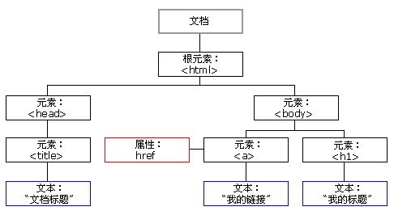

# JavaScript

## w3school
http://www.w3school.com.cn/js/index.asp

### Integrate with Html
[src1](http://www.w3school.com.cn/js/js_howto.asp), [src2](http://www.w3school.com.cn/js/js_whereto.asp)

HTML 中的脚本(也就是HTML无法访问的内容，如变量，函数内容，而非函数名)必须位于`<script>` 与`</script>` 标签之间。脚本可被放置在HTML 页面的`<body>` 和`<head>` 部分中。函数通常放于`<head>` 中或`<body>` 底部。

旧版本需`<script>` 标签中使用`type="text/javascript"` 。现在不必。

脚本可设置在某个事件发生时执行代码。

点击Try it 按钮，则A Paragraph变为My First JavaScript Function。
```
<!DOCTYPE html>
<html>
<head>
<script>
function myFunction(){
  document.getElementById("demo").innerHTML="My First JavaScript Function";
}
</script>
</head>
<body>

<h1>My Web Page</h1>
<p id="demo">A Paragraph</p>
<button type="button" onclick="myFunction()">Try it</button>
</body>
</html>
```

可把脚本存于*.js文件中，并通过`<script src="myScript.js"></script>`导入。外部脚本不能有`<script>`标签。

脚本通过`id`访问HTML元素。`document.getElementById("id")`。HTML元素的内容为`innerHTML`。

直接写入HTML输出中：在页面加载时script向页面写文本`document.write()`。不能用于函数中，不然执行时覆盖全部HTML内容。
```
<body><p></p>
<script>
document.write("<h1>This is a heading</h1>");
document.write("<p>This is a paragraph</p>");
</script>
<p></p></body>
```

### Gramma
[src](http://www.w3school.com.cn/js/js_statements.asp)

Statement
- 脚本代码用`;`分隔，但不必须用来结束语句。
- JavaScript对大小写敏感。
- 忽略多余空格。
- 可在字符串中用`\ `跳脱回车。但是不能用于其它地方。

JavaScript是脚本型语言，边读取代码边执行。

注释：`//`, `/**/`

Variable
- 声明变量：`var x;`。赋值`x=2;`。`var name="Bill";` 变量名一定要以字母开始。不赋值之前值为`undefined`。
- 重复声明不会使值消失。`var x=2; var x; // x is still 2`
- 数据类型是动态的，可赋不同类型的值。
- 字符串用单或双引号括起来。内部可包含与整个字符串外部不同的引号。
- 数字类型只有一种，小数点可有可无。`var z=123e-5;` 均使用8 byte十位底的浮点数存储。
  - 整数精度最多17位，小数误差通过对每个操作数先乘十再除十消除。
  - 前缀为0和x的为8和16进制。
- 方法：`toExponential()`，`toFixed()`，`toPrecision()`，`toString()`，`valueOf()`
- 布尔：`var x=true;` 通过构造器时，`var x=new Boolean(值);` 空是`false`，0是`false`,1是`true`,空字符串是`false`, `null`是`false`, `NaN`是`false`,字符串`'false'`是`true`。
- 数组：
  - 创建`var cars=new Array(); cars[0]="Audi"; cars[1]="BMW"; cars[2]="Volvo";`
  - 或condensed array: `var cars=new Array("Audi","BMW","Volvo");`
  - 或literal array: `var cars=["Audi","BMW","Volvo"];`
  - 如果你需要在数组内指定数值或者逻辑值，那么变量类型应该是数值变量或者布尔变量，而不是字符变量。 **?**
  - 合并数组：`arr.concat(arr2); `
  - 将整个数组组成字符串：`arr.join(".");` 如果不加字符则缺省为`","`。
  - 排序：`arr.sort();` 
- 对象：属性值对形式定义。`var person={firstname:"Bill", lastname:"Gates", id:5566};`
  - 寻址方式：`name=person.lastname;` 或 `name=person["lastname"];`
  - 调用方法：`objectName.methodName();`
  - 声明新变量: `person=new Object(); person.firstname="Bill"; person.lastname="Gates"; person.age=56; person.eyecolor="blue";`
  - 使用literals创建：`person={firstname:"John",lastname:"Doe",age:50,eyecolor:"blue"};`
  - 使用构造器：`var myFather=new person("Bill","Gates",56,"blue");`

构造器函数
```
function person(firstname,lastname,age,eyecolor){
  this.firstname=firstname;
  this.lastname=lastname;
  this.age=age;
  this.eyecolor=eyecolor;
  function changeName(name){
    this.lastname=name;
  }
}
```

声明变量类型：
```
var carname=new String;
var x=      new Number;
var y=      new Boolean;
var cars=   new Array;
var person= new Object;
```

null值：可通过将变量设为此值将变量设为undefined。 

### Object
[src](http://www.w3school.com.cn/js/js_obj_intro.asp)

JavaScript中所有事物都是对象。

JavaScript面向对象但不使用类，使用prototype。

[src](http://www.w3school.com.cn/js/js_objects.asp)

数值类型属性：`MAX VALUE`，`MIN VALUE`，`NEGATIVE INFINITIVE`，`POSITIVE INFINITIVE`，`NaN`，`prototype`，`constructor`

字符串对象：
- 属性：txt.length=5
- 方法：
  - `txt.indexOf(str)`返回str第一次出现在txt中位置，如果在头出现就为0；
  - `txt.replace()`；
  - `txt.search()`；
  - `toUpperCase()`；
  - `txt.match(str)`查找str，如果找到返回str，不然返回Null；
  - `str.replace(/Microsoft/,"W3School")`；

日期对象：
- `Date()`获取当前日期；
- `getTime()`返回1970.1.1至今的毫秒数；
- `date.setFullYear(1992,10,1)`,注意是月是从0开始的为1月；
  - `myDate.setFullYear(2008,8,9);var today = new Date();`
- `date.toUTCString()`返回UTC标准的字符串；
- `date.getDay()`返回数字表示的今天是周几；
- 构造器：`var d=new Date(); `
- 可用`<`, `>`比较日期：
  - `if (myDate>today){alert("before 9th August 2008");}`

算术对象：
- `Math.round(数)` 按小数部分最高位四舍五入；
- `Math.random()`随机产生一个0到1之间的值，产生0～10之间：`Math.floor(Math.random()*11)`；
- `Math.max(a, b)`返回两个数中较大的值；
- `Math.min(a, b)`；
- 可被访问的算术值：
  - 常数: `Math.E`;
  - 圆周率: `Math.PI`; 
  - 2 的平方根: `Math.SQRT2`; 
  - 1/2 的平方根: `Math.SQRT1_2`; 
  - 2 的自然对数: `Math.LN2`; 
  - 10 的自然对数: `Math.LN10`; 
  - 以 2 为底的 e 的对数: `Math.LOG2E`; 
  - 以 10 为底的 e 的对数: `Math.LOG10E`;

### 正则表达式
[src](http://www.w3school.com.cn/js/js_obj_regexp.asp)

RegExp: 多个字符，解析，格式检查，替换。设置索引位置，要检查的字符串类型。
- 声明：`var patt1=new RegExp("e");` 单个字符'e'表明检查字符串中是否存在这个字符。
  - 可添加参数如`var patt1=new RegExp("e","g")`; `g`表明查找所有符合的结果。
- `test()`方法为检索字符串中的指定值，返回布尔值。`patt1.test("The best things in life are free");` 就为true。
- `exec()`同`test()`，但返回该指定值或Null。
- `compile()` 方法用于改变 RegExp。`compile()` 既可以改变检索模式，也可以添加或删除第二个参数。

```
var patt1=new RegExp("e","g");
do
{
  result=patt1.exec("The best things in life are free");
  document.write(result);
}
while (result!=null) // output is eeeeeenull
```

等同于`var pattl=new RegExp("d");` 
```
var patt1=new RegExp("e");
patt1.compile("d");
```

### Expression
[src](http://www.w3school.com.cn/js/js_functions.asp)

函数：`function myFunction(参量表){var x; return x;}`
- 函数内部的是局部变量，函数外的是全局变量。全局变量可直接在函数内部使用。全局变量在页面关闭时删除。

运算符：
- 算术：`+-*/%,++,--`
- 赋值：`=,+=,-=,*=,/=,%=`
- 字符串运算符：`string1+string2`。数字与字符串相加，数字转为字符。
- 比较：`==`,`===`值和类型全等，`!=`，`>=`，`<=`，`>`，`<`
- 逻辑：`&&` `||` `!`
- 条件运算：`variablename=(condition)?value1:value2;`

条件控制：
1. `if`：
```
if (time<10) {
  x="Good morning";
} else if (time<20) {
  x="Good day";
} else {
  x="Good evening";
}
```

2. `switch`：
```
var day=new Date().getDay();
switch (day) {
case 6:
  x="Today it's Saturday";
  break;
case 0:
  x="Today it's Sunday";
  break;
default:
  x="Looking forward to the Weekend";
}
```

3. `for`：
```
for (var i=0,len=cars.length; i<len; i++) {
  document.write(cars[i] + "<br>");
}
```
或
```
var i=2,len=cars.length;
for (; i<len; i++)
{
  document.write(cars[i] + "<br>");
}
```

4. `for in`：对对象中的所有属性执行一遍。
```
var person={fname:"John",lname:"Doe",age:25};
for (x in person){
  txt=txt + person[x];
}
```

也可对数组遍历。
```
var mycars =["Saab", "Volvo", "BMW"];
var x;
for (x in mycars){
  document.write(mycars[x] + "<br />")
}
```

5. `while`：
```
cars=["BMW","Volvo","Saab","Ford"];
var i=0;
while (cars[i]){
  document.write(cars[i] + "<br>");
  i++;
}
```

6.`do while`：
```
do{
  x=x + "The number is " + i + "<br>";
  i++;
}while (i<5);
```

7. 循环控制：`break`，`continue`。

对语句设定label以后，break label可跳出代码块。
```
cars=["BMW","Volvo","Saab","Ford"];
list: {
  document.write(cars[0] + "<br>"); 
  break list;
  document.write(cars[3] + "<br>"); 
  document.write(cars[4] + "<br>"); 
  document.write(cars[5] + "<br>"); 
}
```

### 错误处理
[src](http://www.w3school.com.cn/js/js_errors.asp)

try catch
```
var txt="";
try {
  ...
} catch(err) {
  txt+=err.message+"\n";
}
```

throw
```
function foo() {
  var x=document.getElementById("demo").value;
  if (x<0)  throw "negative value";
}
```

### 表单验证
[src](http://www.w3school.com.cn/js/js_form_validation.asp)


### 文档对象模型(DOM)
[src](http://www.w3school.com.cn/js/js_htmldom.asp)

当网页被加载时，浏览器会创建页面的文档对象模型（Document Object Model）。



- JavaScript 能够改变页面中的所有 HTML 元素，HTML 属性，CSS 样式。
- JavaScript 能够对页面中的所有事件做出反应

查找元素：
- 通过id：`var x=document.getElementById("intro");` 失败返回Null。
- 通过标签名：`var x=document.getElementById("main"); var y=x.getElementsByTagName("p");` 则找到`<div id=main>`中所有`<p>`元素。

改变
- 改变内容：`element.innerHTML`指的是标签开始到标签结束之间的内容。
- 改变属性：如`element.src= "new.gif";`
- 改变样式：`element.style.属性名`，如`elment.style.visibility='hidden'/ 'visible';`可显示或隐藏元素。

HTML事件：
- 点击鼠标：`onclick`。
- 载入：`onload` 和 `onunload` 事件会在用户进入或离开页面时被触发。用于检测浏览器版本和处理`cookie`。`<body onload="checkCookies()">`是否启用cookies.
- 字段验证：`onchange`，字段改变时调用。`<input type="text" id="fname" onchange="upperCase()">`。
- 鼠标事件：`onmouseover`，`onmouseout`，`onmousedown`，`onmouseup`。
- 输入字段获得焦点：`onfocus`。

在属性中添加事件不用<script>标签。
```
<button type="button" onclick="document.getElementById('id1').style.color='red'">点击这里！</button>
```

也可在`<script>function 函数名(){}</script>`，然后`onclick= "函数名()"`。

还可通过分配属性分配事件：`<script>document.getElementById("myBtn").onclick=function(){displayDate()};</script>` 注意此时不是用引号括起函数名。在HTML中直接执行一段JavaScript函数的方式。

用this表明当前元素，`this.innerHTML和this.attribute`。
```
<div onmouseover="mOver(this)" onmouseout="mOut(this)" style="background-color:green;width:120px;height:20px;padding:40px;color:#ffffff;">把鼠标移到上面</div>
<script>
function mOver(obj)
{
  obj.innerHTML="谢谢"
}
function mOut(obj)
{
  obj.innerHTML="把鼠标移到上面"
}
</script>
```

添加元素：首先创建节点，在朝里面添加内容。
```
<div id="div1"></div>
<script>
var para=document.createElement("p");
var node=document.createTextNode("这是新段落。"); //innerHTML内的文字部分。
para.appendChild(node);
var element=document.getElementById("div1");
element.appendChild(para);
</script>
```

删除元素：找到父元素并删除。可以通过属性`parentNode`找到。`child.parentNode.removeChild(child);`
```
<div id="div1"><p id="p1">这是一个段落。</p></div>
<script>
var parent=document.getElementById("div1");
var child=document.getElementById("p1");
parent.removeChild(child);
</script>
```

### JS Window
[src](http://www.w3school.com.cn/js/js_window.asp)

Browser Object Model: 和浏览器的交互。

Window对象：浏览器窗口。
- 所有全局对象，函数和变量均是window的成员。
- 窗口尺寸：`window.innerHeight`，`window.innerWidth`。考虑到老版本的浏览器：`var w=window.innerWidth || document.documentElement.clientWidth || document.body.clientWidth;`
- 方法：打开新窗口：`window.open()`。
- 关闭当前窗口：`window.close()`。
- 移动当前窗口：`window.moveTo()`。
- 调整当前窗口的尺寸：`window.resizeTo()`。

屏幕对象：`window.screen`，可不使用window 这个前缀。
- 可用的屏幕宽度：`screen.availWidth`。以像素计，减去了界面特性如任务栏。
- 可用的屏幕高度：`screen.availHeight`。

页面地址对象：`window.location` 对象用于获得当前页面的地址 (URL)，并把浏览器重定向到新的页面。可省window。
- 主机的域名：`location.hostname`。
- 当前页面的路径和文件名：`location.pathname`。
- 端口(80或443): `location.port`。
- web协议（`http://`或`https://`）：`location.protocol`。
- 当前页面的URL：`location.href`。
- 加载新的文档：`window.location.assign("http://www.w3school.com.cn")`;

页面跳转：[src](http://www.111cn.net/wy/js-ajax/48824.htm)
```
onclick="window.location.href='www.aaa.com'"
```

历史对象：`window.history`对象可省前缀，有一定限制。
- 后退到前一个页面：`history.back();`
- 向前到后一个页面：`history.forward();`

[用navigator检测浏览器](http://www.w3school.com.cn/js/js_window_navigator.asp)


三种消息框：
- 警告框：弹出窗口显示字符串：`alert("string”+’\n’+”string");`
- 确认框：OK或Cancel按钮。`confirm(‘’string’);` 返回true或false。
- 提示框：输入值并确认或返回。`prompt("string","default");` 返回输入值或null。

计时事件：
- 延时发生事件：`var t=setTimeout("函数名或执行语句",毫秒); `
```
var c=0
var t
function timedCount(){
		document.getElementById('txt').value=c
		c=c+1
		t=setTimeout("timedCount()",1000)
}
```

- 清除计时器：`clearTimeout(setTimeout_variable)`。

简单时钟：
```
<html>
<head>
<script type="text/javascript">
function startTime(){
  var today=new Date()
  var h=today.getHours()
  var m=today.getMinutes()
  var s=today.getSeconds()
  
  // add a zero in front of numbers<10
  m=checkTime(m)
  s=checkTime(s)
  
  document.getElementById('txt').innerHTML=h+":"+m+":"+s
  t=setTimeout('startTime()',500)
}

function checkTime(i){
  if (i<10) 
    {i="0" + i}
    return i
}
</script>
</head>
<body onload="startTime()">
<div id="txt"></div>
</body>
</html>
```

cookie对象：`document.cookie`可储存各种信息，甚至是密码。
```
<html>
<head>
<script>
function getCookie(c_name){ // Find element
  if (document.cookie.length>0){
    c_start=document.cookie.indexOf(c_name + "=");
    if (c_start!=-1){
      c_start=c_start + c_name.length+1;
      c_end=document.cookie.indexOf(";",c_start); // The char after an index
      if (c_end==-1) c_end=document.cookie.length; 
      return decodeURI(document.cookie.substring(c_start,c_end));
    } 
  }
  return "";
}

function setCookie(c_name,value,expiredays){ // expiredays can be null
  var exdate=new Date();
  exdate.setDate(exdate.getDate()+expiredays);
  document.cookie=c_name+ "=" +encodeURI(value)+((expiredays==null) ? "" : ";expires="+exdate.toGMTString());
}

function checkCookie(){
  username=getCookie('username');
  if (username!=null && username!=""){
    alert('Welcome again '+username+'!');
  }else{
    username=prompt('Please enter your name:',"");
    if (username!=null && username!=""){
      setCookie('username',username,365); 
    }
  }
}
</script>
</head>
<body onLoad="checkCookie()">
</body>
</html>
```


### JavaScript 库
[src](http://www.w3school.com.cn/js/js_library_jquery.asp)

JavaScript框架：库，高级应用程序设计。特别针对浏览器差异处理。常用的有jQuery、Prototype、MooTools。

CDN (Content Delivery Network)把框架库存放在一个通用的位置供每个网页分享就变得很有意义了。

### JQuery
[src](http://www.w3school.com.cn/js/js_library_jquery.asp)

使用前需要引用jQuery 库。
```
<script src="https://ajax.googleapis.com/ajax/libs/jquery/1.8.3/jquery.min.js">
</script>
<script>
mycode
...
</script>
```

测试 JavaScript 框架库
- 主要的jQuery 函数是`$()` 函数(jQuery 函数)。
- 如果您向该函数传递DOM 对象，它会返回jQuery 对象，带有向其添加的jQuery 功能。
- 可以通过CSS 选择器来选取元素
- jQuery 函数返回jQuery 对象。

DOM 对象$(document) 传递到jQuery。返回的jQuery对象有ready 方法。
```
function myFunction() {
  $("#h01").html("Hello jQuery"); // element id "h01", innerHTML set to "Hello jQuery"
}

$(document).ready(myFunction); // onload
```

See JQuery.md

### AJAX
[src](http://www.w3school.com.cn/php/php_ajax_xmlhttprequest.asp)

AJAX(Asynchronous JavaScript And XML)：运用JavaScript，XML，HTML，CSS，通过在幕后向服务器发送 HTTP 请求并交换数据，而不是每当用户作出改变时重载整个 web 页面，AJAX 技术可以使网页更迅速地响应。

不同的浏览器使用不同的方法来创建 XMLHttpRequest 对象：Internet Explorer 使用`ActiveXObject`。其他浏览器使用名为`XMLHttpRequest` 的`JavaScript` 内建对象。
```
function GetXmlHttpObject(){
 var xmlHttp=null;
 try{
  // Firefox, Opera 8.0+, Safari
  xmlHttp=new XMLHttpRequest();
 }catch (e){
  // Internet Explorer
  try{
   xmlHttp=new ActiveXObject("Msxml2.XMLHTTP"); //IE 6
  }catch (e){
   xmlHttp=new ActiveXObject("Microsoft.XMLHTTP"); // IE5.5
  }
 }
 return xmlHttp;
}
```

用xmlHttp对象来后台交互数据。
- `open(method,url,async)`: 规定请求的类型、URL 以及是否异步处理请求。
  - method: 请求的类型；GET 或 POST
  - url: 文件在服务器上的位置
  - async: true（异步）或 false（同步）
- `send(string)`: 将请求发送到服务器。
  - string: 仅用于 POST 请求

GET 更简单也更快，并且在大部分情况下都能用。GET的信息包含在url中。
```
xmlHttp.open("GET", "demo_get.php?q信息&sid="+Math.random(),true); xmlHttp.send();
```

无法使用缓存文件（更新服务器上的文件或数据库，或向服务器发送大量数据（POST 没有数据量限制），或发送包含未知字符的用户输入时，POST 比 GET 更稳定也更可靠。

POST需要为HTML请求添加头。
```
xmlhttp.open("POST","demo_post.php",true);
xmlhttp.setRequestHeader("Content-type","application/x-www-form-urlencoded");
xmlhttp.send("fname=Bill&lname=Gates");
```

`open()`的最后一个参量表示是否异步。XMLHttpRequest 对象如果要用于AJAX 的话，async 参数必须设置为 true。

异步指在等待服务器响应时执行其他脚本，并当响应就绪后对响应进行处理，即`onreadystatechange` 事件中的就绪状态时执行的函数。

响应数据：`responseText`属性为获得字符串形式的响应数据；`responseXML`为获得XML 形式的响应数据。

onreadystatechange事件：
- `onreadystatechange`: 存储函数（或函数名），每当 readyState 属性改变时，就会调用该函数。
- `readyState`: 存有 XMLHttpRequest 的状态。从 0 到 4 发生变化。
  - 0: 请求未初始化
  - 1: 服务器连接已建立
  - 2: 请求已接收
  - 3: 请求处理中
  - 4: 请求已完成，且响应已就绪

status
- 200: "OK"
- 404: 未找到页面

```
xmlhttp.onreadystatechange=function(){
  if (xmlhttp.readyState==4 && xmlhttp.status==200){
    document.getElementById("myDiv").innerHTML=xmlhttp.responseText;
  }
}
```

下例是一段根据form中`<input type="text" id="txt1" onkeyup="showHint(this.value)">`内容显示数据的JavaScript脚本。
```
var xmlHttp;

function showHint(str){
  if (str.length==0){ 
    document.getElementById("txtHint").innerHTML="";
    return;
  }
  xmlHttp=GetXmlHttpObject();
  if (xmlHttp==null){
    alert ("Browser does not support HTTP Request");
    return;
  } 
  var url="gethint.php"; 
  url=url+"?q="+str+"&sid="+Math.random(); // 随机数用于防止浏览器使用缓存
  xmlHttp.onreadystatechange=stateChanged(); 
  xmlHttp.open("GET", url, true); // 发送的目的地
  xmlHttp.send(null); // 发送的内容，因为get的内容在url中。
}

function stateChanged(){ 
  if (xmlHttp.readyState==4 || xmlHttp.readyState=="complete"){
    document.getElementById("txtHint").innerHTML=xmlHttp.responseText; //完成，输出信息到<p>Suggestions: <span id="txtHint"></span></p>
  } 
}
```

用gethint.php接收get的内容并作出回应。
```
<?php
$a[]="Anna"; // Suggestion
$q=$_GET["q"]; //get the q parameter from URL
//lookup all hints from array if length of q>0
if (strlen($q) > 0){
  $hint="";
  for($i=0; $i<count($a); $i++){
    if (strtolower($q)==strtolower(substr($a[$i],0,strlen($q)))){ // Find all the fit suggestion
      if ($hint==""){
        $hint=$a[$i];
      }else{
        $hint=$hint." , ".$a[$i];
      }
    }
  }
}
if ($hint == ""){
  $response="no suggestion";
}else{
  $response=$hint;
}
echo $response; //output the response
?>
```

# Node.js
https://www.nczonline.net/blog/2013/10/07/node-js-and-the-new-web-front-end/
